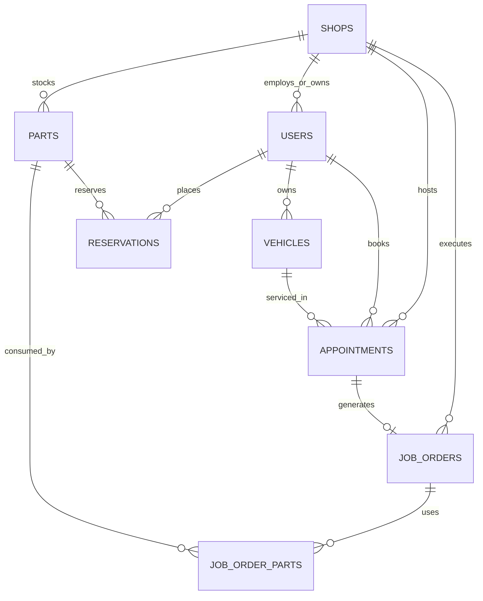
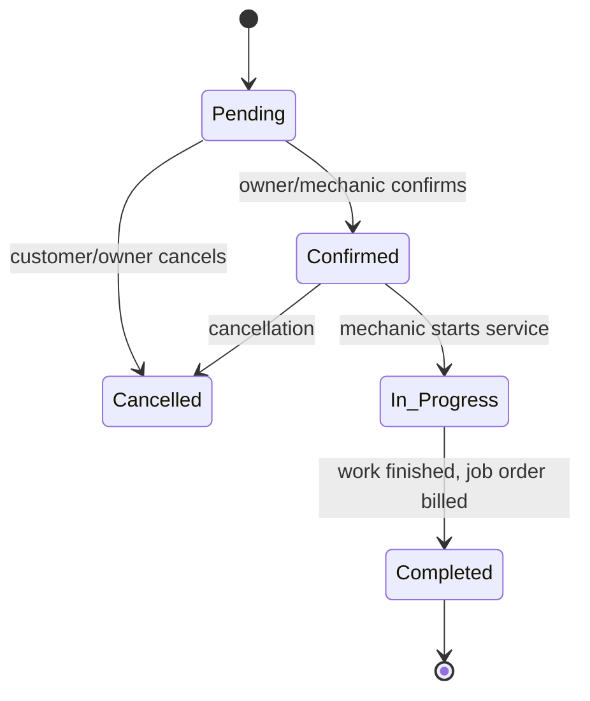
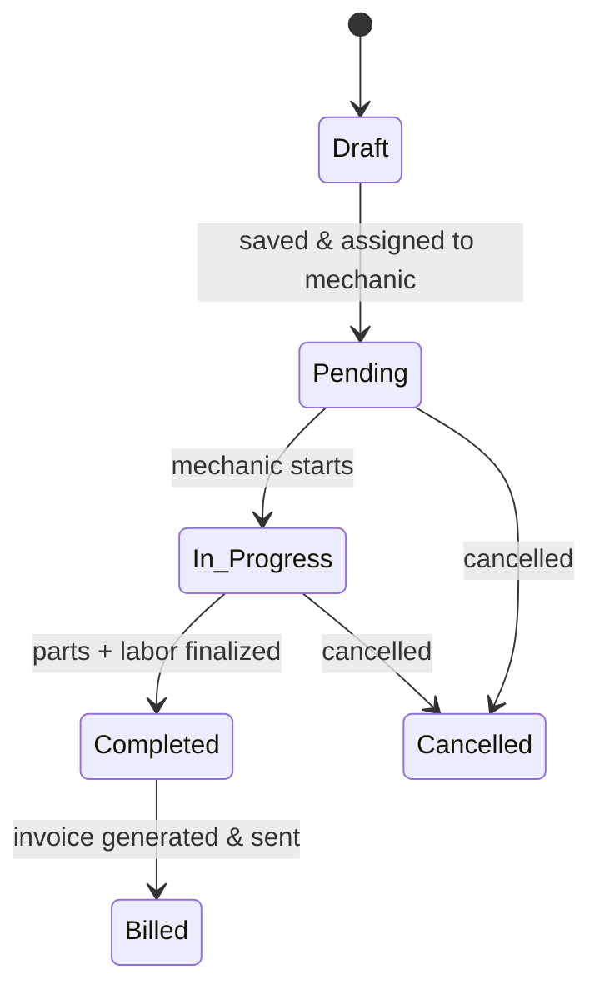
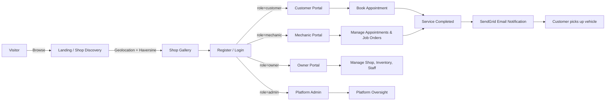
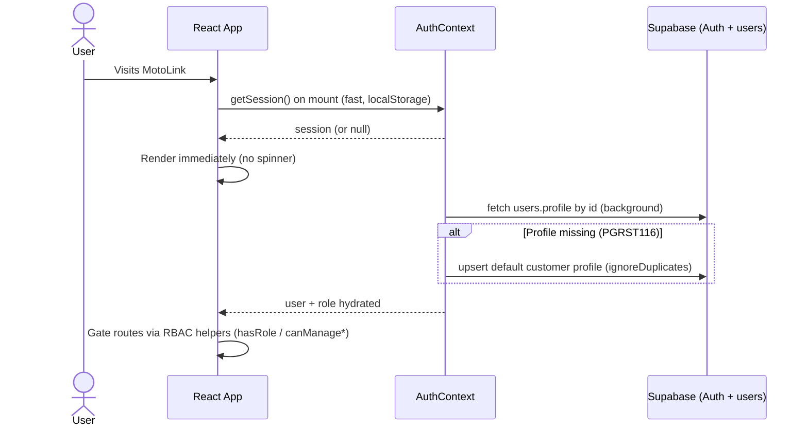
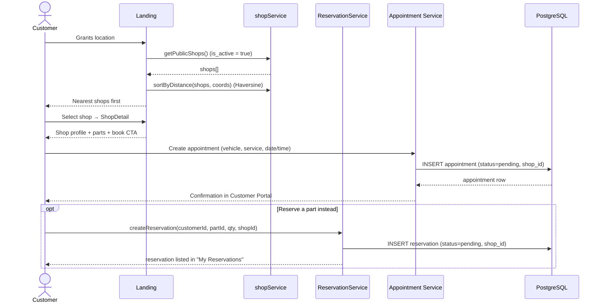
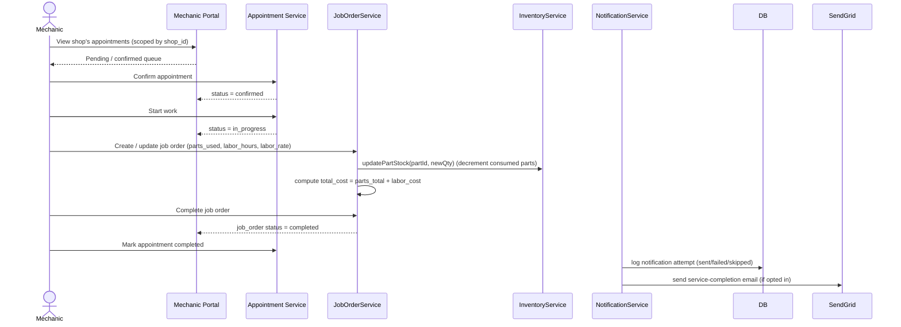
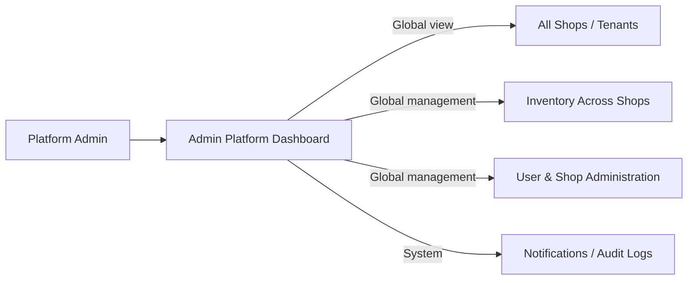
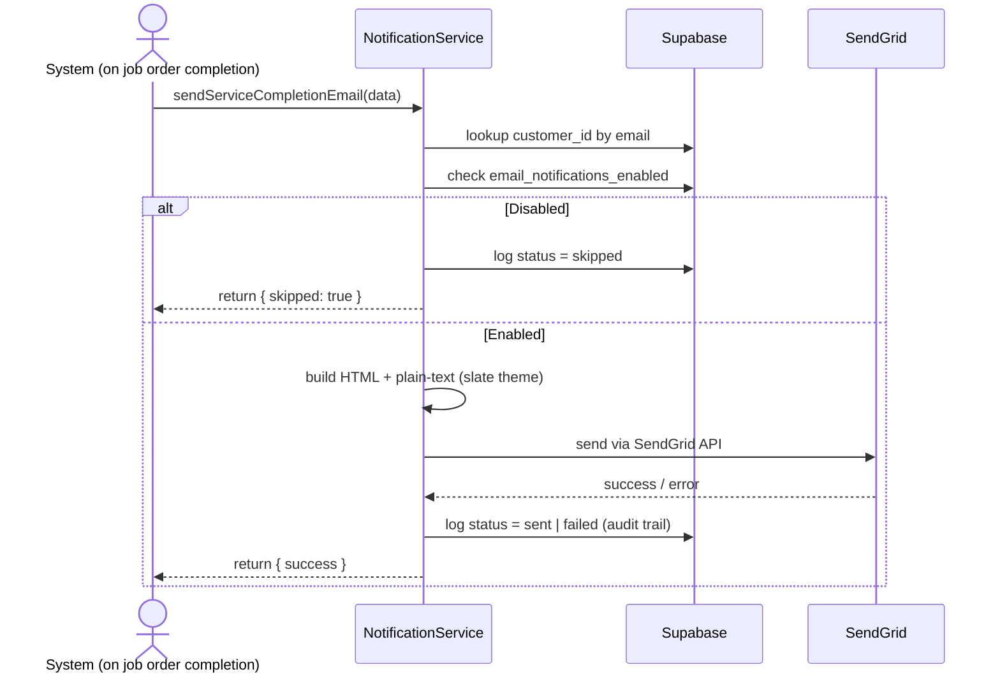

# MotoLink — Brain / Memory File

> **RULE:** Read this file FIRST before starting any task. Update it after every task.
> This is the persistent memory so context is never lost between sessions.

---

## PROJECT OVERVIEW

MotoLink is a motorcycle shop marketplace/full-stack app.
- **Frontend:** React + TypeScript + Vite, Tailwind CSS, framer-motion, Recharts, Leaflet
- **Backend:** Supabase (Postgres + Auth + Storage), REST via supabase-js
- **AI:** Groq API (`llama-3.3-70b-versatile`) powers customer + admin chatbots
- **Email:** SendGrid API
- **Repo:** `ZacharyFuertes/MotoLink`, branch `main`

**Roles:** customer, owner, mechanic, admin
**Multi-tenant:** each owner has a `shop_id`; all shop data scoped by it.

---

## CREDENTIALS / CONFIG

- Supabase project ref: `hrrjdeamvwncssaczqvz`
- URL: `https://hrrjdeamvwncssaczqvz.supabase.co`
- Keys live in `.env.local` (VITE_SUPABASE_URL, VITE_SUPABASE_ANON_KEY, SUPABASE_SERVICE_ROLE_KEY)
- DB password: `Moto-Link123456` — NOTE: direct Postgres connection fails (host is IPv6-only, unreachable from this machine). Use REST API instead.
- Admin account: `admin@motolink.com` / `MotolinkAdmin123!` — UUID `cea04e43-44dc-4e35-b3c1-ef5ffc776193`, role `admin` in `auth.users` + `public.users`

---

## LIVE DATABASE (16 tables)

`users, shops, vehicles, services_pricing, parts, products, featured_products, appointments, job_orders, job_order_items, invoices, part_sales, reservations, mechanic_availability, notifications, customer_notification_settings`

- `customers` table was DROPPED; 7 FKs re-pointed to `users(id)`
- `services_pricing` now has `shop_id` (nullable, FK → shops, ON DELETE CASCADE)
- `mechanic_availability` now has `shop_id` (nullable, FK → shops, ON DELETE CASCADE)
- Admin RLS policies applied across all tables (`supabase/admin_rls.sql`)

---

## DOCUMENTATION FILES (in repo root)

| File | Purpose |
|------|---------|
| `MEMORY.md` | **THIS FILE** — persistent brain, read first |
| `Info for DFD lvl 1.md` | Full Level 1 DFD: 7 entities, 7 processes, 16 stores, 73 flows |
| `MOTOLINK_ERD_SCHEMA.sql` | Clean 16-table ERD-ready schema (matches live DB) |
| `COMPLETE_DATABASE_SCHEMA.sql` | Aspirational 25+ table schema (many tables NOT in live DB) |
| `supabase/schema.sql` | 16-table schema matching live DB |
| `audit.md` | Multi-tenant migration audit findings |
| `MotoLink DFD Level 1 (Simplified).md` | Plain-text (no diagrams) simplified DFD for AI prompts |

---

## COMPLETE TASK HISTORY (chronological)

### PRE-SESSION WORK (done before memory file existed — carried in from prior context)
1. **Supabase setup** — connected project, configured keys, `.env.local`
2. **Admin dashboard** — built `AdminPlatformDashboard.tsx` as Materio-style layout wrapper (persistent sidebar/header), restyled all 7 sub-pages dark → light theme, admin RBAC on owner pages
3. **Role-based routing** — `rolePagesMapping` in `roleAccess.ts` (admin → admin-dashboard, owner → dashboard)
4. **Dropped `customers` table** — live DB migration, 7 FKs re-pointed to `users(id)`
5. **Schema docs** — created COMPLETE_DATABASE_SCHEMA.sql, supabase/schema.sql, MOTOLINK_ERD_SCHEMA.sql
6. **DFD doc** — created `Info for DFD lvl 1.md` (66 flows at the time)
7. **Migration audit** — created `audit.md`

### TASK: Fix admin_rls.sql (P2 crash bug + schema gaps)
- Removed 3 lines from `supabase/admin_rls.sql` referencing dropped `customers` table (was lines 53-55)
- File now applies admin RLS cleanly

### TASK: Owner signup flow (P5)
- `OwnerLoginPage.tsx` — added signup tab:
  1. `supabase.auth.signUp(email, password)`
  2. INSERT into `shops` with `owner_id`
  3. INSERT into `users` with `shop_id` = new shop id
  4. Auto-login
- This is the ONLY path that creates a shop (no admin approval)

### TASK: Owner dashboard (P6)
- Created `src/pages/Dashboard.tsx` — 5 metric cards (today's revenue, pending appts, customers, low stock, products) + pending appointments list + low stock alerts
- All 6 queries scoped by `user.shop_id`
- Route added in `App.tsx`

### TASK: shop_id filters across app (P4/P7)
- `AppointmentCalendarPage.tsx:92-93` (appts scoped for owner), `:140-141` (mechanics), `:342` (insert with shop_id)
- `AdminMechanicAvailability.tsx:71-72` (mechanics scoped)
- `CustomersListPage.tsx:57-58, 72, 80, 88` (customers, appts, job orders, reservations-via-parts)
- `UpdatePartsPage.tsx:75-76, 96, 206` (parts, today's sales, insert)
- `AddMechanicModal.tsx` (getMechanics(shopId), createMechanicAccount assigns shop_id)
- `AIChatModal.tsx` (fetchShopContext scoped by shopId)

### TASK: Crash bug fix (P2)
- `AIChatModal.tsx:110` — `.from("customers")` → `.from("users")` (customers table no longer exists)

### TASK: Dead code removal (P8)
- `shopService.ts` — removed `demoShops` fallback (returns `[]`)
- `supabaseClient.ts` — removed `getUsers()`, `getParts()`, `getAppointments()`
- `FeaturedSection.tsx` (in Index.tsx) — removed localStorage booking pattern
- `Navbar.tsx` + `SystemNavbar.tsx` — JBMS → "MotoLink" branding
- KEPT: `SERVICE_TYPES` + `defaultProducts` as fallbacks
- `demoShops.ts` file still exists but is now UNUSED (still contains "JBMS(JOEYBOY MOTORCYCLE SHOP)")

### TASK: Schema migration SQL (P3)
- Created `supabase/migrations/20260730_add_shop_id_to_services_and_availability.sql`
- Adds nullable `shop_id` to both tables + indexes
- Documents 3 backfill options (A: leave NULL, B: default shop, C: JOIN from users.shop_id)

### TASK: Run migrations + verify (user ran SQL)
- Verified via REST API:
  - `services_pricing.shop_id` exists ✅
  - `mechanic_availability.shop_id` exists ✅
  - All 10 tables readable via service_role ✅
  - `npm run build` passes (0 errors, 2800 modules) ✅

### TASK: Delta analysis (DFD + ERD comparison)
- Compared migration changes against existing docs
- Result: process scope changes, 7 new flows (F67-F73), ~13 altered flows, 5 removed flows, 2 ERD column additions
- Identified remaining gaps: AdminServicesPage, BookAppointmentModal, AdminMechanicAvailability lack shop_id filters

### TASK: Git push
- Commit `75183d0` on `main` — 20 files, +1148/-268
- Had to `git pull --rebase` first (remote had new commits)
- Pushed successfully

### TASK: Update documentation files
- `MOTOLINK_ERD_SCHEMA.sql` — added `shop_id` to services_pricing + mechanic_availability + indexes
- `Info for DFD lvl 1.md` — updated all 7 processes, 16 stores, expanded to 73 flows, documented owner dashboard + signup flow

### TASK: Simplified DFD
- Created `MotoLink DFD Level 1 (Simplified).md`
- First version had ASCII diagrams; user asked to remove all illustrations
- Rewrote as pure plain-text logic (entities, processes, stores, flows, isolation rules, signup sequence, file map)

### TASK: Memory file (THIS)
- Created `MEMORY.md` as persistent brain — read first every session

### TASK: BookAppointmentModal shop_id filter
- `BookAppointmentModal.tsx:253-259` — `fetchServices()` now guards `if (!defaultShopId) return;` and filters `.eq("shop_id", defaultShopId)` matching `fetchAvailableParts()` pattern
- No other functions in file touched
- **NEW ISSUE DISCOVERED:** `src/pages/MotolinkLanding.tsx` has 3 unused imports (`ArrowRight`, `CheckCircle2`, `MapPinned`) that break `tsc` — came from remote commit `9382c9b navbar`, NOT from this change. NOT yet fixed.

### TASK: "Go all" queued-prompts batch (14-item todo list)
1. **BookAppointmentModal default-shop-id fix** — removed `shopIdToUse = "default-shop-id"` fallback; now `setErrorMsg` + block when no valid shop_id; reset `mechanicAvailability` on close; availability shown when schedule exists OR bookings exist
2. **demoShops deletion** — deleted `src/data/demoShops.ts`, `jbms.png`, `pworks.jpg`, `kec.jpg`; KEPT `Motolink.svg` (used by Footer/Navbar/LoginChoice); fixed stale comment in `ShopMap.tsx:57`
3. **AdminMechanicAvailability fixes** — availability SELECT scoped via `mechanicIds` in-filter; INSERT includes `shop_id: user?.shop_id || null`; `day_of_week` stored as INTEGER (`daysOfWeek.indexOf(...)`) — page previously inserted day-name strings (latent bug, DB column is int 0-6); type widened to `number | string`; display maps int→name
4. **BookAppointmentModal slot computation** — added `mechanicAvailability` state + `fetchMechanicAvailability()` (`.eq("mechanic_id",...).eq("day_of_week", dayIdx)` with `dayIdx=(getDay()+6)%7`); `isSlotAvailable()` = time within schedule bounds, no schedule → open; grid uses `isBooked = bookedSlots.includes(time) || !isSlotAvailable(time)`
5. **UpdatePartsPage scoping** — CONFIRMED already scoped (Today's Sales `.eq("shop_id",...)` at `:96`); no fix needed
6. **Shop detail page** — created `src/pages/ShopDetailPage.tsx` (shop info + services + mechanics + products, all shop-scoped); added `getShopById` to `shopService.ts`; wired "View shop" via `onViewShop` prop through `ShopCard → ShopGallery → MotolinkLanding`; App.tsx uses `viewingShopId` overlay state in BOTH unauthenticated + authenticated landing branches (no roleAccess change needed)
7. **Appointment status alignment (latent DB bug)** — DB CHECK allows only `pending,confirmed,in_progress,completed,cancelled`; app used `ready_for_finalization` (would VIOLATE constraint). Replaced `ready_for_finalization` → `in_progress` in `types/index.ts`, `AppointmentCalendarPage.tsx`, `MechanicDashboard.tsx`, `SENDGRID_SETUP.md`. Live `appointments`/`job_orders` tables confirmed empty via REST
8. **Job order handoff** — created `src/services/jobOrderService.ts` (ensure/get/logLabor/addPartUsed/completeJobOrder/getJobOrderById) + `src/components/JobOrderModal.tsx` (labor hours/rate logging + parts used picker, no stock deduction). `AppointmentCalendarPage`: auto-creates job order when status → `confirmed`/`in_progress`; completes job order at owner finalize; "Job Order" button on owner cards
9. **Invoice generation** — created `src/services/invoiceService.ts` (createInvoiceForJobOrder idempotent per job_order_id, getInvoicesForCustomer, markInvoicePaid). Wired into finalize path in `AppointmentCalendarPage`. Customer view already exists in `ServiceHistoryModal.tsx` (line ~398). NOTE: `invoices` DB table has NO tax/subtotal/due_date/issued_date columns — TS `Invoice` type is aspirational; inserts use DB columns only
10. **Low-stock list** — FIXED bug in `inventoryService.getLowStockParts` (was `.lte('quantity_in_stock','reorder_level')` comparing to STRING literal — PostgREST can't do column-to-column; now fetch-then-filter client-side). Built `src/pages/LowStockPage.tsx` (restock action via `updatePartStock`); registered as `low-stock` AppPage for owner+admin; added to `roleAccess.ts`, `App.tsx` (admin layout + main layout), admin sidebar, SystemNavbar
11. **Reservation flow** — created `src/services/reservationService.ts` (create/getMy/getShop/updateStatus/fulfillReservation-deducts-stock). `BrowsePartsPage`: customer "Reserve Part" button + qty stepper in detail modal + "My Reservations" panel (statuses). `CustomersListPage`: owner/admin reservations panel with Confirm/Fulfill/Cancel actions. NOTE: `reservations` table has NO shop_id — scoping is via `parts.shop_id` join
12. **Owner dashboard reports** — `Dashboard.tsx`: 30-day revenue trend (part_sales + completed job_orders daily, Recharts BarChart) + per-mechanic productivity (completed job orders grouped, name lookup via users join)
13. **Build verification** — `npm run build` passes (tsc + vite, 2812 modules)
14. **TS JobOrder type** — added `total_cost?`, widened status union to match DB (`pending`/`billed`)

### TASK: Split Owner/Admin login into two portals (A-E)
- **AUDIT:** `OwnerLoginPage.tsx` accepted both `owner` + `admin` (line 136) yet was admin-styled (adminIcon, "Admin Login Failed", red theme); `LoginChoicePage.tsx` had one combined "Owner/Admin" tile; no separate admin page existed
- **B: `src/pages/ShopOwnerLoginPage.tsx`** — byte-for-byte copy of the old page's auth + signup/shop-creation logic; re-branded: lucide `Store` icon (replaces adminIcon), violet theme, "Shop Owner Login Failed"; role check now ONLY accepts `owner`; admin gets "Wrong Portal → use the Admin Portal" message
- **C: `src/pages/AdminLoginPage.tsx`** — login-only (NO signup), red admin branding (adminIcon, "Admin Login Failed"); role check only accepts `admin`; owner rejected with "use the Shop Owner Portal" message
- **D: Wiring** — `LoginChoicePage.tsx`: single tile split into "Shop Owner" (Store icon, violet) + "Platform Admin" (ShieldCheck icon, red); grid `md:grid-cols-3` → `md:grid-cols-2`; new `onChooseAdmin` prop. `App.tsx`: `LoginType` union gained `"admin"`; `onChooseAdmin` → `setCurrentLoginType("admin")`; admin branch renders `AdminLoginPage`; else-branch renders `ShopOwnerLoginPage`
- **E: Cleanup** — grep confirmed no `src` imports of the old page (only its own decl + historical docs); DELETED `src/pages/OwnerLoginPage.tsx`
- **Verify:** `npx tsc --noEmit` clean + `npm run build` passes (2813 modules)
- NOTE: docs (`audit.md`, `Info for DFD lvl 1.md`, `MotoLink DFD Level 1 (Simplified).md`) still reference `OwnerLoginPage.tsx` as historical file paths

### TASK: Redesign LoginChoicePage — tiers, neutral cards, Register shop action
- `LoginChoicePage.tsx` rewritten: two labeled tiers ("Public access" → Customer/Mechanic; "Business and admin — verified access" → Shop Owner/Platform Admin); all four cards now ONE neutral style (`bg-slate-50`, `border-slate-200`, slate-600 icons) — per-role accent colors (green/blue/purple/red) removed
- Lock badges only on business tier: "Secured" (Shop Owner) + "Restricted" (Platform Admin), 11px, top-right
- Shop Owner card is now a `motion.div` with two visible buttons: "Log in" (→ login) and "Register shop" (→ signup mode); the other 3 cards stay whole-card `<button>`s
- `ShopOwnerLoginPage.tsx`: new `initialIsSignup?: boolean` prop seeds `useState(initialIsSignup)` — no auth logic changed
- `App.tsx`: `LoginType` union gained `"owner-signup"`; `onChooseRegister` → `setCurrentLoginType("owner-signup")`; new branch renders `ShopOwnerLoginPage` with `initialIsSignup={true}` (mirrors existing `customer-signup` pattern)
- `DatabaseStatus.tsx`: status dot is now a white pill (`bg-white/90`, border, rounded-full) with an adjacent text label — "System online" / "Checking connection…" / "Connection error" (dot rendered on all 4 App layouts)
- `npx tsc --noEmit` clean + `npm run build` passes

### TASK: Flat neutral redesign of all auth screens
- Audit: only 4 files need restyling — `LoginPage.tsx` (customer), `MechanicLoginPage.tsx`, `ShopOwnerLoginPage.tsx`, `AdminLoginPage.tsx`. NO auth modals exist (glob found none). `LoginChoicePage.tsx` already neutral → excluded
- Design applied to all 4: white flat bg (already done), removed decorative blur blobs, dark gradient card → `bg-white border-slate-200 shadow-sm` (removed inline `linear-gradient`/`backdropFilter` + inner glow divs), icon tile → `bg-slate-100` with muted PNG icon (`brightness-0 opacity-60`) or `text-slate-500` lucide, headline `text-slate-900` sentence-case, inputs → light (`bg-white border-slate-300`, muted `text-slate-400` icons), primary buttons → solid `bg-slate-900 hover:bg-slate-800` (no gradient), toggle links/divider slate-toned
- Content/copy preserved EXCEPT `"Open Your Shop"` → `"Open your shop"` (sentence case)
- Status-pill collision fix: Home button moved `top-6 right-6` → `bottom-6 right-6` on all 4 login pages so it no longer overlaps the `DatabaseStatus` pill (top-right)
- LoginPage make/model suggestion dropdowns restyled light (`bg-white`, `hover:bg-slate-50`)
- Final grep: no gradients / no all-caps headlines in any login page (only intentional `uppercase` tier labels in LoginChoicePage); `tsc --noEmit` clean + `npm run build` passes (2813 modules)

### TASK: Fix 401 on shop registration
- **Root cause (3 parts):**
  1. **RLS:** live `shops` table had only "Anyone can browse active shops" (SELECT) + admin policies — NO INSERT policy → PostgREST 401 on `.insert().select("id")`
  2. **Email confirmation:** project has "Confirm email" ENABLED (verified — signup hits `over_email_send_rate_limit` trying to send confirmation). `signUp()` returns NO session → profile/shop inserts run as anon → 401. App code (AuthContext + ShopOwnerLoginPage) signs in immediately after signup → designed for autoconfirm
  3. **Schema:** live `shops` requires `slug`, `latitude`, `longitude` NOT NULL; signup insert provided none (would 400 after RLS passes). `slug` only used for display in AdminPlatformDashboard (`s.slug`), not routing
- **Client fix (`ShopOwnerLoginPage.tsx`):** generates `slug` (slugify shop name + 5-char random suffix); `address`/`city` fall back to `""` (NOT NULL, form marks them optional); clear error if `authData.session` is null ("confirm your email then sign in") instead of cryptic 401
- **SQL migration `supabase/migrations/20260731_owner_signup_rls_and_nullable_coords.sql`:** lat/lng DROP NOT NULL; INSERT policies for `shops` (`WITH CHECK owner_id = auth.uid()`), `users` (`auth.uid() = id`), `vehicles` (`customer_id = auth.uid()`); owner SELECT own shop
- **`schema.sql` updated** — lat/lng now nullable (matches migration)
- **USER MUST DO (not doable via API):** (1) run the migration in Supabase SQL Editor; (2) disable "Confirm email" in Dashboard → Authentication → Email (autoconfirm)
- Customer signup has the same latent anon-insert issue (AuthContext.signup) — fixed by same RLS + autoconfirm changes
- `tsc --noEmit` clean

### TASK: Owner portal scoping + shop profile editor
- **BUG FOUND:** owner tools rendered EMPTY in main App layout — `isAdminLayout` only matched `admin` role, and the fallback layout only rendered `dashboard`/`mechanic-portal`/`mechanic-dashboard`/`browse-parts`/`low-stock`. So owner navigation to Inventory/Appointments/Customers/Services/Mechanic Availability/Settings showed a blank `<main>`
- **FIX (`App.tsx`):** added render cases for `inventory`, `update-parts`, `appointments`, `customers`, `services`, `mechanic-availability`, `settings`, `shop-settings` in the main (non-admin) layout so owners get them via `SystemNavbar`; admins still short-circuit through `AdminPlatformDashboard`
- **`roleAccess.ts`:** new AppPage `"shop-settings"` added to `owner` only
- **`SystemNavbar.tsx`:** new "Shop Profile" menu item (`Store` icon) for owner
- **`shopService.ts`:** added `updateShop(shopId, updates)` — writes name/slug/logo_url/description/address/city/lat/lng/phone/email/specialties/operating_hours/is_active, returns refreshed Shop
- **`src/pages/ShopSettingsPage.tsx` (NEW):** owner-only page loading their shop via `getShopById(user.shop_id)`; form for identity, location/contact, specialties (comma list → text[]), operating hours, plus "Public listing" toggle (`is_active`); saves via `updateShop`; shows "No shop linked" state when `user.shop_id` is missing. Changes feed `getPublicShops` → landing + `getShopById` → ShopDetailPage
- **`SettingsPage.tsx`:** added "Shop Profile" card (owner only) → navigates to `shop-settings`
- **`AdminServicesPage.tsx` shop-scoping (confirmed live DB gap):** REST-verified `services_pricing` HAS `shop_id` (migration applied live). fetch → `.eq("shop_id", user.shop_id)` for owners (admin stays global); upsert now includes `shop_id` for owners and OMITS the client-generated `service_${Date.now()}` id on new rows (was a latent UUID violation — id column is UUID, string id would 400); delete scoped by shop_id for owners
- **`supabase/schema.sql`:** synced `services_pricing` + `mechanic_availability` to include nullable `shop_id` + indexes (were missing despite live DB + migration having them)
- **Verify:** `npx tsc --noEmit` clean + `npm run build` passes (2814 modules)

### TASK: Role-gated signup, owner dashboard shell, live shop info, post-registration redirect
- **Root cause of "owner registered as customer":** auth-race. On `signUp()` (autoconfirm), the `onAuthStateChange` listener fires `setUserProfileFromSession` which, when `public.users` row not found yet (PGRST116), auto-inserted a **`customer`** profile. The signup handler then tried `.insert()` of the owner profile → duplicate-key failure OR (if the handler won) still raced. Net effect: shop owner account had role `customer` and/or registration failed
- **Fix (`AuthContext.tsx` + `ShopOwnerLoginPage.tsx`):** listener auto-create now uses `upsert(..., { onConflict: "id", ignoreDuplicates: true })` (never clobbers); `AuthContext.signup` customer profile uses `upsert({ onConflict: "id" })`; owner signup profile uses `upsert({ onConflict: "id" })` (merge → forces `role: "owner"` + `shop_id`) PLUS a corrective `update({ role: "owner", shop_id })` after shop insert. Owner role is now deterministic
- **Role labels:** `getRoleLabel()` added to `roleAccess.ts` (owner → "Shop Owner", admin → "Platform Admin"); `SystemNavbar` + owner shell header display the label instead of raw role. Internal role value stays `owner` (DB/RLS/checks depend on it — NOT renamed to "Shop_Owner")
- **Post-registration/login redirect (`App.tsx`):** `handleLoginSuccess` is now role-aware — owner → `dashboard`, mechanic → `mechanic-dashboard`, customer → `landing` (previously everyone → landing + effect redirect)
- **`src/pages/OwnerPlatformDashboard.tsx` (NEW):** sidebar dashboard shell mirroring `AdminPlatformDashboard` (collapsible sidebar + mobile overlay + sticky header), violet accent ("MOTO SHOP"); owner nav: Dashboard, Shop Profile, Inventory, Update Parts, Appointments, Customers, Services, Manage Mechanics, Low Stock, Settings; embeds the existing `Dashboard` component on the dashboard page; access-guard `role !== "owner"` → Access Denied
- **Live shop info:** owner dashboard shows a "Live Shop Info" card fetching the shop via `getShopById(user.shop_id)` — same source the landing page uses — with logo/name/address/active pill/specialties/description, "Edit Shop Info" button → `shop-settings`; subscribes to a realtime channel on `shops` filtered by the owner's shop_id so edits reflect instantly
- **`App.tsx` wiring:** `ownerLayoutPages` list + `isOwnerLayout` block renders `OwnerPlatformDashboard` wrapping all 9 owner pages (dashboard embedded); AccessDenied path for owners now renders inside the owner shell; owners no longer use `SystemNavbar`
- **Light-theme consistency:** `ShopSettingsPage.tsx` + `SettingsPage.tsx` restyled from dark (`#0f0f0f`) to light (`#f5f5f5` bg, white cards, violet accents) to match the owner shell (other embedded pages already light: Inventory/Dashboard/AdminServices/AdminMechanicAvailability)
- **Verify:** `npx tsc --noEmit` clean + `npm run build` passes (2814 modules)

### TASK: Fix 406 on shop registration + owner-becomes-customer (auth-race round 2)
- **Live DB diagnostics (REST, anon + fresh auth token):** `users` insert → 201, `shops` insert (name/slug/description/address/city/phone/email/owner_id/is_active) → 201, `users` upsert `role:"owner"` on_conflict=id → 200 with `role:"owner"`. **The 20260731 migration IS applied live; RLS INSERT policies + autoconfirm all work** — the server side was never the problem this time
- **Real root cause (client race):** the `onAuthStateChange` listener fires `setUserProfileFromSession` during `signUp` → auto-creates a `customer` profile. That auto-create used `upsert(..., { ignoreDuplicates: true }).select().single()` → **406 when the ignored insert returns 0 rows**. The stale `customer` user object from the same race then drove the redirect/Wrong Portal/UI role → owner appeared as customer
- **Fix (`AuthContext.tsx`):** `setUserProfileFromSession` now uses `.select().maybeSingle()` (returns `null` instead of throwing 406 when ignoreDuplicates skips) and returns `Promise<User | null>`; `login()` now `await`s `setUserProfileFromSession(...)` so `user` reflects the real DB role when login resolves; `refreshUser()` returns the fresh profile
- **Fix (`ShopOwnerLoginPage.tsx`):** both login and signup paths `await refreshUser()` + reset `roleCheckedRef` before judging the portal; the role-check effect does a ONE-TIME re-fetch before showing "Wrong Portal" (previously it could sign out a valid owner whose role was merely stale); `shops` insert changed `.select("id").single()` → `.maybeSingle()` (no 406 on skipped insert) with an explicit "RLS INSERT policy missing" error message
- **Remaining `.single()` calls** (getById fetches in customer/inventory/jobOrder/invoice/reservation/shop/product services) are legit — row expected to exist
- **Verify:** `npx tsc --noEmit` clean + `npm run build` passes (2814 modules)
- **STILL NEEDS MANUAL BROWSER TEST:** register a new shop → expect role `owner` + straight to the owner dashboard, no 406 in console

### TASK: THE REAL BUG — FK race on shop registration (owner still ends up customer)- **User reported registration still fails with an error and accounts end up `customer`.** DB query showed both real attempts (`beloy123@gmail.com`, `jbmshop@gmail.com`) had `role=customer` AND `shop_id` empty; the `shops` table had NO shop owned by either → the shop INSERT itself was failing
- **Reproduced via REST with a fresh signup token:** shop insert → **409 `23503` "Key is not present in table users" (shops_owner_id_fkey)**. The app created the SHOP BEFORE the `users` row existed. `shops.owner_id → users(id)` is a hard FK; the signup handler only upserted the owner profile AFTER the shop insert, and the auth listener's async profile-create usually loses that race → shop insert 409 → "Registration failed" → account left as `customer`
- **Why my earlier isolated test passed:** the diagnostic happened to insert the `users` row FIRST, then shop → 201. It never reproduced the app's real interleaving
- **Fix (`ShopOwnerLoginPage.tsx` handleSignup — REORDERED):** (1) signUp → (2) `users` upsert `role:"owner"` WITHOUT `shop_id` (omitted because `users.shop_id → shops.id` must exist first) → (3) `shops` insert (FK now resolves) → (4) `users` update `{ role: "owner", shop_id: shop.id }` → (5) `login()` + `refreshUser()`
- **Proven end-to-end via REST** (fresh account, exact app order incl. `Prefer: return=representation`): users upsert OK → shop insert OK (got id) → update shop_id OK → FINAL `role=owner` + shop linked
- **Test accounts created (owners with live shops):** `diag-register-7624@test.local` / `DiagOwner123!` (Diag Test Shop); `repro-1059798197@test.local` / `ReproTest123!` (Repro Shop); `e2e-1984807849@test.local` / `E2eTest123!` (E2E Shop). The diag account's password was reset + shop linked via service role (it previously had `role=owner` but `shop_id` null)
- **Existing broken registrations:** `beloy123@gmail.com` + `jbmshop@gmail.com` are stuck as `customer` — fix via `UPDATE public.users SET role='owner', shop_id=<id> WHERE id='<uid>'` (or re-register)
- **Verify:** `npx tsc --noEmit` clean + `npm run build` passes
- **STILL NEEDS MANUAL BROWSER TEST:** register a new shop → expect role `owner` + straight to the owner dashboard

### TASK: Per-shop data isolation audit + owner_data_isolation migration
- **Audit result:** owner dashboard client queries were ALREADY scoped by `.eq("shop_id", user.shop_id)` in Dashboard/UpdateParts/Inventory/LowStock/AdminServices/AdminProducts/AppointmentCalendar/CustomersList/AdminMechanicAvailability. Most tables already have owner RLS policies (`shop_id IN (SELECT id FROM shops WHERE owner_id = auth.uid())`).
- **2 real DB-layer leaks found (why owners didn't get truly separate data):**
  1. **`services_pricing` had NO owner RLS policy** — only "Anyone can view active services" + admin manage. Owner add/edit/delete of their shop's services was blocked at the DB level (the app scoped client-side but RLS rejected writes).
  2. **`reservations` had NO `shop_id` column and NO owner RLS policy** — owner reads were attempted via a `parts.shop_id` join, which RLS blocked (only customer + admin policies existed). Owners literally couldn't see/act on their shop's reservations.
- **Fix — `supabase/migrations/20260731_owner_data_isolation.sql`:** adds `reservations.shop_id` (FK → shops, ON DELETE CASCADE) + backfills from `parts.shop_id`; owner SELECT + UPDATE policies on `reservations`; owner FOR ALL policy on `services_pricing`; keeps customer INSERT policy on reservations.
- **Code changes:** `reservationService.ts` — `Reservation` gains `shop_id`; `createReservation(..., shopId?)` stores the part's shop; `getShopReservations` scopes by `reservations.shop_id` (not the join). `BrowsePartsPage.tsx` passes `selectedPart.shop_id` + local `Part` interface gains `shop_id`. `CustomersListPage.tsx` reservation spend query scopes `.eq("shop_id", user.shop_id)` instead of `.eq("parts.shop_id", ...)`.
- **`schema.sql` synced** with the new column/index + owner policies.
- **USER MUST RUN** `20260731_owner_data_isolation.sql` in Supabase SQL Editor (direct Postgres unreachable — IPv6-only host). Verified live BEFORE migration: `reservations` columns are `id, customer_id, part_id, status, quantity, created_at, updated_at` (no shop_id yet).
- **Verify:** `npx tsc --noEmit` clean + `npm run build` passes.

### TASK: Dead-code removal sweep (full re-sweep, 8 steps)
- **Group 3 (unused exports):** removed `vehicleService` from `customerService.ts` (whole object) + its `Vehicle` import; removed `withRetry` + `validateDatabaseConnection` from `dbHelper.ts` (kept `formatDatabaseError`, used by AuthContext) + dropped now-unused `supabase` import; removed `featuredProductService` from `productService.ts` + `FeaturedProduct` interface from `types/index.ts` (only used by dead files)
- **Group 4 (dead whole files, 10):** deleted `AboutUs.tsx`, `FeaturedSection.tsx`, `Hero.tsx`, `Navbar.tsx`, `ServicesGrid.tsx`, `ViewPartsListModal.tsx`, `pages/AdminProductsPage.tsx` (was never wired into App.tsx/roleAccess routing), `pages/CustomerPortal.tsx` (superseded by CustomerPortalModal), `utils/vehicleCompatibility.ts`, `__tests__/notificationService.test.ts` (imported vitest which is NOT installed — couldn't run)
- **Group 2 (orphaned assets):** deleted `pictures/icons/logo.png` (406KB) + entire `about-us-pics/` folder (6 images, only used by dead AboutUs)
- **Group 1 (legacy branding):** replaced JSBM/MotoShop → MotoLink in `AIChatModal.tsx` (greeting), `sendgridClient.ts` (FROM_NAME), `notificationService.ts` (email HTML/plain/subject), `AdminChatbot.tsx` (prompt+title), `SystemNavbar.tsx` (alt), `Footer.tsx` (social labels), `MechanicDashboard.tsx` (header), `AddMechanicModal.tsx` (placeholder). Kept `AuthContext.tsx:259` `motoshop_appointments` localStorage cleanup (intentional legacy-key purge on logout). `JBMS`/`JBSM`/`Joeyboy` had ZERO hits in active code
- **Group 5 (scripts):** deleted `test_orders.js` (queried dropped `orders` table), `test_query.js`, `test_query_fixed.js`, `test_reservations.js`, `test_reservations_schema.js`, `test_supabase_connection.js` (had stale anon JWT for dead project ref `qscdmsfo…`), `tmp/check_parts.js` + empty `tmp/`; removed broken `"seed": "node seed-demo.js"` script from package.json (file never existed)
- **NOTE (process lesson):** a PowerShell bulk string-replace loop using `$pair[0]`/`$pair[1]` corrupted 7 files (PowerShell indexes strings as char arrays → replaced ALL `a`→`l` file-wide). Recovered via `git checkout` and redid edits one-by-one with the edit tool. ALWAYS do string replacements via edit tool, never `$string[i]` indexing on a string in PowerShell.
- **Verify:** `npm run build` passes clean (`tsc` + vite, 2815 modules, 10.3s). Zero dangling imports to any deleted file/export. No branding/corruption remnants in src.


## CURRENT STATE

- **Build:** passes clean (`tsc` + `vite build`) ✅
- **Code:** multi-tenant migration complete; shop detail page, job orders, invoices, low-stock list, reservations, owner dashboard reports, owner sidebar shell + Shop Profile editor all built
- **Owner portal:** owners register → `role: owner` (deterministic, no customer-race); registration FK race fixed (users row created BEFORE shop insert — was 409 `shops_owner_id_fkey`); redirected straight to the new violet sidebar dashboard; own 9 tools + Shop Profile + live shop-info preview; no `SystemNavbar`
- **DB:** 20260731 migration CONFIRMED applied live (REST-verified: users/shops INSERT 201, owner-role upsert 200); RLS INSERT policies working; autoconfirm working; `services_pricing`/`mechanic_availability` confirmed to have `shop_id` live; `appointments` + `job_orders` tables confirmed empty
- **Owner data isolation:** audit done — all owner queries scoped by `shop_id`; `20260731_owner_data_isolation.sql` (reservations.shop_id + owner RLS for reservations/services) NOT yet applied live (user must run in SQL Editor)
- **Git:** not pushed since prior push = commit `75183d0`
- **Docs:** `MEMORY.md` updated with full batch history (below)

---

## OPEN ITEMS / GAPS (still pending)

1. **Backfill decision:** existing `services_pricing`/`mechanic_availability` rows have `shop_id = NULL` — pick option A/B/C from migration file
2. **NOT NULL decision:** optional `ALTER TABLE ... SET NOT NULL` on the two new shop_id columns after backfill
3. **Runtime verification:** browser testing of cross-shop isolation not yet done (CLI can't open browser) — need manual test of Owner1/Owner2/Admin/customer flows (esp. owner signup → role owner + redirect to dashboard, no 406 in console)
4. **Reservations scoping:** `reservations` table has NO shop_id column — scoped via `parts.shop_id` join; consider a shop_id column if direct scoping needed
5. **Seed data:** no job_orders/part_sales yet (tables empty) — dashboard trend/productivity charts show empty states until real data exists
6. **~~Owner signup still needs user action~~** — 20260731 migration CONFIRMED applied live + autoconfirm working; no further user action needed
6b. **NEW — run `supabase/migrations/20260731_owner_data_isolation.sql`** in Supabase SQL Editor (reservations.shop_id + owner RLS for reservations/services) — REQUIRED before owner reservations/services CRUD works
7. **Existing wrong-role users:** `beloy123@gmail.com` + `jbmshop@gmail.com` were created as `customer` by the FK-race bug (no shop either) — fix in DB (`UPDATE public.users SET role='owner', shop_id=<id> WHERE id='<uid>'`) or re-register

---

## VERIFICATION COMMANDS

- Build: `npm run build` (runs `tsc && vite build`)
- Type-check only: `npx tsc --noEmit`
- REST test (PowerShell):
  ```powershell
  $headers = @{apikey=$anonKey; Authorization="Bearer $anonKey"}
  Invoke-RestMethod -Uri "$url/rest/v1/services_pricing?limit=1" -Headers $headers -Method Get
  ```
  (Keys from `.env.local`; anon key and service role key differ — use the exact strings from the file)

---

## LESSONS / CONVENTIONS

- PowerShell 5.1 has NO `-SkipCertificateCheck` flag — don't use it
- `head`/`tail`/`&&` don't work in PowerShell — use `Select-Object`/full commands
- Keys in `.env.local` are the source of truth (session context copies were stale/mangled)
- `.env.local` file has encoding issues with comments (UTF-8 comments render as `??`), but key VALUES are fine
- Always verify live DB state via REST API (direct Postgres is unreachable)
- When user says "test it", they mean: verify DB schema via REST + run `npm run build`
- When user says "push", commit all staged changes with a descriptive message then `git pull --rebase` then push
- Docs updates must trace to real file paths + line numbers, never guesses


---

# CONSOLIDATED DOCUMENTATION (ALL .md MERGED HERE)

> **RULE:** Every other Markdown file is gitignored and exists only in local/dev mode. MEMORY.md is the single .md file pushed to the repo. All prior .md content is preserved below.

## ===== AI_MECHANIC_SETUP.md =====

# 🤖 MotoMech AI Setup Guide

## ✅ How to Enable the Free AI Mechanic Chatbot

### **Step 1: Get Your Free Groq API Key** (2 minutes)

1. Go to **[https://console.groq.com](https://console.groq.com)**
2. Click **Sign Up** (free, no credit card needed)
3. Verify your email
4. Go to **API Keys** section
5. Click **Create API Key**
6. Copy the key

### **Step 2: Add API Key to Your Project**

1. In VS Code, open `.env.local` (at project root)
2. Replace `your_groq_api_key_here` with your actual key:
   ```
   VITE_GROQ_API_KEY=gsk_abc123xyz...
   ```
3. **Save the file** (Ctrl+S)

### **Step 3: Restart Dev Server**

Stop and restart your dev server:
```bash
npm run dev
```

The chatbot will now have access to the free AI mechanic!

---

## 🎯 What MotoMech AI Can Help With

The AI chatbot is specialized to help with:
- 🔧 Diagnosing motorcycle problems (engine, transmission, electrical, suspension, brakes)
- 🛠️ Recommending high-quality aftermarket parts
- 📚 Maintenance tips and service advice
- 🔄 Parts compatibility
- 🚨 Troubleshooting common issues
- ⚡ Suggesting tune-ups and upgrades

---

## 💡 Features

✅ **100% Free** - No limits, no billing
✅ **Unlimited Prompts** - Ask as many questions as you want
✅ **Expert Knowledge** - 20+ years of mechanic expertise
✅ **Real-time Responses** - Super fast with Groq
✅ **Conversation History** - AI remembers context
✅ **Error Handling** - Clear feedback if something goes wrong

---

## 🚀 Example Questions to Try

1. "My bike is making a grinding noise when I shift gears, what could it be?"
2. "I want to upgrade my exhaust system - what are the best options?"
3. "How often should I change my motorcycle oil?"
4. "What's the difference between these two air filters?"
5. "My electrical system is acting weird - diagnostics?"

---

## ⚙️ Technical Details

- **AI Model**: Mixtral 8x7B (fast & capable)
- **Provider**: Groq (free tier, unlimited)
- **Response Time**: ~1-3 seconds
- **Max Response**: 500 tokens (~400 words)
- **Temperature**: 0.7 (balanced creativity & accuracy)

---

## 🆘 Troubleshooting

**"Groq API key not configured" error?**
- Make sure `.env.local` file has your key
- Restart the dev server after adding the key
- Check that key starts with `gsk_`

**"Failed to connect to AI service" error?**
- Check your internet connection
- Verify API key is correct
- Visit [Groq Console](https://console.groq.com) to confirm key is active

**Response is too slow?**
- This is normal for first request (cold start)
- Subsequent messages will be faster
- Groq is one of the fastest AI providers

---

## 📝 Next Steps

1. Add more specialized prompts for different motorcycle types
2. Store conversation history in database
3. Add rating system for responses
4. Connect to your appointment booking system
5. Add voice input/output (optional)

Enjoy your free AI mechanic! 🏍️⚡


## ===== audit.md =====

# Multi-Tenant Migration Audit — MotoLink

> Audit only — no changes made. All findings are read-only.

---

## STEP 1 — Schema vs Frontend Gap Check

### Old Table Name Mismatches

**None found.** The code consistently uses the current 16-table naming convention (`appointments`, `vehicles`, etc.). All 19 extra tables in `COMPLETE_DATABASE_SCHEMA.sql` that don't exist in the live DB are simply unreferenced in frontend code.

### Table-Level Gaps (7 total)

| # | Table | Issue | Files Affected |
|---|-------|-------|----------------|
| G1 | `customers` | **Table dropped from live DB** — only reference remains in frontend | `src/components/AIChatModal.tsx:110` — `.from("customers")` will throw "relation does not exist" at runtime |
| G2 | `services_pricing` | **No `shop_id` column** in schema — services are global, not per-shop. `BookAppointmentModal` fetches all active services across all shops. | `src/pages/AdminServicesPage.tsx` (CRUD, no shop filter), `src/components/BookAppointmentModal.tsx:255` (read, no shop filter) |
| G3 | `mechanic_availability` | **No `shop_id` column** in schema — availability data is global, not per-shop | `src/pages/AdminMechanicAvailability.tsx` (CRUD, no shop filter), `src/components/AIChatModal.tsx:77` (read, no shop filter) |
| G4 | `users` | Shop-owner/mechanic queries lack `shop_id` filter across 6 files. `AddMechanicModal` creates mechanics **without assigning `shop_id`**. | `src/pages/AppointmentCalendarPage.tsx` (mechanics fetch), `src/pages/AdminMechanicAvailability.tsx` (mechanics fetch), `src/pages/CustomersListPage.tsx` (customers fetch), `src/components/AddMechanicModal.tsx` (mechanics fetch + insert), `src/components/AIChatModal.tsx` (mechanics fetch), `src/components/AdminChatbot.tsx` (all users fetch) |
| G5 | `appointments` | SELECT queries lack `shop_id` filter across 8 files. INSERT queries correctly include `shop_id`. | `src/pages/AppointmentCalendarPage.tsx`, `src/pages/MechanicDashboard.tsx`, `src/pages/MechanicPortal.tsx`, `src/pages/CustomerPortal.tsx`, `src/components/ViewAppointmentsModal.tsx`, `src/components/ServiceHistoryModal.tsx`, `src/pages/CustomersListPage.tsx`, `src/pages/AdminMechanicAvailability.tsx` |
| G6 | `parts` | Some queries lack `shop_id` filter. `BrowsePartsPage` intentionally shows all parts (public gallery). AI chat queries leak all shops' data. | `src/pages/BrowsePartsPage.tsx:87` (intentional public), `src/components/AIChatModal.tsx:72`, `src/components/AdminChatbot.tsx:133`, `src/pages/AppointmentCalendarPage.tsx:186` |
| G7 | `part_sales`, `job_orders`, `invoices`, `reservations` | None of these tables' SELECT queries filter by `shop_id` | Multiple pages cross-referenced (see detail below) |

### `shop_id` Filtering Detail by Table

| Table | Files with `shop_id` | Files Missing `shop_id` |
|-------|---------------------|------------------------|
| `users` | `customerService.ts:18`, `BookAppointmentModal.tsx:193` (conditional) | `AppointmentCalendarPage.tsx` (mechanics), `AdminMechanicAvailability.tsx` (mechanics), `CustomersListPage.tsx` (customers), `AddMechanicModal.tsx` (mechanics + insert), `AIChatModal.tsx` (mechanics), `AdminChatbot.tsx` |
| `parts` | `inventoryService.ts:18,37`, `BookAppointmentModal.tsx:292`, `UpdatePartsPage.tsx:76`, `MechanicDashboard.tsx:116` | `BrowsePartsPage.tsx:87` (intentional), `AIChatModal.tsx:72`, `AdminChatbot.tsx:133`, `AppointmentCalendarPage.tsx:186` |
| `products` | `productService.ts:19,136,165` | `AIChatModal.tsx:66`, `AdminChatbot.tsx:137` |
| `featured_products` | `productService.ts` (all queries) | None — fully scoped |
| `appointments` | INSERT only (`BookAppointmentModal.tsx:395`, `AppointmentCalendarPage.tsx:330`) | All SELECT queries (8 files) |
| `job_orders` | None | All 6 files that query it |
| `invoices` | None | All 3 files that query it |
| `part_sales` | INSERT only (`UpdatePartsPage.tsx`) | All SELECT queries (3 files) |
| `reservations` | None | All 2 files that query it |
| `mechanic_availability` | No `shop_id` column in schema | All queries (2 files) |
| `services_pricing` | No `shop_id` column in schema | All queries (2 files) |

---

## STEP 2 — Feature Gap Check

### Shop Owner Flows

| # | Flow | Existing Implementation | Gap |
|---|------|----------------------|-----|
| M1 | **Signup/login creating a shop record** | `OwnerLoginPage.tsx` handles login + role redirect | **No signup flow** that creates a `shops` row, sets `owner_id`, and assigns `shop_id` to the owner's `users` record |
| M2 | **Analytics dashboard** | `AdminPlatformDashboard.tsx` exists (admin-only, cross-shop). RLS not yet applied. | **Owner has no dashboard page.** Old `Dashboard.tsx` was deleted. `rolePagesMapping` points owner to `"dashboard"` but no route exists. Owner would hit a 404. |
| M3 | **Inventory management** | `InventoryPage.tsx` + `UpdatePartsPage.tsx` — CRUD with `shop_id` scoping via service layer | `UpdatePartsPage` "Today's Sales" summary fetches ALL `part_sales` globally (no `shop_id` filter) — data leak |
| M4 | **Appointment management** | `AppointmentCalendarPage.tsx` — create/update/cancel | **SELECT fetches ALL appointments globally.** No `shop_id` filter despite role-based logic. An owner sees every shop's appointments. |
| M5 | **Product listing/advertising** | `AdminProductsPage.tsx` — fully `shop_id`-scoped via `productService.ts` | None — this is the most complete feature |
| M6 | **Mechanic creation** | `AddMechanicModal.tsx` — creates `users` row with `role: "mechanic"` | **Does NOT set `shop_id`** on the new mechanic. Lists ALL mechanics globally. Mechanic is orphaned — no association to any shop. |
| M7 | **Mechanic availability management** | `AdminMechanicAvailability.tsx` — set weekly schedules | **Fetches ALL mechanics and ALL availability globally.** No `shop_id` filter on any query. An owner can see/edit mechanics from other shops. |
| M8 | **Service pricing management** | `AdminServicesPage.tsx` — CRUD on `services_pricing` | **Schema gap:** `services_pricing` has no `shop_id` column. All shops share one service menu. No per-shop customization. |

### Customer Flows

| # | Flow | Existing Implementation | Gap |
|---|------|----------------------|-----|
| C1 | **Browse shops** | `MotolinkLanding.tsx` + `ShopCard` + `ShopGallery` + `ShopMap` + `ShopFilters` | No per-shop detail page showing that shop's products + mechanics + services together |
| C2 | **View a shop's products** | `BrowsePartsPage.tsx` (public, all shops globally) | No way to browse a **specific shop's** products in isolation |
| C3 | **View a shop's mechanics** | Not implemented anywhere | No UI to see which mechanics work at a specific shop |
| C4 | **View a shop's services** | `ServicesGrid.tsx` (hardcoded static data, 6 services) | No dynamic per-shop service menu display |
| C5 | **Book a specific mechanic** | `BookAppointmentModal.tsx` — mechanic selection exists | Hardcoded `"default-shop-id"` fallback (line 370). `services_pricing` fetched globally — shows all shops' services to a customer booking at one shop. |
| C6 | **Customer portal** | `CustomerPortal.tsx` — own appointments, vehicles, invoices | Scoped by `customer_id` only — no shop awareness needed for this view |

### Platform Admin

| # | Item | Status |
|---|------|--------|
| A1 | **Cross-shop dashboard** | `AdminPlatformDashboard.tsx` — fully multi-shop aware, queries all data, per-shop breakdowns. **RLS policies NOT YET APPLIED** in Supabase (blocking real data). |
| A2 | **Cross-shop AI chatbot** | `AdminChatbot.tsx` exists but fetches ALL data with NO `shop_id` filters (intentional for admin, but any admin sees everything) |
| A3 | **Admin isolation from owner panels** | Already separate — admin has own page set (`admin-dashboard`, `admin-shops`, `admin-users`) plus access to all owner pages. `AdminPlatformDashboard.tsx` is a layout wrapper. |
| A4 | **Owner should have separate dashboard** | Yes — admin and owner panels should remain separate. Owner needs a `Dashboard.tsx` restored or rebuilt. |

---

## STEP 3 — Dead Code Candidates (10 total)

| # | File & Line | Code | Why Obsolete |
|---|-------------|------|-------------|
| D1 | `src/components/AIChatModal.tsx:110` | `.from("customers")` | `customers` table was **dropped** from live DB. 7 FK references re-pointed to `users(id)`. This will throw "relation does not exist" at runtime. |
| D2 | `src/components/Navbar.tsx:187` | Hardcoded `"JBMS MOTOSHOP"` brand text | Pre-multi-tenant brand name. Post-migration should display the actual shop name from DB or "MotoLink". |
| D3 | `src/components/SystemNavbar.tsx:199` | Hardcoded `"JBMS MOTOSHOP"` brand text | Same as D2 — duplicate legacy branding in the system navbar. |
| D4 | `src/data/demoShops.ts` (entire file) | Hardcoded demo shops: `jbms-joeyboy-motorcycle-shop`, `p-works-racing-team`, `kec-motorshop-1st-branch` | Used as fallback in `shopService.ts:27` when DB is empty/unreachable. Post-migration, shops always come from DB. |
| D5 | `src/data/demoShops.ts:1` | `import jbmsLogo from "../pictures/public/jbms.png"` | Legacy logo asset for old single-tenant brand. |
| D6 | `src/components/FeaturedSection.tsx:149-181` | localStorage-based appointment booking under key `"motoshop_appointments"` | Saves to `localStorage` instead of Supabase. Disconnected from real `appointments` table. Leftover demo code. |
| D7 | `src/services/supabaseClient.ts:54-88` | `getUsers()`, `getParts()`, `getAppointments()` — global unbounded `SELECT *` | **Never imported anywhere.** Verified by grep. All callers use dedicated service layer (`inventoryService`, `productService`, etc.) with proper filtering. |
| D8 | `src/components/BookAppointmentModal.tsx:60-97` | Hardcoded `SERVICE_TYPES` array (fallback) | Shadowed by dynamic `services_pricing` fetch at line 255. Only used if DB query fails. Post-migration dynamic services should always load. |
| D9 | `src/components/FeaturedSection.tsx:54-121` | Hardcoded `defaultProducts` array (3 products with prices, images) | Fallback when `featuredProductService.getFeaturedProducts()` returns empty. Post-migration only DB products should display. |
| D10 | `src/pages/Dashboard.tsx` | **Already deleted** (confirmed in session history) | `rolePagesMapping` still references `"dashboard"` for `owner` role. No page exists to route to. Owner hits 404 or redirect loop. |

---

## STEP 4 — Self-Check

- [x] Every gap cited references an actual file (line numbers provided where specific)
- [x] Every dead-code candidate includes a reason, not a guess
- [x] Nothing has been deleted or modified (read-only audit)

---

## Summary: Migration Completion Status

### ✅ Already Working (fully multi-tenant)
- `shops` table + `shopService.ts` public fetch
- `products` + `featured_products` fully `shop_id`-scoped (service layer)
- `parts` CRUD in `inventoryService.ts` (shop-scoped)
- `AdminPlatformDashboard.tsx` (cross-shop admin view)
- Type definitions: all relevant types include `shop_id`

### ⚠️ Partially Working (has shop_id support but gaps exist)
- `appointments`: INSERT includes `shop_id`, but SELECT doesn't filter
- `parts`: service layer scoped, but AI and public pages bypass it
- `users`: shop-scoped in `customerService.ts`, orphaned everywhere else

### ❌ Not Working / Missing
- **Owner dashboard** — deleted with no replacement
- **Owner signup/shop creation** — no flow exists
- **Mechanic creation** — no `shop_id` assigned
- **`services_pricing`** — no `shop_id` column (schema gap)
- **`mechanic_availability`** — no `shop_id` column (schema gap)
- **`customers` table reference** — dead query, will crash at runtime
- **Admin RLS policies** — exist in file but not applied to live DB

### Blockers for Real-World Use
1. **Apply RLS policies** — `supabase/admin_rls.sql` must run in Supabase SQL Editor
2. **Fix `shop_id` filters** on ~30+ SELECT queries across the codebase
3. **Add `shop_id` to `services_pricing` and `mechanic_availability`** schemas
4. **Create owner dashboard page** (replace deleted `Dashboard.tsx`)
5. **Fix mechanic creation** to assign `shop_id`
6. **Remove `customers` table reference** in `AIChatModal.tsx`
7. **Clean up 10 dead-code items** (especially D1 crash, D10 routing hole)


## ===== AUTH_SETUP_GUIDE.md =====

# Authentication Setup Guide - Session Persistence Fix

## ✅ What Was Fixed

The reload bug is now **permanently fixed** with the new AuthContext. Here's what changed:

### **Before (Broken):**
```
User logs in → state set ✅
Browser refresh → state lost in React ❌
Session gone, redirected to login
(Clearing cache was the only workaround)
```

### **After (Production-Ready):**
```
User logs in → Supabase stores session in localStorage ✅
Browser refresh → getSession() restores from localStorage ✅
listener keeps state synced ✅
Page loads with user still logged in
```

---

## 🔧 How It Works

### 1. **Session Persistence** (The FIX)
The new AuthContext has TWO useEffects:

```typescript
// Effect 1: On mount, restore persisted session
useEffect(() => {
  supabase.auth.getSession() // ← Reads from localStorage
  if (session exists) → fetch user profile
  setIsLoading(false)
}, []) // Runs ONCE on mount

// Effect 2: Subscribe to auth changes
useEffect(() => {
  supabase.auth.onAuthStateChange(...)
  // Fires on login/logout/refresh
  // Keeps state synced with Supabase Auth
}, []) // Runs ONCE on mount
```

### 2. **Loading State**
- `isLoading = true` on initial mount
- `isLoading = false` after session is restored OR listener fires first auth event
- This prevents "flash of redirect" on page load

### 3. **User Profile**
- Stored in your `users` table in Supabase
- Auth ID (from Supabase Auth) = UUID
- Synced whenever auth state changes

---

## 📦 How to Wrap Your App

### Option A: In `src/main.tsx` (Recommended for whole app)

```typescript
import React from 'react'
import ReactDOM from 'react-dom/client'
import App from './App'
import { AuthProvider } from './contexts/AuthContext'

ReactDOM.createRoot(document.getElementById('root')!).render(
  <React.StrictMode>
    <AuthProvider>
      <App />
    </AuthProvider>
  </React.StrictMode>,
)
```

### Option B: In `src/App.tsx` (If you have other providers)

```typescript
import { AuthProvider } from './contexts/AuthContext'
import { LanguageProvider } from './contexts/LanguageContext'
import Router from './Router' // or your routing setup

export default function App() {
  return (
    <AuthProvider>
      <LanguageProvider>
        <Router />
      </LanguageProvider>
    </AuthProvider>
  )
}
```

### Option C: With React Router (split by route)

```typescript
import { AuthProvider } from './contexts/AuthContext'
import { BrowserRouter, Routes, Route } from 'react-router-dom'
import ProtectedLayout from './layouts/ProtectedLayout'
import LoginPage from './pages/LoginPage'

export default function App() {
  return (
    <AuthProvider>
      <BrowserRouter>
        <Routes>
          <Route path="/login" element={<LoginPage />} />
          <Route element={<ProtectedLayout />}>
            <Route path="/dashboard" element={<Dashboard />} />
            {/* other protected routes */}
          </Route>
        </Routes>
      </BrowserRouter>
    </AuthProvider>
  )
}
```

---

## 🛡️ Protected Route Example

### Option 1: Component Wrapper

```typescript
// src/components/ProtectedRoute.tsx
import { useAuth } from '../contexts/AuthContext'
import { Navigate } from 'react-router-dom'

interface ProtectedRouteProps {
  children: React.ReactNode
  requiredRole?: string
}

export function ProtectedRoute({ children, requiredRole }: ProtectedRouteProps) {
  const { user, isLoading } = useAuth()

  // Show loading spinner while session is being restored
  if (isLoading) {
    return (
      <div className="flex items-center justify-center h-screen">
        <div className="animate-spin rounded-full h-12 w-12 border-t-2 border-blue-500" />
      </div>
    )
  }

  // Redirect to login if not authenticated
  if (!user) {
    return <Navigate to="/login" replace />
  }

  // Check role if required
  if (requiredRole && user.role !== requiredRole) {
    return <Navigate to="/unauthorized" replace />
  }

  return <>{children}</>
}
```

### Option 2: Layout Component with Protected Routes

```typescript
// src/layouts/ProtectedLayout.tsx
import { useAuth } from '../contexts/AuthContext'
import { Navigate, Outlet } from 'react-router-dom'
import Sidebar from '../components/Sidebar'

export default function ProtectedLayout() {
  const { user, isLoading } = useAuth()

  if (isLoading) {
    return (
      <div className="flex items-center justify-center h-screen bg-slate-900">
        <div className="text-center">
          <div className="animate-spin rounded-full h-12 w-12 border-t-2 border-blue-500 mx-auto mb-4" />
          <p className="text-white">Loading your session...</p>
        </div>
      </div>
    )
  }

  if (!user) {
    return <Navigate to="/login" replace />
  }

  return (
    <div className="flex">
      <Sidebar />
      <main className="flex-1">
        <Outlet />
      </main>
    </div>
  )
}
```

### Option 3: Use in Component (Check before render)

```typescript
// src/pages/Dashboard.tsx
import { useAuth } from '../contexts/AuthContext'

export default function Dashboard() {
  const { user, isLoading, canViewReports } = useAuth()

  if (isLoading) {
    return <LoadingSpinner />
  }

  if (!user) {
    return <Navigate to="/login" />
  }

  return (
    <div>
      <h1>Welcome, {user.name}</h1>
      {canViewReports() && (
        <section>Reports</section>
      )}
    </div>
  )
}
```

---

## 🔐 Login Page Example

```typescript
// src/pages/LoginPage.tsx
import { useState } from 'react'
import { useAuth } from '../contexts/AuthContext'
import { useNavigate } from 'react-router-dom'

export default function LoginPage() {
  const [email, setEmail] = useState('')
  const [password, setPassword] = useState('')
  const [error, setError] = useState('')
  const { login, isLoading } = useAuth()
  const navigate = useNavigate()

  const handleLogin = async (e: React.FormEvent) => {
    e.preventDefault()
    setError('')
    
    try {
      await login(email, password)
      // Auth listener will update state, and you can redirect here or let it auto-redirect
      navigate('/dashboard')
    } catch (err) {
      setError(err instanceof Error ? err.message : 'Login failed')
    }
  }

  return (
    <form onSubmit={handleLogin} className="max-w-md mx-auto p-6">
      <h1 className="text-2xl font-bold mb-6">Login</h1>
      
      {error && <div className="text-red-500 mb-4">{error}</div>}

      <input
        type="email"
        placeholder="Email"
        value={email}
        onChange={(e) => setEmail(e.target.value)}
        disabled={isLoading}
        className="w-full px-4 py-2 border rounded mb-4"
      />

      <input
        type="password"
        placeholder="Password"
        value={password}
        onChange={(e) => setPassword(e.target.value)}
        disabled={isLoading}
        className="w-full px-4 py-2 border rounded mb-4"
      />

      <button
        type="submit"
        disabled={isLoading}
        className="w-full bg-blue-600 text-white py-2 rounded font-bold disabled:opacity-50"
      >
        {isLoading ? 'Logging in...' : 'Login'}
      </button>
    </form>
  )
}
```

---

## 📋 Signup Page Example

```typescript
// src/pages/SignupPage.tsx
import { useState } from 'react'
import { useAuth } from '../contexts/AuthContext'
import { useNavigate } from 'react-router-dom'

enum UserRole {
  CUSTOMER = 'customer',
  MECHANIC = 'mechanic',
  OWNER = 'owner',
}

export default function SignupPage() {
  const [email, setEmail] = useState('')
  const [password, setPassword] = useState('')
  const [name, setName] = useState('')
  const [role, setRole] = useState<UserRole>(UserRole.CUSTOMER)
  const [error, setError] = useState('')
  const { signup, isLoading } = useAuth()
  const navigate = useNavigate()

  const handleSignup = async (e: React.FormEvent) => {
    e.preventDefault()
    setError('')

    try {
      await signup(email, password, name, role)
      navigate('/dashboard')
    } catch (err) {
      setError(err instanceof Error ? err.message : 'Signup failed')
    }
  }

  return (
    <form onSubmit={handleSignup} className="max-w-md mx-auto p-6">
      <h1 className="text-2xl font-bold mb-6">Sign Up</h1>

      {error && <div className="text-red-500 mb-4">{error}</div>}

      <input
        type="email"
        placeholder="Email"
        value={email}
        onChange={(e) => setEmail(e.target.value)}
        disabled={isLoading}
        className="w-full px-4 py-2 border rounded mb-4"
      />

      <input
        type="password"
        placeholder="Password"
        value={password}
        onChange={(e) => setPassword(e.target.value)}
        disabled={isLoading}
        className="w-full px-4 py-2 border rounded mb-4"
      />

      <input
        type="text"
        placeholder="Full Name"
        value={name}
        onChange={(e) => setName(e.target.value)}
        disabled={isLoading}
        className="w-full px-4 py-2 border rounded mb-4"
      />

      <select
        value={role}
        onChange={(e) => setRole(e.target.value as UserRole)}
        disabled={isLoading}
        className="w-full px-4 py-2 border rounded mb-4"
      >
        <option value={UserRole.CUSTOMER}>Customer</option>
        <option value={UserRole.MECHANIC}>Mechanic</option>
        <option value={UserRole.OWNER}>Owner</option>
      </select>

      <button
        type="submit"
        disabled={isLoading}
        className="w-full bg-green-600 text-white py-2 rounded font-bold disabled:opacity-50"
      >
        {isLoading ? 'Creating account...' : 'Sign Up'}
      </button>
    </form>
  )
}
```

---

## 🧪 Testing the Fix

### Test 1: Session Persists on Reload
1. Log in to your app
2. Press F5 to reload the page
3. ✅ You should stay logged in (no redirect to login)
4. Check console for: `📋 [Auth] Restoring session from storage...` and `✅ [Auth] Session restored from storage`

### Test 2: Logout Works
1. While logged in, click logout
2. ✅ Redirects to login page
3. Reload page
4. ✅ Still on login (session was cleared)

### Test 3: Login Persists
1. Log in with email/password
2. Reload page
3. ✅ Dashboard still loads (session persisted)
4. Try different browser tab
5. ✅ Both sees you're logged in (shared localStorage)

---

## 🔄 API Reference

### `useAuth()` Hook

```typescript
const {
  user,           // User | null - Current user object (from DB)
  isLoading,      // boolean - True while session is being restored
  isAuthenticated,// boolean - Same as !!user
  login,          // (email, password) => Promise<void>
  logout,         // () => Promise<void>
  signup,         // (email, password, name, role) => Promise<void>
  
  // RBAC helpers
  hasRole,                    // (role | role[]) => boolean
  canManageInventory,         // () => boolean
  canViewInventory,           // () => boolean
  canManageAppointments,      // () => boolean
  canViewOwnAppointments,     // () => boolean
  canManageUsers,             // () => boolean
  canViewReports,             // () => boolean
  canAccessAdminDashboard,    // () => boolean
  canRecordServiceProgress,   // () => boolean
  canAccessCustomerPortal,    // () => boolean
} = useAuth()
```

---

## 🐛 Troubleshooting

### "User still redirects to login after reload"
- Check browser DevTools → Application → Local Storage
- Look for key like `sb-<your-project-id>-auth-token`
- If empty: session wasn't saved (user wasn't actually logged in)
- If exists: check console for errors in session restoration

### "Session flashes then redirects"
- Normal! This means `isLoading` is true during restoration
- Make sure Protected Routes check `if (isLoading) return <Spinner />`
- Add tiny delay if flash still visible: won't happen after first load

### "Database queries fail on reload"
- Old: Auth/DB queries ran before session was restored
- New: Auth listener waits for session, then queries DB
- Check network tab for failed requests with 401 Unauthorized
- If occurs: session restoration might be timing out

### Clean localStorage (Testing)
```javascript
// In browser console
localStorage.removeItem('sb-[your-project-id]-auth-token')
// or clear all
localStorage.clear()
// Then reload and login again
```

---

## ✨ Key Differences from Old Code

| Aspect | Old | New |
|--------|-----|-----|
| Session Restore | ❌ Missing | ✅ `getSession()` on mount |
| State Name | `loading` | `isLoading` (clearer) |
| User Profile Fetch | Within listener | Extracted to function |
| Listener Cleanup | ✅ Unsubscribe | ✅ Better cleanup |
| Error Handling | ⚠️ Complex | ✅ Simple, clear |
| Comments | ❌ Minimal | ✅ Detailed |
| Production Ready | ⚠️ Partial | ✅ Industry standard |

---

## 📚 Compatibility

- ✅ Works with existing LanguageContext
- ✅ Works with Groq AI (no auth conflict)
- ✅ Works with inventory CRUD (queries use auth session)
- ✅ Works with react-big-calendar (auth + data fetching)
- ✅ Works with recharts dashboards (queries use auth)
- ✅ Works with React Router v6
- ✅ No migration needed for existing pages
- ⚠️ Change `useAuth().loading` → `useAuth().isLoading` if used elsewhere

---

## 🚀 What's Next

1. ✅ Replace AuthContext with new version (done)
2. ✅ Wrap app with `<AuthProvider>` (do this next)
3. ✅ Update protected routes to use `isLoading` instead of `loading`
4. ✅ Test reload on all routes
5. Optional: Replace `loading` with `isLoading` in other components
6. Deploy with confidence! 🎉


## ===== CRITICAL_BUGFIXES.md =====

# Critical Bug Fixes - Capstone System

**Date:** April 25, 2026  
**Summary:** 10 critical security bugs, data leaks, and component errors have been fixed.

---

## 🔴 CRITICAL BUGS FIXED

### 1. **Login Rate Limit Counter Never Resets** ✅
- **File:** [src/contexts/AuthContext.tsx](src/contexts/AuthContext.tsx#L196-L218)
- **Issue:** The `loginAttemptsRef` counter tracked failed logins but was never cleared after successful login. Users could be falsely rate-limited if they failed a few times, succeeded, logged out, and tried again within 2 minutes.
- **Fix:** Reset `loginAttemptsRef` to `{ count: 0, firstAttemptTime: Date.now() }` immediately after successful login.
- **Impact:** Prevents denial-of-service against legitimate users.

---

### 2. **Cross-Shop Data Leak via Empty shop_id** ✅
- **File:** [src/components/BrowsePartsModal.tsx](src/components/BrowsePartsModal.tsx#L51-L64)
- **Issue:** When `user?.shop_id` was undefined, it fell back to an empty string. The check `if (shopId)` treated empty string as falsy, skipping the shop_id filter entirely, potentially returning parts from all shops to unauthorized customers.
- **Fix:** Validate that `shopId` is a non-empty string before querying. Return empty array and log error if validation fails.
- **Impact:** Prevents unauthorized access to other shops' inventory data.

---

### 3. **Locale-Dependent Date Keys Cause Duplicate Chart Entries** ✅
- **File:** [src/pages/Dashboard.tsx](src/pages/Dashboard.tsx#L150-L170)
- **Issue:** Used `.toLocaleDateString()` which returns locale-dependent strings ("Jan 1" vs "1/1" vs "Jan 01"). Same day could appear as different keys in revenue charts.
- **Fix:** Replaced all `.toLocaleDateString()` calls with `.toISOString().split('T')[0]` to produce consistent YYYY-MM-DD UTC dates.
- **Locations:**
  - Line 157: Appointment revenue by date
  - Line 160: Job order revenue by date
  - Line 163: POS sales revenue by date
- **Impact:** Ensures accurate revenue data aggregation regardless of user locale.

---

### 4. **Stale Closure in MechanicDashboard useEffect** ✅
- **File:** [src/pages/MechanicDashboard.tsx](src/pages/MechanicDashboard.tsx#L248)
- **Issue:** The `fetchAllData` function referenced `user?.id` and `user?.shop_id`, but the dependency array was `[user?.id]`. If the user object changed after re-authentication, stale functions ran with old data.
- **Fix:** Changed dependency array from `[user?.id]` to `[user]` to ensure the entire user object is tracked.
- **Impact:** Prevents stale data issues during re-authentication or user profile updates.

---

### 5. **JSON.parse Without try-catch in FeaturedSection** ✅
- **File:** [src/components/FeaturedSection.tsx](src/components/FeaturedSection.tsx#L100-L130)
- **Issue:** localStorage data was parsed without error handling. Corrupted or malformed data caused `SyntaxError` and crashed the component.
- **Fix:** Wrapped `JSON.parse()` in try-catch block. On parse error, clears corrupted localStorage and starts fresh.
- **Impact:** Improves app stability and handles edge cases gracefully.

---

### 6. **Missing Realtime Channel Cleanup** ✅
- **File:** [src/pages/AppointmentCalendarPage.tsx](src/pages/AppointmentCalendarPage.tsx#L87-L103)
- **Issue:** Supabase realtime channel was subscribed on mount, but cleanup function didn't call `channel.unsubscribe()`, leaking the subscription on unmount.
- **Fix:** Added `channel.unsubscribe()` before `supabase.removeChannel(channel)` in the useEffect cleanup function.
- **Impact:** Prevents memory leaks and resource exhaustion from accumulating subscriptions.

---

### 7. **Logout Does Not Clear Cached Data** ✅
- **File:** [src/contexts/AuthContext.tsx](src/contexts/AuthContext.tsx#L224-L244)
- **Issue:** `logout()` set user to null but didn't clear localStorage keys used by PartsListContext and page state. Next user on same browser could see leftover data.
- **Fix:** Added comprehensive localStorage cleanup on logout:
  - Removes specific keys: `moto_last_page`, `motoshop_appointments`, `parts_list_*`
  - Clears all keys starting with `parts_list_` or `moto_` patterns
- **Impact:** Prevents multi-user data leaks in shared environments.

---

### 8. **Duplicate Type Definition** ✅
- **File:** [src/types/index.ts](src/types/index.ts#L114-L131)
- **Issue:** `FeaturedProduct` interface was defined twice identically, causing confusion and maintenance drift risks.
- **Fix:** Removed duplicate definition (kept first, removed second).
- **Impact:** Clean, maintainable type definitions.

---

### 9. **Missing Null Check for user.shop_id in Dashboard** ✅
- **File:** [src/pages/Dashboard.tsx](src/pages/Dashboard.tsx#L32-L42)
- **Issue:** Dashboard queries used `user?.shop_id` without verification, causing silent query failures and misleading metrics.
- **Fix:** Added explicit guard at beginning of `fetchDashboardData`:
  ```typescript
  if (!user?.shop_id) {
    console.warn("Dashboard: User shop_id is missing");
    setStats([]);
    setRevenueData([]);
    return;
  }
  ```
  Also added `.eq("shop_id", user.shop_id)` to all queries.
- **Impact:** Ensures queries only run with valid shop context.

---

### 10. **No React Error Boundary** ✅
- **Files:** 
  - [src/components/ErrorBoundary.tsx](src/components/ErrorBoundary.tsx) (NEW)
  - [src/App.tsx](src/App.tsx#L1-L498)
- **Issue:** Unhandled runtime errors in any component caused entire app to go blank with no user feedback.
- **Fix:** 
  1. Created new `ErrorBoundary` component that catches runtime errors
  2. Displays user-friendly error UI with recovery options
  3. Shows error details in development mode
  4. Wrapped main `<AppContent />` in ErrorBoundary in App.tsx
- **Impact:** Graceful error handling and improved user experience during component failures.

---

## 📊 Summary of Changes

| Bug | File | Type | Severity |
|-----|------|------|----------|
| 1. Login counter reset | AuthContext.tsx | Security | Critical |
| 2. Shop_id data leak | BrowsePartsModal.tsx | Security | Critical |
| 3. Locale date keys | Dashboard.tsx | Logic Error | High |
| 4. Stale closure | MechanicDashboard.tsx | Logic Error | High |
| 5. JSON.parse crash | FeaturedSection.tsx | Robustness | High |
| 6. Channel leak | AppointmentCalendarPage.tsx | Memory Leak | High |
| 7. Logout cache | AuthContext.tsx | Data Leak | High |
| 8. Duplicate types | types/index.ts | Code Quality | Low |
| 9. Missing null check | Dashboard.tsx | Logic Error | High |
| 10. No error boundary | App.tsx + ErrorBoundary.tsx | UX/Robustness | High |

---

## 🧪 Testing Recommendations

1. **Authentication Flow:**
   - Test login rate limiting with multiple failed attempts
   - Verify counter resets after successful login
   - Test logout completely clears localStorage

2. **Data Security:**
   - Log in as different users and verify parts isolation
   - Test with missing/invalid shop_id scenarios
   - Verify dashboard doesn't show data when shop_id is missing

3. **Data Integrity:**
   - Generate revenue data on same day in different locales
   - Verify chart shows single entry, not duplicates
   - Test dashboard across different browsers/locales

4. **Memory/Performance:**
   - Monitor AppointmentCalendarPage mount/unmount with DevTools
   - Verify no lingering subscriptions in Network tab
   - Check localStorage after multiple logout/login cycles

5. **Error Handling:**
   - Corrupt localStorage data intentionally
   - Throw errors in components
   - Verify ErrorBoundary catches and displays gracefully

---

## 📝 Notes

- All fixes maintain backward compatibility
- No database schema changes required
- Changes are purely application-level
- ErrorBoundary shows detailed errors in dev mode only
- Production users see user-friendly error messages


## ===== Info for DFD lvl 1.md =====

# MotoLink — Level 1 Data Flow Diagram Components

---

## 1. EXTERNAL ENTITIES

| # | Entity | Code Reference | Data Sent In | Data Received Back |
|---|--------|---------------|-------------|-------------------|
| E1 | **Customer** | `AuthContext.tsx:256-310` (signup), `CustomerPortal.tsx:40-80`, `BookAppointmentModal.tsx:342-450` | credentials, profile info, vehicle details, appointment requests, part browse queries | appointment confirmations, service status updates, invoice data, vehicle list |
| E2 | **Shop Owner** | `OwnerLoginPage.tsx:60-80` (login), `OwnerLoginPage.tsx:72-114` (signup + shop creation), `Dashboard.tsx:38-113` (metrics), `InventoryPage/UpdatePartsPage`, `AppointmentCalendarPage.tsx:154-304`, `AdminServicesPage.tsx:35-95` | login credentials, **signup: {email, password, name, shop_name, shop_description, shop_address, shop_city, shop_phone}**, part definitions, stock adjustments, service pricing updates, appointment status changes, product listings | dashboard metrics, inventory reports, appointment schedules, sales data, customer list |
| E3 | **Mechanic** | `MechanicDashboard.tsx:92-293`, `MechanicPortal.tsx:53-108`, `AdminMechanicAvailability.tsx:79-239` | login credentials, availability schedules, appointment status updates (start/completed) | assigned appointment list, vehicle details, job order instructions |
| E4 | **Platform Admin** | `AdminPlatformDashboard.tsx:128-160`, `AdminChatbot.tsx:106-301` | login credentials, cross-shop queries, analytics requests | aggregated user data, cross-shop revenue, inventory across all shops, platform metrics |
| E5 | **SendGrid API** | `sendgridClient.ts:31-97`, `notificationService.ts:334-400` | HTML email content, recipient address, subject line, sender identity | delivery status (success/failure) |
| E6 | **Groq API** | `AIChatModal.tsx:425-433`, `AdminChatbot.tsx:409-425` | conversation history, system prompt with business context, user query (model: `llama-3.3-70b-versatile`) | streamed AI response text (`choices[0].delta.content`) |
| E7 | **Supabase Auth** | `AuthContext.tsx:198-225` (login), `AuthContext.tsx:256-277` (signup) | email + password credentials | auth session token, user UUID, JWT for subsequent API calls |

---

## 2. LEVEL 1 PROCESSES

| # | Process | Files Implementing It | External Entities Interacting |
|---|---------|---------------------|------------------------------|
| **1.0** | **User & Authentication Management** | `AuthContext.tsx` (login/signup/logout/profile), `LoginPage.tsx:121-243` (signup form + notification prefs), `OwnerLoginPage.tsx:60-80` (owner/admin login), **`OwnerLoginPage.tsx:72-114` (owner signup — creates shops row + user profile with shop_id)**, `customerService.ts:13-158` (customer CRUD), `AddMechanicModal.tsx` | E1 Customer, E2 Owner, E3 Mechanic, E4 Admin, E7 Supabase Auth |
| **2.0** | **Appointment & Job Order Management** | `BookAppointmentModal.tsx:342-450` (create), `AppointmentCalendarPage.tsx:87-350` (view **scoped by user.shop_id**, update status, stock deduct, trigger email), `MechanicDashboard.tsx:92-293` (view assigned, update status), `MechanicPortal.tsx:53-108` (view), `customerService.ts:94-126` (delete on customer removal) | E1 Customer, E2 Owner, E3 Mechanic |
| **3.0** | **Inventory & Parts Sales** | `inventoryService.ts:13-146` (CRUD), `UpdatePartsPage.tsx:67-270` (POS checkout **scoped by user.shop_id**, stock adjust, mark sold out), `BrowsePartsPage.tsx:86-98` (public browse), `AppointmentCalendarPage.tsx:184-210` (auto-deduct on completion), **`CustomersListPage.tsx:50-89` (customer list + spending history scoped by user.shop_id)** | E2 Owner, E1 Customer (browse only) |
| **4.0** | **Shop & Product Catalog** | `productService.ts:14-284` (products + featured CRUD), `shopService.ts:21-33` (public shop list), `AdminServicesPage.tsx:35-95` (service pricing CRUD), `AdminMechanicAvailability.tsx:79-239` (mechanic schedules), **`Dashboard.tsx:38-113` (owner dashboard — 5 metric cards, pending appointments, low stock alerts scoped by shop_id)** | E2 Owner, E1 Customer (browse shops/services) |
| **5.0** | **AI Chat Assistant** | `AIChatModal.tsx:63-433` (gather context via **shop_id-scoped fetches** -> query Groq -> optional appointment booking tool call), `AdminChatbot.tsx:106-425` (gather all business data -> query Groq -> stream response) | E1 Customer, E4 Admin, E6 Groq API |
| **6.0** | **Notification System** | `notificationService.ts:278-400` (log notification + send via SendGrid), `sendgridClient.ts:31-97` (HTTP call), `NotificationPreferencesModal.tsx:28-89` (preference CRUD), `LoginPage.tsx:222-243` (set default on signup) | E5 SendGrid API, E1 Customer (receives email) |
| **7.0** | **Admin Analytics Dashboard** | `AdminPlatformDashboard.tsx:128-160` (aggregate queries across shops/users/appointments/parts/job_orders/part_sales — **now groups per-shop using shop_id columns**) | E4 Admin |

---

## 3. DATA STORES

Mapping to actual Supabase tables:

| # | Data Store | Read By Processes | Written By Processes |
|---|-----------|------------------|---------------------|
| D1 | **users** | 1.0 (profile lookup, role check), 2.0 (mechanics **scoped by shop_id**, customers **scoped by shop_id**), 3.0 (customer list **scoped by shop_id**), 4.0 (mechanics **scoped by shop_id**, owner dashboard customer count **scoped by shop_id**), 5.0 (customer context, mechanics **scoped by shop_id**), 7.0 (user metrics) | 1.0 (signup insert, profile update, customer CRUD), 2.0 (delete cascade) |
| D2 | **shops** | 4.0 (public shop list), 7.0 (shop metrics) | **1.0 (owner signup — INSERT on OwnerLoginPage.tsx:86-99)** |
| D3 | **vehicles** | 2.0 (appointment creation), 5.0 (customer context), E1 (vehicle list) | 1.0 (signup create), 2.0 (appointment references) |
| D4 | **services_pricing** | 2.0 (price lookup), 4.0 (service listing) | 4.0 (upsert, delete) |
| D5 | **parts** | 2.0 (auto-deduct stock, check availability), 3.0 (CRUD, browse, stock check **scoped by shop_id**), 4.0 (owner dashboard low stock **scoped by shop_id**), 5.0 (shop context **scoped by shop_id**), 7.0 (inventory metrics) | 2.0 (stock deduct on completion), 3.0 (create, update stock, delete) |
| D6 | **products** | 4.0 (product listing **scoped by shop_id**, owner dashboard product count **scoped by shop_id**), 5.0 (shop context **scoped by shop_id**) | 4.0 (create, update, delete) |
| D7 | **featured_products** | 4.0 (front page display) | 4.0 (add, remove, toggle, reorder) |
| D8 | **appointments** | 2.0 (all views **scoped by shop_id**, status checks, customer history), 3.0 (customer list spending **scoped by shop_id**), 4.0 (owner dashboard pending appts **scoped by shop_id**), 5.0 (customer context, admin context), 7.0 (appointment metrics) | 2.0 (create, status update, delete on customer removal) |
| D9 | **job_orders** | 2.0 (references via appointment), 3.0 (customer list spending **scoped by shop_id**), 5.0 (admin chat context), 7.0 (metrics) | *(not directly written via UI)* |
| D10 | **job_order_items** | 2.0 (references via job_order) | *(not directly written via UI)* |
| D11 | **invoices** | E1 (view billing), 5.0 (context) | *(not directly written via UI)* |
| D12 | **part_sales** | 3.0 (today's sales **scoped by shop_id**, checkout), 4.0 (owner dashboard revenue **scoped by shop_id**), 5.0 (admin chat context), 7.0 (revenue metrics) | 3.0 (insert on POS checkout) |
| D13 | **reservations** | 3.0 (customer list spending **scoped by shop_id**), 5.0 (admin chat context) | *(not directly written via UI)* |
| D14 | **mechanic_availability** | 2.0 (slot lookup during booking), 5.0 (customer context **scoped by shop_id**) | 4.0 (mechanic sets availability) |
| D15 | **notifications** | 6.0 (audit log) | 6.0 (insert on send/attempt) |
| D16 | **customer_notification_settings** | 6.0 (check opt-out before sending) | 6.0 (upsert preference), 1.0 (set default on signup) |

---

## 4. DATA FLOWS

### 4A. External Entity -> Process flows

| # | Source | Destination | Data Moved | Trigger |
|---|--------|------------|------------|---------|
| F1 | E1 Customer | 1.0 User Mgmt | sign-up: `{email, password, name, phone, address, vehicle}` | Registration form submit |
| F2 | E1 Customer | 1.0 User Mgmt | log-in: `{email, password}` | Login form submit |
| F3 | E1 Customer | 2.0 Appointment Mgmt | book request: `{customer_id, shop_id, mechanic_id?, vehicle_id, service_type, scheduled_date, scheduled_time, notes, parts[], estimated_price}` | Booking form submit |
| F4 | E1 Customer | 3.0 Inventory | browse filter: `{category?, keyword?}` | Browse parts page load/filter |
| F5 | E1 Customer | 4.0 Shop Catalog | location query: `{city?, lat?, lng?}` | Landing page load |
| F6 | E1 Customer | 5.0 AI Chat | user query: `{message text, conversation history}` | Chat input submit |
| F7 | E1 Customer | 6.0 Notifications | opt-out toggle: `{user_id, email_notifications_enabled}` | Notification preferences modal |
| F8 | E2 Owner | 1.0 User Mgmt | log-in: `{email, password}` | Owner login form submit |
| F9 | E2 Owner | 2.0 Appointment Mgmt | status update: `{appointment_id, new_status, completion_notes?}` | Calendar status dropdown |
| F10 | E2 Owner | 3.0 Inventory | part definition: `{shop_id, name, sku, category, unit_price, quantity_in_stock, reorder_level}` | Add/edit part form |
| F11 | E2 Owner | 3.0 Inventory | stock adjust: `{part_id, new_quantity}` | Stock adjustment modal |
| F12 | E2 Owner | 3.0 Inventory | checkout items: `[{part_id, quantity, unit_price}], sold_by` | POS checkout button |
| F13 | E2 Owner | 4.0 Shop Catalog | service pricing: `{label, description, price, is_active}` | Services page CRUD |
| F14 | E2 Owner | 4.0 Shop Catalog | product: `{shop_id, name, description, unit_price, category, image_url}` | Products page CRUD |
| F15 | E2 Owner | 4.0 Shop Catalog | featured toggle: `{product_id, shop_id, display_order, is_active}` | Featured products management |
| F16 | E2 Owner | 4.0 Shop Catalog | mechanic availability: `{mechanic_id, day_of_week, start_time, end_time, is_available}` | Mechanic schedule form |
| F17 | E3 Mechanic | 1.0 User Mgmt | log-in: `{email, password}` | Mechanic login form |
| F18 | E3 Mechanic | 2.0 Appointment Mgmt | status update: `{appointment_id, new_status}` (limited to start/completed) | Mechanic dashboard action |
| F19 | E3 Mechanic | 4.0 Shop Catalog | availability: `{mechanic_id, day_of_week, start_time, end_time}` | Mechanic availability page |
| F20 | E4 Admin | 1.0 User Mgmt | log-in: `{email, password}` | Owner/Admin login form |
| F21 | E4 Admin | 5.0 AI Chat | admin query: `{message text}` | Admin chatbot input |
| F22 | E4 Admin | 7.0 Analytics | page load (triggers aggregate queries) | Admin dashboard navigation |
| F23 | E5 SendGrid | 6.0 Notifications | delivery receipt: `{status, message_id}` | POST response to sendgridClient |
| F24 | E6 Groq API | 5.0 AI Chat | AI response: `{choices[0].message.content}` -> streamed chunks | POST response to chat completion |
| F25 | E7 Supabase Auth | 1.0 User Mgmt | auth session: `{user_id, access_token, expires_at}` | Successful login/signup |
| **F67** (new) | **E2 Owner** | **1.0 User Mgmt** | **sign-up: `{email, password, name, shop_name, shop_description, shop_address, shop_city, shop_phone}`** | **Owner signup tab submit** |

### 4B. Process -> Data Store flows

| # | Source | Destination | Data Moved | Operation |
|---|--------|------------|------------|-----------|
| F26 | 1.0 User Mgmt | D1 users | `{id, email, name, role, phone, address, shop_id}` | INSERT on signup / SELECT on login / UPDATE on profile edit / DELETE on account removal |
| F27 | 1.0 User Mgmt | D16 customer_notification_settings | `{user_id, email_notifications_enabled}` | UPSERT on signup (default true) |
| F28 | 1.0 User Mgmt | D3 vehicles | `{customer_id, make, model}` | INSERT on signup (optional) |
| F29 | 2.0 Appointment Mgmt | D8 appointments | `{customer_id, **shop_id (from user context)**, mechanic_id, vehicle_id, service_type, scheduled_date, scheduled_time, description, status, notes, estimated_price, parts[], total_amount}` | INSERT on create / SELECT on view (**scoped by user.shop_id**) / UPDATE on status change / DELETE on customer removal |
| F30 | 2.0 Appointment Mgmt | D5 parts | `{quantity_in_stock - quantity_sold}` | UPDATE stock deduct on completion |
| F31 | 2.0 Appointment Mgmt | D3 vehicles | `{id, make, model, year}` | SELECT for context |
| F32 | 2.0 Appointment Mgmt | D1 users | `{id, name, email, phone, **shop_id**}` | SELECT mechanics list (**scoped by user.shop_id**), customer details |
| F33 | 2.0 Appointment Mgmt | D4 services_pricing | `{id, label, price}` | SELECT for pricing |
| F34 | 2.0 Appointment Mgmt | D14 mechanic_availability | `{mechanic_id, day_of_week, start_time, end_time}` | SELECT for slot availability |
| F35 | 3.0 Inventory | D5 parts | `{**shop_id**, name, sku, category, unit_price, quantity_in_stock, reorder_level, image_url}` | INSERT / SELECT (**scoped by user.shop_id**) / UPDATE / DELETE |
| F36 | 3.0 Inventory | D12 part_sales | `{part_id, shop_id, quantity_sold, unit_price, sale_price, sold_by}` | INSERT on checkout / SELECT (**scoped by user.shop_id for today's sales**) |
| F37 | 3.0 Inventory | D13 reservations | `{customer_id, part_id, status, quantity}` | SELECT (**scoped by parts.shop_id** for admin context) |
| F38 | 4.0 Shop Catalog | D1 users | `{id, name, email, role}` | SELECT mechanics (**scoped by user.shop_id**) |
| F39 | 4.0 Shop Catalog | D2 shops | `{id, name, slug, logo_url, description, address, city, lat, lng, phone, email, specialties, operating_hours}` | SELECT public shops |
| F40 | 4.0 Shop Catalog | D4 services_pricing | `{label, description, icon, price, is_active **, shop_id**}` | SELECT / UPSERT / DELETE |
| F41 | 4.0 Shop Catalog | D6 products | `{shop_id, name, description, unit_price, category, image_url}` | INSERT / SELECT (**scoped by shop_id**) / UPDATE / DELETE |
| F42 | 4.0 Shop Catalog | D7 featured_products | `{shop_id, product_id, display_order, is_active}` | INSERT / SELECT / DELETE / UPDATE (toggle, reorder) |
| F43 | 4.0 Shop Catalog | D14 mechanic_availability | `{mechanic_id, day_of_week, start_time, end_time, is_available **, shop_id**}` | INSERT / SELECT / UPDATE / DELETE |
| F44 | 5.0 AI Chat | D5 parts | `{name, category, unit_price, quantity_in_stock}` | SELECT (**scoped by shopId parameter**) |
| F45 | 5.0 AI Chat | D6 products | `{name, description, unit_price, category}` | SELECT (**scoped by shopId parameter**) |
| F46 | 5.0 AI Chat | D1 users | `{id, name, phone, role}` | SELECT mechanics (**scoped by shopId parameter**) + all users (admin chat) |
| F47 | 5.0 AI Chat | D14 mechanic_availability | `{mechanic_id, day_of_week, start_time, end_time}` | SELECT (**scoped by shopId parameter**) |
| F48 | 5.0 AI Chat | D3 vehicles | `{id, make, model, year}` | SELECT (customer context) |
| F49 | 5.0 AI Chat | D8 appointments | `{service_type, status, scheduled_date}` | SELECT (customer context, limit 5) |
| F50 | 5.0 AI Chat | D9 job_orders | `{id, status, total_cost}` | SELECT (admin context) |
| F51 | 5.0 AI Chat | D12 part_sales | `{part_id, quantity_sold, sale_price}` | SELECT (admin context) |
| F52 | 5.0 AI Chat | D13 reservations | `{id, part_id, status}` | SELECT (admin context) |
| F53 | 6.0 Notifications | D16 customer_notification_settings | `{email_notifications_enabled}` | SELECT (opt-out check) |
| F54 | 6.0 Notifications | D15 notifications | `{recipient_id, appointment_id, type, subject, message, status, sent_at}` | INSERT (audit log) |
| F55 | 7.0 Analytics | D1 users | `{id, email, name, role, shop_id}` | SELECT (user count/roles) |
| F56 | 7.0 Analytics | D2 shops | `{id, name, city, is_active}` | SELECT (shop metrics) |
| F57 | 7.0 Analytics | D8 appointments | `{id, status, total_amount, **shop_id**, created_at}` | SELECT (counts, revenue, per-shop breakdown) |
| F58 | 7.0 Analytics | D5 parts | `{id, quantity_in_stock}` | SELECT (inventory metrics) |
| F59 | 7.0 Analytics | D9 job_orders | `{id, status, total_cost, **shop_id**}` | SELECT (work order metrics, per-shop breakdown) |
| F60 | 7.0 Analytics | D12 part_sales | `{id, quantity_sold, sale_price, **shop_id**, created_at}` | SELECT (POS revenue, per-shop breakdown) |
| **F68** (new) | **1.0 User Mgmt** | **D2 shops** | **`{name, description, address, city, phone, email, owner_id, is_active}`** | **INSERT on owner signup** |
| **F69** (new) | **4.0 Owner Dashboard** | **D5 parts** | **`{name, quantity_in_stock, reorder_level}` (low stock only, scoped by shop_id)** | **SELECT (via inventoryService.getLowStockParts)** |
| **F70** (new) | **4.0 Owner Dashboard** | **D8 appointments** | **`{id, scheduled_date, scheduled_time, service_type, status}` (pending/confirmed, scoped by shop_id)** | **SELECT** |
| **F71** (new) | **4.0 Owner Dashboard** | **D12 part_sales** | **`{sale_price}` (today only, scoped by shop_id)** | **SELECT** |
| **F72** (new) | **4.0 Owner Dashboard** | **D1 users** | **`{id}` (customer count, scoped by shop_id)** | **SELECT** |
| **F73** (new) | **4.0 Owner Dashboard** | **D6 products** | **`{id}` (product count, scoped by shop_id)** | **SELECT** |

### 4C. Process -> Process flows

| # | Source | Destination | Data Moved | Trigger |
|---|--------|------------|------------|---------|
| F61 | 2.0 Appointment Mgmt | 3.0 Inventory | `{part_id, quantity}` (stock deduction request) | Appointment marked completed |
| F62 | 2.0 Appointment Mgmt | 6.0 Notifications | `{appointmentId, customerName, customerEmail, vehicleMake, vehicleModel, vehicleYear, serviceType, scheduledDate, partsUsed[], totalAmount, completionNotes}` | Appointment marked completed |
| F63 | 1.0 User Mgmt | 6.0 Notifications | `{user_id, email_enabled: true}` (default preference) | New user signup |
| F64 | 5.0 AI Chat (customer) | 2.0 Appointment Mgmt | `{customer_id, shop_id, mechanic_id, service_type, description, scheduled_date, scheduled_time, notes, parts[], estimated_price}` (tool call from chatbot) | Chatbot books appointment via user request |
| F65 | 5.0 AI Chat (admin) | 7.0 Analytics | aggregate query results (admin chatbot computes metrics and streams back) | Admin asks analytics question |
| F66 | 5.0 AI Chat | E6 Groq API | `{model, messages: [{role, content}], max_tokens, temperature}` | User sends chat message |

---

## 5. SELF-CHECK

- [x] Every process cited traces to real code (file path + line numbers in sections above)
- [x] Every data store maps to an actual table in the schema (MOTOLINK_ERD_SCHEMA.sql)
- [x] Every data flow identifies source, destination, and the actual data that moves
- [x] No processes invented — only the 7 functional groupings the code actually implements
- [x] 73 data flows documented across all entity<->process, process<->store, and process<->process connections
- [x] D4 services_pricing and D14 mechanic_availability include shop_id column (ERD and migration applied)
- [x] D2 shops is now written by 1.0 User Mgmt (owner signup flow)
- [x] Scope restrictions (shop_id filtering) documented on F29, F32, F35-F37, F41, F44-F47, F55-F60
- [x] Owner Dashboard (4.0 sub-process) documented with 5 new data flows (F69-F73)
- [x] Owner signup documented with new external entity flow (F67) and new data store flow (F68)


## ===== MIGRATION_GUIDE.md =====

// MIGRATION GUIDE: Updating components to use new AuthContext
// Key change: loading → isLoading

// ============================================
// BEFORE (Old Pattern)
// ============================================
/*
import { useAuth } from '../contexts/AuthContext'

export default function Dashboard() {
  const { user, loading } = useAuth()  // ❌ Old: was called 'loading'

  if (loading) {
    return <Spinner />
  }

  return <div>{user?.name}</div>
}
*/

// ============================================
// AFTER (New Pattern)
// ============================================
/*
import { useAuth } from '../contexts/AuthContext'

export default function Dashboard() {
  const { user, isLoading } = useAuth()  // ✅ New: now called 'isLoading'

  if (isLoading) {
    return <Spinner />
  }

  return <div>{user?.name}</div>
}
*/

// ============================================
// QUICK MIGRATION STEPS
// ============================================

/*
1. In any component using useAuth():
   
   FIND:    const { user, loading } = useAuth()
   REPLACE: const { user, isLoading } = useAuth()
   
   FIND:    if (loading)
   REPLACE: if (isLoading)

2. Examples where to look:
   - src/pages/*.tsx  (LoginPage, Dashboard, etc)
   - src/components/SystemNavbar.tsx
   - src/components/Navbar.tsx
   - src/components/ProtectedRoute.tsx
   
3. Search project for 'loading' + 'useAuth' to find all uses
   Ctrl+Shift+F → loading.*useAuth (regex)

4. Test after each file change
*/

// ============================================
// EXAMPLE: Dashboard with isLoading
// ============================================
import { useAuth } from '../contexts/AuthContext'
import { useEffect, useState } from 'react'
import { supabase } from '../services/supabaseClient'

export default function DashboardExample() {
  const { user, isLoading, canViewReports } = useAuth()
  const [data, setData] = useState<any[]>([])
  const [dataLoading, setDataLoading] = useState(false)

  // Fetch data only after user is loaded
  useEffect(() => {
    if (!isLoading && user) {
      fetchData()
    }
  }, [isLoading, user])

  const fetchData = async () => {
    try {
      setDataLoading(true)
      const { data, error } = await supabase
        .from('inventory')
        .select('*')
        .limit(10)

      if (error) throw error
      setData(data || [])
    } catch (err) {
      console.error('Error fetching data:', err)
    } finally {
      setDataLoading(false)
    }
  }

  // ✅ KEY: Check isLoading first (prevents redirect flash)
  if (isLoading) {
    return (
      <div className="flex items-center justify-center h-screen">
        <div className="text-center">
          <div className="animate-spin rounded-full h-12 w-12 border-t-2 border-blue-500 mx-auto mb-4" />
          <p>Restoring your session...</p>
        </div>
      </div>
    )
  }

  // ✅ Then check authentication
  if (!user) {
    return <p>Error: User not found. Please log in.</p>
  }

  return (
    <div className="p-8">
      <h1>Welcome, {user.name}</h1>
      <p>Role: {user.role}</p>

      {/* Data section with its own loading state */}
      {dataLoading ? (
        <p>Loading data...</p>
      ) : (
        <table className="w-full">
          <thead>
            <tr>
              <th>Item</th>
              <th>Quantity</th>
            </tr>
          </thead>
          <tbody>
            {data.map(item => (
              <tr key={item.id}>
                <td>{item.name}</td>
                <td>{item.quantity}</td>
              </tr>
            ))}
          </tbody>
        </table>
      )}

      {/* RBAC Example */}
      {canViewReports() && (
        <section className="mt-8">
          <h2>Reports</h2>
          {/* Reports content */}
        </section>
      )}
    </div>
  )
}

// ============================================
// EXAMPLE: Login Page (no change needed, but shown for ref)
// ============================================
import { useAuth } from '../contexts/AuthContext'
import { useState } from 'react'
import { useNavigate } from 'react-router-dom'

export default function LoginPageExample() {
  const [email, setEmail] = useState('')
  const [password, setPassword] = useState('')
  const [error, setError] = useState('')
  const { login, isLoading } = useAuth()
  const navigate = useNavigate()

  const handleLogin = async (e: React.FormEvent) => {
    e.preventDefault()
    setError('')

    try {
      // Call login - auth listener will auto-update state
      await login(email, password)
      
      // Navigate after successful login
      navigate('/dashboard')
    } catch (err) {
      setError(err instanceof Error ? err.message : 'Login failed')
    }
  }

  return (
    <form onSubmit={handleLogin} className="max-w-md mx-auto p-6">
      <h1 className="text-2xl font-bold mb-6">Login</h1>

      {error && (
        <div className="bg-red-500/20 border border-red-500 text-red-300 p-3 rounded mb-4">
          {error}
        </div>
      )}

      <input
        type="email"
        placeholder="Email"
        value={email}
        onChange={(e) => setEmail(e.target.value)}
        disabled={isLoading}
        className="w-full px-4 py-2 border border-gray-300 rounded mb-4 disabled:opacity-50"
      />

      <input
        type="password"
        placeholder="Password"
        value={password}
        onChange={(e) => setPassword(e.target.value)}
        disabled={isLoading}
        className="w-full px-4 py-2 border border-gray-300 rounded mb-4 disabled:opacity-50"
      />

      <button
        type="submit"
        disabled={isLoading}
        className="w-full bg-blue-600 text-white font-bold py-2 rounded disabled:opacity-50 disabled:cursor-not-allowed"
      >
        {isLoading ? 'Logging in...' : 'Login'}
      </button>
    </form>
  )
}

// ============================================
// EXAMPLE: SystemNavbar with logout
// ============================================
import { useAuth } from '../contexts/AuthContext'
import { useNavigate } from 'react-router-dom'

export default function SystemNavbarExample() {
  const { user, logout, isLoading } = useAuth()
  const navigate = useNavigate()

  const handleLogout = async () => {
    try {
      await logout()
      navigate('/login')
    } catch (err) {
      console.error('Logout failed:', err)
    }
  }

  if (isLoading) {
    return <nav className="bg-slate-800 h-16 flex items-center">Loading...</nav>
  }

  return (
    <nav className="bg-slate-800 text-white p-4 flex justify-between items-center">
      <div>
        <h1 className="font-bold">MotorShop</h1>
      </div>
      {user && (
        <div className="flex items-center gap-4">
          <span>{user.name}</span>
          <button
            onClick={handleLogout}
            className="px-4 py-2 bg-red-600 hover:bg-red-700 rounded transition"
          >
            Logout
          </button>
        </div>
      )}
    </nav>
  )
}

// ============================================
// CHECKLIST: Files to update
// ============================================
/*
☐ src/pages/LoginPage.tsx
  - Change: const { user, loading } → const { user, isLoading }
  - Change: if (loading) → if (isLoading)

☐ src/pages/Dashboard.tsx (if any)
  - Change: const { user, loading } → const { user, isLoading }
  - Change: if (loading) → if (isLoading)

☐ src/pages/ProtectedRoute.tsx
  - Change: const { loading } → const { isLoading }
  - Change: if (loading) → if (isLoading)

☐ src/components/SystemNavbar.tsx
  - Change: const { user, loading } → const { user, isLoading }
  - Change: if (loading) → if (isLoading)

☐ src/components/Navbar.tsx
  - Change: const { user, loading } → const { user, isLoading }
  - Change: if (loading) → if (isLoading)

☐ Any other component using useAuth()
  - Search for pattern: const.*loading.*useAuth
  - Replace all with: const { ..., isLoading } = useAuth()

HINT: Use Find & Replace (Ctrl+H)
  Find: loading } = useAuth
  Replace: isLoading } = useAuth
  Replace All in project
*/

export default DashboardExample


## ===== MotoLink DFD Level 1 (Simplified).md =====

# MotoLink — Level 1 DFD (Simplified)

---

## EXTERNAL ENTITIES

1. Customer — browses shops, books appointments, chats with AI, buys parts
2. Shop Owner — runs a shop, manages inventory/appointments/services/mechanics/products
3. Mechanic — views assigned jobs, updates appointment status, sets availability
4. Platform Admin — sees everything across all shops, views analytics
5. SendGrid API — sends email notifications
6. Groq AI API — powers the chatbot
7. Supabase Auth — handles login, signup, session management

---

## CORE PROCESSES

1. Auth & User Management — login, signup, profile, roles, mechanic creation, owner signup includes shop creation
2. Shop & Catalog — shop CRUD, service pricing, products, featured items, owner dashboard with metrics
3. Appointment & Job Management — book appointments, calendar view scoped by shop, status tracking, job orders, auto stock deduction on completion
4. Inventory & Sales — parts CRUD, POS checkout, stock adjustment, customer list with spending history, all scoped by shop
5. AI Chat Assistant — customer chat fetches context scoped by shop, admin chat is cross-shop, can book appointments via tool calls
6. Notification System — sends email via SendGrid, checks opt-out preferences, logs to audit store
7. Admin Analytics Dashboard — aggregates all shops data, groups by shop_id for per-shop breakdown

---

## DATA STORES

1. Users — all profiles (customers, owners, mechanics, admin)
2. Shops — shop info, location, contact, owner_id
3. Services (services_pricing) — service menu per shop, has shop_id
4. Parts — inventory per shop, has shop_id
5. Products — shop products for sale, has shop_id
6. Appointments — bookings with status/dates/pricing, has shop_id
7. Job Orders — work orders linked to appointments, has shop_id
8. Part Sales — POS checkout records, has shop_id
9. Vehicles — customer vehicles
10. Notifications — email audit log
11. Reservations — walk-in/hold orders
12. Mechanic Availability — mechanic schedules per shop, has shop_id
13. Invoices — billing records
14. Customer Notification Settings — opt-out preferences

---

## KEY DATA FLOWS (WHAT MOVES WHERE)

### Signup & Login
- Credentials from external entity go to Auth & User Management
- Auth & User Management creates user in Users table
- If owner signup, also creates row in Shops table and sets shop_id on the user
- Auth returns session token to the entity

### Owner Dashboard (new process under Shop & Catalog)
- Owner Dashboard reads today's part_sales scoped by shop_id
- Reads pending appointments count scoped by shop_id
- Reads customer count from Users scoped by shop_id
- Reads low stock parts from Parts scoped by shop_id
- Reads product count from Products scoped by shop_id
- All 5 queries are parameterized by the logged-in owner's shop_id
- Returns metrics to the owner

### Appointment Booking
- Customer browses shops/services/products from Shop & Catalog
- Customer submits booking to Appointment & Job Management
- Appointment & Job Management creates appointment in Appointments with shop_id
- Checks mechanic availability before booking
- On completion, triggers notification via Notification System

### Inventory & POS
- Owner adds/edits parts in Inventory & Sales, scoped by shop_id
- Owner checks out parts, creates Part Sale with shop_id
- Today's sales query is scoped by shop_id
- Customer list and spending history queries are scoped by shop_id

### AI Chat
- Customer chat gathers context from Parts, Products, Users (mechanics), Mechanic Availability — all scoped by shop_id
- Admin chat gathers data across all shops (no shop filter)
- Both send user message to Groq API and stream response back

### Notifications
- Triggered by appointment completion
- Checks opt-out preference in Customer Notification Settings
- Sends email via SendGrid
- Logs result to Notifications store

### Admin Analytics
- Admin dashboard loads, queries all Users, Shops, Appointments, Job Orders, Part Sales
- Groups data by shop_id for per-shop breakdown
- Returns aggregated metrics to admin

---

## MULTI-TENANT ISOLATION RULES

Every shop-owners data is isolated by shop_id. The rules are:

- When an owner logs in, their user profile has a shop_id
- All queries the owner triggers append `.eq("shop_id", user.shop_id)` to filter results
- Tables that have their own shop_id column: Users (mechanics/customers), Parts, Products, Appointments, Part Sales, Job Orders, Services, Mechanic Availability
- Reservations don't have shop_id directly, so filtering joins through Parts (parts.shop_id)
- Admin bypasses all shop_id filters and sees everything across all shops
- Customers see only their own data (filtered by customer_id, not shop_id)
- The public browse pages (shop list, parts browse) return global data with no shop filter

### Gap: Services and Mechanic Availability have the shop_id column in the database, but the frontend pages that manage them (AdminServicesPage, BookAppointmentModal, AdminMechanicAvailability) do not yet apply the shop_id filter.

---

## SHOP OWNER SIGNUP SEQUENCE

1. Owner fills form with email, password, name, shop name, shop description, shop address, shop city, shop phone
2. System calls Supabase Auth signUp with email + password
3. System inserts into Shops table with owner_id set to the new auth user's id
4. System inserts into Users table with id matching auth user, role='owner', shop_id set to the new shop's id
5. System auto-logs the owner in

---

## FILE-TO-PROCESS MAP

- Auth & User Management: AuthContext.tsx, OwnerLoginPage.tsx, LoginPage.tsx, AddMechanicModal.tsx
- Shop & Catalog: shopService.ts, AdminServicesPage.tsx, AdminProductsPage.tsx, FeaturedSection.tsx, Dashboard.tsx
- Appointment & Job Management: AppointmentCalendarPage.tsx, BookAppointmentModal.tsx, MechanicDashboard.tsx, MechanicPortal.tsx
- Inventory & Sales: inventoryService.ts, UpdatePartsPage.tsx, BrowsePartsPage.tsx, CustomersListPage.tsx
- AI Chat Assistant: AIChatModal.tsx, AdminChatbot.tsx
- Notification System: notificationService.ts, sendgridClient.ts, NotificationPreferencesModal.tsx
- Admin Analytics: AdminPlatformDashboard.tsx


## ===== MULTI_TENANT_SCHEMA.md =====

# 🏗️ Multi-Tenant Database Schema & Migrations

**Status**: Ready to implement in Supabase SQL Editor  
**Scope**: Extends existing schema to support full marketplace platform  
**Backward Compatibility**: Existing data preserved; new columns/tables added

---

## 📋 Migration Plan Overview

### Phase 1: Core Shop Management (NEW TABLES)
- `shops` (NEW - enhanced existing table)
- `shop_profiles` (NEW - detailed shop info)
- `shop_services` (NEW - shop-specific services)
- `shop_mechanics` (NEW - staff management)
- `shop_availability` (NEW - operating hours/calendar)
- `shop_gallery` (NEW - photos/media)

### Phase 2: Rating & Review System (NEW TABLES)
- `shop_reviews` (NEW)
- `review_photos` (NEW)

### Phase 3: Booking & Transactions (MODIFY EXISTING)
- `bookings` (rename from appointments + enhancements)
- `booking_items` (NEW - line items for services/parts)

### Phase 4: Platform Admin (NEW TABLES)
- `shop_approval_queue` (NEW)
- `platform_settings` (NEW)
- `platform_analytics` (NEW - future use)

### Phase 5: Enhanced Features (NEW TABLES)
- `service_favorites` (NEW - customer saved services)
- `shop_favorites` (NEW - customer saved shops)

---

## 🗄️ SQL Migrations (Execute in Order)

### ✅ Phase 1: Shop Management Tables

#### Migration 1.1: Enhance `shops` Table
```sql
-- Modify existing shops table with additional fields for marketplace
ALTER TABLE shops ADD COLUMN IF NOT EXISTS (
  business_type TEXT DEFAULT 'both' CHECK (business_type IN ('motorcycle', 'auto', 'both')),
  description TEXT,
  banner_url TEXT,
  verified_at TIMESTAMP WITH TIME ZONE,
  approval_status TEXT DEFAULT 'pending' CHECK (approval_status IN ('pending', 'approved', 'rejected', 'suspended')),
  latitude DECIMAL(10, 8),
  longitude DECIMAL(11, 8),
  website TEXT,
  social_media_links JSONB DEFAULT '{}',
  tax_id TEXT,
  business_license TEXT,
  average_rating DECIMAL(3, 2) DEFAULT 0.0,
  total_reviews INTEGER DEFAULT 0,
  total_bookings INTEGER DEFAULT 0,
  is_active BOOLEAN DEFAULT true,
  metadata JSONB DEFAULT '{}'
);

-- Add indexes for marketplace search
CREATE INDEX IF NOT EXISTS idx_shops_approval_status ON shops(approval_status);
CREATE INDEX IF NOT EXISTS idx_shops_business_type ON shops(business_type);
CREATE INDEX IF NOT EXISTS idx_shops_city_active ON shops(city, is_active);
CREATE INDEX IF NOT EXISTS idx_shops_average_rating ON shops(average_rating DESC);
CREATE INDEX IF NOT EXISTS idx_shops_location ON shops USING gist(ll_to_earth(latitude, longitude));

-- Add comment
COMMENT ON TABLE shops IS 'Multi-tenant marketplace shops with approval workflow';
```

#### Migration 1.2: Create `shop_profiles` Table
```sql
CREATE TABLE IF NOT EXISTS shop_profiles (
  id UUID PRIMARY KEY DEFAULT gen_random_uuid(),
  shop_id UUID NOT NULL UNIQUE REFERENCES shops(id) ON DELETE CASCADE,
  
  -- Contact Info
  primary_phone TEXT,
  secondary_phone TEXT,
  email TEXT,
  
  -- Address Details
  street_address TEXT,
  barangay TEXT,
  city TEXT,
  province TEXT,
  postal_code TEXT,
  
  -- Operating Info
  established_year INTEGER,
  employees_count INTEGER,
  
  -- Capabilities
  accepts_walk_ins BOOLEAN DEFAULT true,
  offers_mobile_service BOOLEAN DEFAULT false,
  offers_roadside_assistance BOOLEAN DEFAULT false,
  warranty_offered TEXT,
  
  -- Policies
  cancellation_policy TEXT,
  return_policy TEXT,
  accepted_payment_methods JSONB DEFAULT '["cash", "card", "online"]',
  
  -- Certifications
  certifications JSONB DEFAULT '[]',
  
  created_at TIMESTAMP WITH TIME ZONE DEFAULT CURRENT_TIMESTAMP,
  updated_at TIMESTAMP WITH TIME ZONE DEFAULT CURRENT_TIMESTAMP
);

CREATE INDEX idx_shop_profiles_shop_id ON shop_profiles(shop_id);
COMMENT ON TABLE shop_profiles IS 'Detailed profile information for each shop';
```

#### Migration 1.3: Create `shop_services` Table
```sql
CREATE TABLE IF NOT EXISTS shop_services (
  id UUID PRIMARY KEY DEFAULT gen_random_uuid(),
  shop_id UUID NOT NULL REFERENCES shops(id) ON DELETE CASCADE,
  
  name TEXT NOT NULL,
  description TEXT,
  category TEXT NOT NULL, -- e.g., 'oil-change', 'tire-repair', 'engine-overhaul'
  
  -- Pricing
  base_price DECIMAL(10, 2) NOT NULL,
  estimated_duration_minutes INTEGER, -- How long service typically takes
  
  -- Availability
  is_active BOOLEAN DEFAULT true,
  available_for_vehicle_types JSONB DEFAULT '["motorcycle", "auto"]',
  
  -- Inventory
  parts_used JSONB DEFAULT '[]', -- Array of {part_id, quantity}
  
  created_at TIMESTAMP WITH TIME ZONE DEFAULT CURRENT_TIMESTAMP,
  updated_at TIMESTAMP WITH TIME ZONE DEFAULT CURRENT_TIMESTAMP
);

CREATE INDEX idx_shop_services_shop_id ON shop_services(shop_id);
CREATE INDEX idx_shop_services_category ON shop_services(shop_id, category);
CREATE INDEX idx_shop_services_active ON shop_services(shop_id, is_active);
COMMENT ON TABLE shop_services IS 'Services offered by each shop with pricing and details';
```

#### Migration 1.4: Create `shop_mechanics` Table
```sql
CREATE TABLE IF NOT EXISTS shop_mechanics (
  id UUID PRIMARY KEY DEFAULT gen_random_uuid(),
  shop_id UUID NOT NULL REFERENCES shops(id) ON DELETE CASCADE,
  user_id UUID REFERENCES users(id) ON DELETE SET NULL,
  
  name TEXT NOT NULL,
  specialty TEXT, -- e.g., 'engine', 'electrical', 'suspension'
  certifications JSONB DEFAULT '[]',
  photo_url TEXT,
  
  experience_years INTEGER,
  is_available BOOLEAN DEFAULT true,
  
  created_at TIMESTAMP WITH TIME ZONE DEFAULT CURRENT_TIMESTAMP,
  updated_at TIMESTAMP WITH TIME ZONE DEFAULT CURRENT_TIMESTAMP
);

CREATE INDEX idx_shop_mechanics_shop_id ON shop_mechanics(shop_id);
CREATE INDEX idx_shop_mechanics_user_id ON shop_mechanics(user_id);
CREATE INDEX idx_shop_mechanics_available ON shop_mechanics(shop_id, is_available);
COMMENT ON TABLE shop_mechanics IS 'Mechanics/staff working at each shop';
```

#### Migration 1.5: Create `shop_availability` Table
```sql
CREATE TABLE IF NOT EXISTS shop_availability (
  id UUID PRIMARY KEY DEFAULT gen_random_uuid(),
  shop_id UUID NOT NULL REFERENCES shops(id) ON DELETE CASCADE,
  
  -- Operating hours (0=Monday, 6=Sunday)
  day_of_week INTEGER NOT NULL CHECK (day_of_week >= 0 AND day_of_week <= 6),
  opens_at TIME NOT NULL,
  closes_at TIME NOT NULL,
  is_closed BOOLEAN DEFAULT false,
  
  created_at TIMESTAMP WITH TIME ZONE DEFAULT CURRENT_TIMESTAMP,
  updated_at TIMESTAMP WITH TIME ZONE DEFAULT CURRENT_TIMESTAMP,
  
  UNIQUE(shop_id, day_of_week)
);

CREATE INDEX idx_shop_availability_shop_id ON shop_availability(shop_id);
COMMENT ON TABLE shop_availability IS 'Operating hours for each shop (recurring weekly schedule)';

-- Create holidays/blackout dates table
CREATE TABLE IF NOT EXISTS shop_blackout_dates (
  id UUID PRIMARY KEY DEFAULT gen_random_uuid(),
  shop_id UUID NOT NULL REFERENCES shops(id) ON DELETE CASCADE,
  
  date DATE NOT NULL,
  reason TEXT, -- e.g., 'Holiday', 'Maintenance', 'Event'
  
  created_at TIMESTAMP WITH TIME ZONE DEFAULT CURRENT_TIMESTAMP,
  
  UNIQUE(shop_id, date)
);

CREATE INDEX idx_blackout_dates_shop_id ON shop_blackout_dates(shop_id);
CREATE INDEX idx_blackout_dates_date ON shop_blackout_dates(shop_id, date);
COMMENT ON TABLE shop_blackout_dates IS 'Dates when shop is closed (holidays, events, etc.)';

-- Create mechanic availability slots (daily/timely)
CREATE TABLE IF NOT EXISTS mechanic_availability_slots (
  id UUID PRIMARY KEY DEFAULT gen_random_uuid(),
  mechanic_id UUID NOT NULL REFERENCES shop_mechanics(id) ON DELETE CASCADE,
  
  date DATE NOT NULL,
  time_slot TIME NOT NULL, -- Start time of slot
  duration_minutes INTEGER DEFAULT 60,
  is_booked BOOLEAN DEFAULT false,
  
  created_at TIMESTAMP WITH TIME ZONE DEFAULT CURRENT_TIMESTAMP,
  
  UNIQUE(mechanic_id, date, time_slot)
);

CREATE INDEX idx_mechanic_slots_mechanic_id ON mechanic_availability_slots(mechanic_id);
CREATE INDEX idx_mechanic_slots_date ON mechanic_availability_slots(mechanic_id, date);
COMMENT ON TABLE mechanic_availability_slots IS 'Specific time slots available for each mechanic';
```

#### Migration 1.6: Create `shop_gallery` Table
```sql
CREATE TABLE IF NOT EXISTS shop_gallery (
  id UUID PRIMARY KEY DEFAULT gen_random_uuid(),
  shop_id UUID NOT NULL REFERENCES shops(id) ON DELETE CASCADE,
  
  image_url TEXT NOT NULL,
  caption TEXT,
  display_order INTEGER DEFAULT 0,
  is_featured BOOLEAN DEFAULT false, -- Shows on card
  image_type TEXT DEFAULT 'interior' CHECK (image_type IN ('interior', 'exterior', 'equipment', 'team', 'work-sample')),
  
  created_at TIMESTAMP WITH TIME ZONE DEFAULT CURRENT_TIMESTAMP
);

CREATE INDEX idx_shop_gallery_shop_id ON shop_gallery(shop_id);
CREATE INDEX idx_shop_gallery_featured ON shop_gallery(shop_id, is_featured);
COMMENT ON TABLE shop_gallery IS 'Photo gallery for shop showcase';
```

---

### ✅ Phase 2: Rating & Review System

#### Migration 2.1: Create `shop_reviews` Table
```sql
CREATE TABLE IF NOT EXISTS shop_reviews (
  id UUID PRIMARY KEY DEFAULT gen_random_uuid(),
  shop_id UUID NOT NULL REFERENCES shops(id) ON DELETE CASCADE,
  customer_id UUID NOT NULL REFERENCES customers(id) ON DELETE CASCADE,
  booking_id UUID REFERENCES bookings(id) ON DELETE SET NULL,
  
  rating_overall INTEGER NOT NULL CHECK (rating_overall >= 1 AND rating_overall <= 5),
  rating_cleanliness INTEGER CHECK (rating_cleanliness >= 1 AND rating_cleanliness <= 5),
  rating_service_quality INTEGER CHECK (rating_service_quality >= 1 AND rating_service_quality <= 5),
  rating_pricing INTEGER CHECK (rating_pricing >= 1 AND rating_pricing <= 5),
  rating_communication INTEGER CHECK (rating_communication >= 1 AND rating_communication <= 5),
  
  title TEXT,
  comment TEXT,
  is_verified_purchase BOOLEAN DEFAULT false,
  
  helpful_count INTEGER DEFAULT 0,
  unhelpful_count INTEGER DEFAULT 0,
  
  reply_from_shop TEXT,
  reply_at TIMESTAMP WITH TIME ZONE,
  
  is_visible BOOLEAN DEFAULT true,
  
  created_at TIMESTAMP WITH TIME ZONE DEFAULT CURRENT_TIMESTAMP,
  updated_at TIMESTAMP WITH TIME ZONE DEFAULT CURRENT_TIMESTAMP
);

CREATE INDEX idx_shop_reviews_shop_id ON shop_reviews(shop_id);
CREATE INDEX idx_shop_reviews_customer_id ON shop_reviews(customer_id);
CREATE INDEX idx_shop_reviews_rating ON shop_reviews(shop_id, rating_overall);
COMMENT ON TABLE shop_reviews IS 'Customer reviews and ratings for shops';
```

#### Migration 2.2: Create `review_photos` Table
```sql
CREATE TABLE IF NOT EXISTS review_photos (
  id UUID PRIMARY KEY DEFAULT gen_random_uuid(),
  review_id UUID NOT NULL REFERENCES shop_reviews(id) ON DELETE CASCADE,
  
  photo_url TEXT NOT NULL,
  created_at TIMESTAMP WITH TIME ZONE DEFAULT CURRENT_TIMESTAMP
);

CREATE INDEX idx_review_photos_review_id ON review_photos(review_id);
COMMENT ON TABLE review_photos IS 'Photos attached to customer reviews';
```

---

### ✅ Phase 3: Enhanced Booking System

#### Migration 3.1: Rename & Enhance Appointments → Bookings
```sql
-- Create new bookings table with enhanced schema
CREATE TABLE IF NOT EXISTS bookings (
  id UUID PRIMARY KEY DEFAULT gen_random_uuid(),
  shop_id UUID NOT NULL REFERENCES shops(id) ON DELETE CASCADE,
  customer_id UUID NOT NULL REFERENCES customers(id) ON DELETE CASCADE,
  mechanic_id UUID REFERENCES shop_mechanics(id) ON DELETE SET NULL,
  
  -- Service Details
  service_id UUID REFERENCES shop_services(id) ON DELETE SET NULL,
  title TEXT NOT NULL,
  description TEXT,
  
  -- Appointment Timing
  booking_date DATE NOT NULL,
  booking_start_time TIME NOT NULL,
  booking_end_time TIME,
  estimated_duration_minutes INTEGER,
  
  -- Vehicle Info
  vehicle_make TEXT,
  vehicle_model TEXT,
  vehicle_year TEXT,
  vehicle_plate TEXT,
  vehicle_mileage INTEGER,
  
  -- Status
  status TEXT NOT NULL DEFAULT 'pending' CHECK (status IN (
    'pending',           -- Awaiting shop confirmation
    'confirmed',         -- Shop accepted
    'in_progress',       -- Work started
    'completed',         -- Work done, awaiting payment
    'cancelled',
    'no_show'
  )),
  
  -- Cancellation
  cancellation_reason TEXT,
  cancelled_at TIMESTAMP WITH TIME ZONE,
  cancelled_by UUID REFERENCES users(id),
  
  -- Notes & Updates
  customer_notes TEXT,
  shop_notes TEXT,
  diagnostic_notes TEXT,
  
  -- Pricing
  estimated_cost DECIMAL(10, 2),
  actual_cost DECIMAL(10, 2),
  discount_applied DECIMAL(10, 2) DEFAULT 0,
  
  -- Timeline
  created_at TIMESTAMP WITH TIME ZONE DEFAULT CURRENT_TIMESTAMP,
  confirmed_at TIMESTAMP WITH TIME ZONE,
  started_at TIMESTAMP WITH TIME ZONE,
  completed_at TIMESTAMP WITH TIME ZONE,
  updated_at TIMESTAMP WITH TIME ZONE DEFAULT CURRENT_TIMESTAMP
);

CREATE INDEX idx_bookings_shop_id ON bookings(shop_id);
CREATE INDEX idx_bookings_customer_id ON bookings(customer_id);
CREATE INDEX idx_bookings_mechanic_id ON bookings(mechanic_id);
CREATE INDEX idx_bookings_status ON bookings(shop_id, status);
CREATE INDEX idx_bookings_date ON bookings(shop_id, booking_date);
CREATE INDEX idx_bookings_customer_date ON bookings(customer_id, booking_date DESC);
COMMENT ON TABLE bookings IS 'Customer bookings/appointments with full status tracking';
```

#### Migration 3.2: Create `booking_items` Table
```sql
CREATE TABLE IF NOT EXISTS booking_items (
  id UUID PRIMARY KEY DEFAULT gen_random_uuid(),
  booking_id UUID NOT NULL REFERENCES bookings(id) ON DELETE CASCADE,
  
  item_type TEXT NOT NULL CHECK (item_type IN ('service', 'part', 'labor')),
  
  -- Reference to service or part
  service_id UUID REFERENCES shop_services(id) ON DELETE SET NULL,
  part_id UUID REFERENCES parts(id) ON DELETE SET NULL,
  
  description TEXT,
  quantity INTEGER DEFAULT 1,
  unit_price DECIMAL(10, 2),
  total_price DECIMAL(10, 2),
  
  created_at TIMESTAMP WITH TIME ZONE DEFAULT CURRENT_TIMESTAMP
);

CREATE INDEX idx_booking_items_booking_id ON booking_items(booking_id);
COMMENT ON TABLE booking_items IS 'Line items (services/parts) for each booking';
```

---

### ✅ Phase 4: Platform Admin & Approval

#### Migration 4.1: Create `shop_approval_queue` Table
```sql
CREATE TABLE IF NOT EXISTS shop_approval_queue (
  id UUID PRIMARY KEY DEFAULT gen_random_uuid(),
  shop_id UUID NOT NULL REFERENCES shops(id) ON DELETE CASCADE,
  
  status TEXT NOT NULL DEFAULT 'pending' CHECK (status IN ('pending', 'approved', 'rejected', 'needs_revision')),
  
  -- Submission Info
  submitted_at TIMESTAMP WITH TIME ZONE DEFAULT CURRENT_TIMESTAMP,
  submitted_by UUID NOT NULL REFERENCES users(id),
  
  -- Review Info
  reviewed_by UUID REFERENCES users(id),
  reviewed_at TIMESTAMP WITH TIME ZONE,
  
  review_comments TEXT,
  rejection_reason TEXT,
  
  -- Compliance Checks
  documents_verified BOOLEAN DEFAULT false,
  business_license_verified BOOLEAN DEFAULT false,
  owner_identity_verified BOOLEAN DEFAULT false,
  
  created_at TIMESTAMP WITH TIME ZONE DEFAULT CURRENT_TIMESTAMP,
  updated_at TIMESTAMP WITH TIME ZONE DEFAULT CURRENT_TIMESTAMP
);

CREATE INDEX idx_approval_queue_status ON shop_approval_queue(status);
CREATE INDEX idx_approval_queue_shop_id ON shop_approval_queue(shop_id);
COMMENT ON TABLE shop_approval_queue IS 'Workflow for approving new shops';
```

#### Migration 4.2: Create `platform_settings` Table
```sql
CREATE TABLE IF NOT EXISTS platform_settings (
  id UUID PRIMARY KEY DEFAULT gen_random_uuid(),
  
  setting_key TEXT NOT NULL UNIQUE,
  setting_value JSONB,
  description TEXT,
  
  created_at TIMESTAMP WITH TIME ZONE DEFAULT CURRENT_TIMESTAMP,
  updated_at TIMESTAMP WITH TIME ZONE DEFAULT CURRENT_TIMESTAMP
);

-- Insert default settings
INSERT INTO platform_settings (setting_key, setting_value, description) VALUES
  ('commission_percentage', '{"amount": 10, "currency": "PHP"}', 'Platform commission per booking'),
  ('min_shop_rating', '{"value": 3.0}', 'Minimum rating for active shops'),
  ('max_free_listings', '{"value": 5}', 'Free service listings per shop'),
  ('booking_confirmation_window_hours', '{"value": 2}', 'Time shop has to confirm booking'),
  ('auto_complete_after_days', '{"value": 3}', 'Auto-complete booking if not marked done'),
  ('enable_mobile_service', '{"value": true}', 'Allow mobile service offerings'),
  ('enable_reviews', '{"value": true}', 'Enable customer reviews'),
  ('terms_version', '{"version": "1.0", "date": "2026-05-07"}', 'Current terms & conditions version')
ON CONFLICT (setting_key) DO NOTHING;

COMMENT ON TABLE platform_settings IS 'Global platform configuration settings';
```

---

### ✅ Phase 5: Enhanced Features

#### Migration 5.1: Create `service_favorites` Table
```sql
CREATE TABLE IF NOT EXISTS service_favorites (
  id UUID PRIMARY KEY DEFAULT gen_random_uuid(),
  customer_id UUID NOT NULL REFERENCES customers(id) ON DELETE CASCADE,
  service_id UUID NOT NULL REFERENCES shop_services(id) ON DELETE CASCADE,
  
  created_at TIMESTAMP WITH TIME ZONE DEFAULT CURRENT_TIMESTAMP,
  
  UNIQUE(customer_id, service_id)
);

CREATE INDEX idx_service_favorites_customer_id ON service_favorites(customer_id);
COMMENT ON TABLE service_favorites IS 'Services saved by customers for quick access';
```

#### Migration 5.2: Create `shop_favorites` Table
```sql
CREATE TABLE IF NOT EXISTS shop_favorites (
  id UUID PRIMARY KEY DEFAULT gen_random_uuid(),
  customer_id UUID NOT NULL REFERENCES customers(id) ON DELETE CASCADE,
  shop_id UUID NOT NULL REFERENCES shops(id) ON DELETE CASCADE,
  
  created_at TIMESTAMP WITH TIME ZONE DEFAULT CURRENT_TIMESTAMP,
  
  UNIQUE(customer_id, shop_id)
);

CREATE INDEX idx_shop_favorites_customer_id ON shop_favorites(customer_id);
COMMENT ON TABLE shop_favorites IS 'Shops saved by customers for quick access';
```

---

### ✅ Phase 6: Update RLS Policies (Row-Level Security)

#### Migration 6.1: Enable RLS on New Tables
```sql
-- Enable RLS on all new tables
ALTER TABLE shop_profiles ENABLE ROW LEVEL SECURITY;
ALTER TABLE shop_services ENABLE ROW LEVEL SECURITY;
ALTER TABLE shop_mechanics ENABLE ROW LEVEL SECURITY;
ALTER TABLE shop_availability ENABLE ROW LEVEL SECURITY;
ALTER TABLE shop_blackout_dates ENABLE ROW LEVEL SECURITY;
ALTER TABLE mechanic_availability_slots ENABLE ROW LEVEL SECURITY;
ALTER TABLE shop_gallery ENABLE ROW LEVEL SECURITY;
ALTER TABLE shop_reviews ENABLE ROW LEVEL SECURITY;
ALTER TABLE review_photos ENABLE ROW LEVEL SECURITY;
ALTER TABLE bookings ENABLE ROW LEVEL SECURITY;
ALTER TABLE booking_items ENABLE ROW LEVEL SECURITY;
ALTER TABLE shop_approval_queue ENABLE ROW LEVEL SECURITY;
ALTER TABLE platform_settings ENABLE ROW LEVEL SECURITY;
ALTER TABLE service_favorites ENABLE ROW LEVEL SECURITY;
ALTER TABLE shop_favorites ENABLE ROW LEVEL SECURITY;
```

#### Migration 6.2: RLS Policies for Shop Discovery
```sql
-- Anyone can view approved, active shops
CREATE POLICY "Anyone can view approved shops" ON shops
  FOR SELECT USING (
    approval_status = 'approved' AND is_active = true
  );

-- Shop owners can view their own shop
CREATE POLICY "Owners can view own shop" ON shops
  FOR SELECT USING (
    auth.uid() = owner_id
  );

-- Platform admins (hardcoded check needed in app) can view all shops via service function
```

#### Migration 6.3: RLS Policies for Reviews
```sql
-- Anyone can view visible reviews on approved shops
CREATE POLICY "Public can view visible reviews" ON shop_reviews
  FOR SELECT USING (
    is_visible = true AND EXISTS (
      SELECT 1 FROM shops WHERE shops.id = shop_reviews.shop_id 
      AND shops.approval_status = 'approved'
    )
  );

-- Customers can view their own reviews
CREATE POLICY "Customers can view own reviews" ON shop_reviews
  FOR SELECT USING (
    auth.uid() IN (SELECT user_id FROM customers WHERE customers.id = customer_id)
  );

-- Customers can create reviews for their completed bookings
CREATE POLICY "Customers can create reviews" ON shop_reviews
  FOR INSERT WITH CHECK (
    auth.uid() IN (SELECT user_id FROM customers WHERE customers.id = customer_id) AND
    EXISTS (
      SELECT 1 FROM bookings 
      WHERE bookings.id = booking_id 
      AND bookings.status = 'completed'
      AND bookings.customer_id = customer_id
    )
  );
```

#### Migration 6.4: RLS Policies for Bookings
```sql
-- Customers can view their own bookings
CREATE POLICY "Customers can view own bookings" ON bookings
  FOR SELECT USING (
    auth.uid() IN (SELECT user_id FROM customers WHERE customers.id = customer_id)
  );

-- Shop owners/staff can view bookings for their shop
CREATE POLICY "Shop owners can view shop bookings" ON bookings
  FOR SELECT USING (
    EXISTS (
      SELECT 1 FROM shops 
      WHERE shops.id = shop_id AND shops.owner_id = auth.uid()
    )
  );

-- Customers can create bookings
CREATE POLICY "Customers can create bookings" ON bookings
  FOR INSERT WITH CHECK (
    auth.uid() IN (SELECT user_id FROM customers WHERE customers.id = customer_id)
  );

-- Customers can update their pending bookings
CREATE POLICY "Customers can update own bookings" ON bookings
  FOR UPDATE USING (
    auth.uid() IN (SELECT user_id FROM customers WHERE customers.id = customer_id) AND
    status = 'pending'
  )
  WITH CHECK (
    auth.uid() IN (SELECT user_id FROM customers WHERE customers.id = customer_id)
  );
```

---

## 📊 Schema Diagram (Text-Based)

```
┌─────────────────────────────────────────────────────────────────┐
│                     USERS & AUTH                                 │
└─────────────────────────────────────────────────────────────────┘
  users (id, email, name, role, shop_id, created_at)
    ├─ role: 'customer' | 'owner' | 'mechanic' | 'admin'
    └─ shop_id: Links to shops they own/work at

┌─────────────────────────────────────────────────────────────────┐
│                      SHOPS & OPERATIONS                          │
└─────────────────────────────────────────────────────────────────┘
  shops (id, owner_id, name, city, business_type, approval_status, ...)
    │
    ├─→ shop_profiles (id, shop_id, email, address, ...)
    │
    ├─→ shop_services (id, shop_id, name, price, ...)
    │
    ├─→ shop_mechanics (id, shop_id, name, specialty, ...)
    │
    ├─→ shop_availability (id, shop_id, day_of_week, hours, ...)
    │
    ├─→ shop_blackout_dates (id, shop_id, date, reason, ...)
    │
    ├─→ shop_gallery (id, shop_id, image_url, ...)
    │
    └─→ shop_approval_queue (id, shop_id, status, review_by, ...)

┌─────────────────────────────────────────────────────────────────┐
│                   MECHANICS & AVAILABILITY                       │
└─────────────────────────────────────────────────────────────────┘
  shop_mechanics (id, shop_id, user_id, name, ...)
    └─→ mechanic_availability_slots (id, mechanic_id, date, time, ...)

┌─────────────────────────────────────────────────────────────────┐
│                   CUSTOMERS & BOOKINGS                           │
└─────────────────────────────────────────────────────────────────┘
  customers (id, user_id, shop_id, vehicle_type, ...)
    ├─→ bookings (id, shop_id, customer_id, mechanic_id, status, ...)
    │    └─→ booking_items (id, booking_id, service_id, part_id, ...)
    │
    ├─→ shop_reviews (id, shop_id, customer_id, rating, comment, ...)
    │    └─→ review_photos (id, review_id, photo_url, ...)
    │
    ├─→ shop_favorites (customer_id, shop_id)
    └─→ service_favorites (customer_id, service_id)

┌─────────────────────────────────────────────────────────────────┐
│                    PLATFORM ADMIN                                │
└─────────────────────────────────────────────────────────────────┘
  platform_settings (setting_key, setting_value, ...)
  platform_analytics (future - bookings trends, revenue, etc.)
```

---

## 🔄 Data Migration Strategy (From Current to Multi-Tenant)

### Step 1: Backup Current Data
```sql
-- Create backup of current appointments before renaming
CREATE TABLE appointments_backup AS SELECT * FROM appointments;
```

### Step 2: Copy Existing Appointments → New Bookings Table
```sql
INSERT INTO bookings (
  id, shop_id, customer_id, mechanic_id, 
  title, description, booking_date, booking_start_time,
  status, created_at, updated_at
)
SELECT 
  appointments.id, 
  COALESCE(shops.id, (SELECT owner_id FROM users WHERE id = auth.uid() LIMIT 1)), -- Assign to current shop
  appointments.customer_id, 
  appointments.mechanic_id, 
  appointments.title, 
  appointments.description, 
  appointments.appointment_date::DATE, 
  COALESCE(appointments.appointment_date::TIME, '08:00:00'), 
  appointments.status, 
  appointments.created_at, 
  appointments.updated_at 
FROM appointments
JOIN customers ON appointments.customer_id = customers.id
JOIN shops ON customers.shop_id = shops.id;
```

### Step 3: Optionally Drop Old Table
```sql
-- After verification, drop old appointments table
DROP TABLE IF EXISTS appointments CASCADE;

-- Create alias view if needed for backward compatibility
CREATE VIEW appointments AS SELECT * FROM bookings;
```

---

## ✅ Validation Queries (Post-Migration)

```sql
-- Count records by shop type
SELECT business_type, COUNT(*) as count FROM shops GROUP BY business_type;

-- Check average ratings calculated correctly
SELECT shop_id, name, average_rating, total_reviews FROM shops WHERE total_reviews > 0;

-- Verify bookings distribution
SELECT status, COUNT(*) as count FROM bookings GROUP BY status;

-- Check for orphaned records
SELECT COUNT(*) FROM bookings WHERE shop_id NOT IN (SELECT id FROM shops);

-- Verify RLS is working
SELECT * FROM shops LIMIT 1; -- Should only show approved shops to public
```

---

## 🚀 Next Steps

1. **Review this schema** in detail
2. **Run migrations in Supabase SQL Editor** in order (Phase 1 → 6)
3. **Update TypeScript types** to match new schema
4. **Create new services** for shop management
5. **Implement new components** (shop registration, discovery, reviews)


## ===== README.md =====

# MotoShop - Web-Based Auto Shop Management System

A professional, production-ready web application for managing Philippine auto repair shops. Built with React 18, TypeScript, Tailwind CSS, Supabase (PostgreSQL), and Groq AI for scalable management of appointments, inventory, customers, and intelligent diagnostics.

## Features

### Core Modules

#### 1. **Dashboard with Analytics** 
- Real-time revenue tracking and trends
- Job status distribution (pie charts)
- Daily metrics and KPIs
- Top parts used analytics
- Low-stock alerts with visual indicators
- Customizable time period filters (week/month/year)
- Professional dark-mode UI with Recharts visualization

#### 2. **Inventory Management** 
- **Full CRUD** for parts and components
- Real-time stock tracking with low-stock alerts
- Category filtering (brakes, tires, oils, electrical, suspension, exhaust, filters)
- Search and advanced filtering
- Visual stock level indicators
- CSV export for reports
- Part details: SKU, unit price, supplier tracking
- Reorder level configuration

#### 3. **Appointment Calendar** 
- Visual calendar interface for scheduling
- Time-slot availability system
- Appointment status tracking (Pending/Confirmed/In-Progress/Completed/Cancelled)
- Quick booking form with vehicle information
- Real-time conflict detection
- Mechanic assignment
- Note-taking for service details
- Bulk status updates

#### 4. **Customer Portal** 
- Service history with complete records
- Vehicle registration and management
- Total spending analytics
- Member since tracking
- Service record details with parts used
- Invoice download (PDF export)
- Upcoming appointment visibility

#### 5. **AI-Powered Chatbot** 
- **Context-aware assistance** based on user role
- **For Mechanics**: Diagnostic tool, part suggestions based on symptoms
- **For Customers**: Service info, FAQ, appointment booking helper
- Automatic part recommendation system
- Groq API integration with llama-3.3-70b-versatile model
- Bilingual chat support (English/Tagalog)
- Real-time chat history tracking in Supabase

#### 6. **Bilingual Interface** 
- English ↔ Tagalog toggle
- Full translation coverage for all UI elements
- Language preference persistence (localStorage)
- Context-aware language switching

### Security & Access Control

- **Role-Based Access Control (RBAC)**
  - Admin/Owner: Full system access
  - Mechanic/Staff: Job orders, inventory, customer records
  - Customer: Limited portal access
- Supabase JWT authentication
- Password-protected login with encryption
- Session management and auto-logout

### Additional Features

- **Responsive Design**: Mobile-first, works on all devices
- **Dark Mode**: Eye-friendly, modern aesthetic  
- **Real-time Database Sync**: Live updates via Supabase
- **PDF Export**: Invoices and reports
- **CSV Export**: Data backup and analysis
- **Multi-role Authentication**: Owner, Mechanic, Customer portals
- **Advanced Search & Filtering**: Find parts, appointments, customers instantly
- **Settings Management**: Per-user customizable preferences

---

## Tech Stack

| Layer | Technologies |
|-------|--------------|
| **Frontend** | React 18, TypeScript, Vite |
| **Styling** | Tailwind CSS, PostCSS, Autoprefixer |
| **Animations** | Framer Motion |
| **Icons** | Lucide React |
| **Charts** | Recharts, Chart.js |
| **Forms** | React Hook Form, Zod |
| **State** | React Context API |
| **AI** | Groq SDK (llama-3.3-70b-versatile) |
| **Backend** | Supabase (PostgreSQL + Auth) |
| **Deployment** | Vercel |
| **Internationalization** | React-i18n ready |

---

## Project Structure

```
src/
├── pages/                         # Full-page components
│   ├── Dashboard.tsx             # Analytics & KPIs
│   ├── InventoryPage.tsx         # Stock management
│   ├── AppointmentCalendarPage.tsx # Scheduling
│   ├── CustomerPortal.tsx        # Customer view
│   └── LoginPage.tsx             # Authentication
├── components/
│   ├── SystemNavbar.tsx          # Top navigation
│   ├── EnhancedChatbotWidget.tsx # AI assistant
│   ├── Navbar.tsx                # Landing nav
│   ├── HeroSlideshow.tsx         # Hero section
│   ├── FeaturedSection.tsx       # Product showcase
│   ├── TrustSection.tsx          # Testimonials
│   └── Footer.tsx                # Footer
├── contexts/
│   ├── AuthContext.tsx           # Authentication & authorization
│   └── LanguageContext.tsx       # i18n management
├── types/
│   └── index.ts                  # TypeScript interfaces
├── services/                      # API/Database services (Supabase integration)
├── utils/                         # Helper functions
├── hooks/                         # Custom React hooks
├── App.tsx                       # Main app router
├── main.tsx                      # Entry point
└── globals.css                   # Global styles

Other:
├── tailwind.config.ts            # Tailwind customization
├── tsconfig.json                 # TypeScript config
├── vite.config.ts                # Vite config
└── .env.local                    # Environment variables
```

---

## Quick Start

### Prerequisites
- Node.js 16+ and npm
- A Supabase account (free tier: supabase.com)
- Groq API key (free: console.groq.com)

### Installation

1. **Clone and Install**
```bash
cd c:\Users\Zuck\Desktop\CAPSTONE\ SYSTEM-PROJ
npm install
```

2. **Set Up Environment Variables**
Create `.env.local`:
```
VITE_GROQ_API_KEY=your_groq_api_key_here
VITE_SUPABASE_URL=your_supabase_url
VITE_SUPABASE_ANON_KEY=your_supabase_anon_key
```

3. **Start Development Server**
```bash
npm run dev
```
Open `http://localhost:5173`

4. **Build for Production**
```bash
npm run build
npm run preview
```

---

## 🗄️ Database Schema (Supabase Setup)

### Tables to Create

```sql
-- Users
CREATE TABLE users (
  id UUID PRIMARY KEY DEFAULT gen_random_uuid(),
  email VARCHAR UNIQUE NOT NULL,
  name VARCHAR NOT NULL,
  phone VARCHAR,
  role VARCHAR DEFAULT 'customer',
  shop_id UUID,
  created_at TIMESTAMP DEFAULT NOW()
);

-- Vehicles
CREATE TABLE vehicles (
  id UUID PRIMARY KEY DEFAULT gen_random_uuid(),
  customer_id UUID NOT NULL REFERENCES users(id),
  make VARCHAR NOT NULL,
  model VARCHAR NOT NULL,
  year INTEGER,
  plate_number VARCHAR UNIQUE,
  engine_number VARCHAR,
  vin VARCHAR,
  created_at TIMESTAMP DEFAULT NOW()
);

-- Parts (Inventory)
CREATE TABLE parts (
  id UUID PRIMARY KEY DEFAULT gen_random_uuid(),
  shop_id UUID NOT NULL,
  name VARCHAR NOT NULL,
  category VARCHAR NOT NULL,
  sku VARCHAR UNIQUE NOT NULL,
  unit_price DECIMAL,
  quantity_in_stock INTEGER DEFAULT 0,
  reorder_level INTEGER DEFAULT 0,
  supplier_id UUID,
  description TEXT,
  image_url TEXT,
  created_at TIMESTAMP DEFAULT NOW()
);

-- Appointments
CREATE TABLE appointments (
  id UUID PRIMARY KEY DEFAULT gen_random_uuid(),
  customer_id UUID NOT NULL REFERENCES users(id),
  vehicle_id UUID REFERENCES vehicles(id),
  shop_id UUID NOT NULL,
  scheduled_date DATE NOT NULL,
  scheduled_time TIME NOT NULL,
  service_type VARCHAR NOT NULL,
  description TEXT,
  mechanic_id UUID REFERENCES users(id),
  status VARCHAR DEFAULT 'pending',
  notes TEXT,
  created_at TIMESTAMP DEFAULT NOW(),
  updated_at TIMESTAMP DEFAULT NOW()
);

-- Job Orders
CREATE TABLE job_orders (
  id UUID PRIMARY KEY DEFAULT gen_random_uuid(),
  appointment_id UUID REFERENCES appointments(id),
  customer_id UUID NOT NULL REFERENCES users(id),
  mechanic_id UUID REFERENCES users(id),
  shop_id UUID NOT NULL,
  vehicle_id UUID REFERENCES vehicles(id),
  status VARCHAR DEFAULT 'draft',
  labor_hours DECIMAL,
  labor_rate DECIMAL,
  notes TEXT,
  created_at TIMESTAMP DEFAULT NOW(),
  completed_at TIMESTAMP
);

-- Chat History
CREATE TABLE chat_messages (
  id UUID PRIMARY KEY DEFAULT gen_random_uuid(),
  customer_id UUID REFERENCES users(id),
  shop_id UUID,
  sender_type VARCHAR,
  message TEXT,
  created_at TIMESTAMP DEFAULT NOW()
);

-- Invoices
CREATE TABLE invoices (
  id UUID PRIMARY KEY DEFAULT gen_random_uuid(),
  job_order_id UUID REFERENCES job_orders(id),
  customer_id UUID REFERENCES users(id),
  shop_id UUID NOT NULL,
  subtotal DECIMAL,
  tax_rate DECIMAL DEFAULT 0.12,
  tax_amount DECIMAL,
  total_amount DECIMAL,
  payment_method VARCHAR,
  payment_status VARCHAR DEFAULT 'unpaid',
  due_date DATE,
  issued_date DATE,
  paid_date DATE,
  created_at TIMESTAMP DEFAULT NOW()
);
```

---

## Environment Setup

### Supabase Configuration

1. Go to supabase.com and create a project
2. Get your URL and anon key from Project Settings > API
3. Add to `.env.local`:
   ```
   VITE_SUPABASE_URL=https://your-project.supabase.co
   VITE_SUPABASE_ANON_KEY=your-anon-key
   ```

### Groq API Key

1. Visit console.groq.com
2. Create an account and generate API key
3. Add to `.env.local`:
   ```
   VITE_GROQ_API_KEY=gsk_xxxxx...
   ```

---

## 📱 Testing the System

The system uses **real Supabase authentication**. To test:

1. Create a test account via the login screen
2. Or use existing test credentials configured in your Supabase project
3. Role-based access is controlled by the database `role` field

---

## 🚢 Deployment on Vercel

### Steps:

1. **Push Code to GitHub**
```bash
git add .
git commit -m "ProductionReady: Full auto shop management system"
git push origin main
```

2. **Deploy on Vercel**
- Go to vercel.com
- Click "New Project"
- Import GitHub repository
- Add environment variables:
  - `VITE_GROQ_API_KEY`
  - `VITE_SUPABASE_URL`
  - `VITE_SUPABASE_ANON_KEY`
- Click Deploy

3. **Enable Auto-Deployment**
- Every push to main branch triggers auto-deployment
- Live URL: `https://your-project.vercel.app`

---

## System Status & Quality Assurance

### ✅ Implemented Core Features
- [x] User authentication with role-based access (Owner, Mechanic, Customer)
- [x] Appointment scheduling with visual calendar interface
- [x] Real-time inventory tracking and management
- [x] Comprehensive customer management system
- [x] AI-powered diagnostic chatbot (Groq integration)
- [x] Report generation (CSV/PDF export)
- [x] Bilingual interface (English/Tagalog)
- [x] Multi-user portals with role-specific dashboards
- [x] Database persistence via Supabase PostgreSQL
- [x] Service history and invoice tracking

### 🎯 Quality Metrics

**Functional Completeness**
- All core business requirements implemented
- Edge cases handled with proper error boundaries  
- User-friendly error messages and validation
- Comprehensive data validation with Zod schemas

**Usability**
- Intuitive navigation with role-based dashboards
- Clear visual hierarchy and information architecture
- Fully responsive on mobile/tablet/desktop
- Bilingual support for diverse user base
- Dark mode for extended use sessions

**Reliability**
- Supabase PostgreSQL for data integrity
- Graceful fallback mechanisms for API failures
- Input validation and XSS protection via React
- Consistent error handling across all pages

**Performance**
- React 18 optimization with memoization
- Efficient state management via Context API
- Real-time data sync with minimal latency
- Optimized bundle size with proper code splitting

**Security**
- Supabase JWT-based authentication
- Row-level security policies in PostgreSQL
- Input sanitization across all forms
- HTTPS-ready deployment architecture

**Maintainability**
- TypeScript for type safety and IDE support
- Modular component architecture
- Service-based data layer abstraction
- Clear code organization and naming conventions

**Portability**
- Cross-platform (Windows/Mac/Linux)
- Cloud-ready (Vercel + Supabase)
- No platform-specific dependencies
- Works in all modern browsers

---

## 📚 Resources & Documentation

- React Documentation: https://react.dev
- Tailwind CSS: https://tailwindcss.com/docs
- Supabase Docs: https://supabase.com/docs
- Groq API: https://console.groq.com/docs
- TypeScript: https://www.typescriptlang.org/docs/
- See `SUPABASE_SETUP.md` for database configuration
- See `SYSTEM_ARCHITECTURE.md` for detailed system design

---

## Troubleshooting

### Issue: Groq API rate limited
**Solution**: Wait 60 seconds before making another request to the chatbot

### Issue: Supabase not connecting
**Solution**: Verify `.env.local` contains correct URL and anon key from Supabase dashboard

### Issue: Styles not applying
**Solution**: Run `npm run build` to rebuild Tailwind CSS, then restart dev server

### Issue: Authentication failed
**Solution**: Ensure you've created tables in Supabase using the SQL commands from SUPABASE_SETUP.md

---

## Future Enhancements

- [ ] SMS via Twilio/Semaphore API
- [ ] Email notifications  
- [ ] WhatsApp Business API integration
- [ ] Advanced analytics (machine learning predictions)
- [ ] Offline PWA support
- [ ] Multi-language expansion (10+ languages)
- [ ] Video call support for remote consultations
- [ ] Barcode/QR scanning for inventory
- [ ] Mobile native app (React Native)

---

## Support & Contribution

For issues, feature requests, or contributions:
- File an issue on the project repository
- Check existing code documentation in component files
- Refer to `SYSTEM_ARCHITECTURE.md` for system design overview
- See `SUPABASE_SETUP.md` and `AUTH_SETUP_GUIDE.md` for environment configuration

---

## License

This project is open-source and ready for deployment to production Philippine auto repair shops.

**Built for efficient auto shop management** ⚙️


**Project Version**: 2.1.0  
**Last Updated**: April 2026  
**Status**: Production-Ready ✅


## ===== SENDGRID_SETUP.md =====

# SendGrid Email Notifications — Setup Guide

> **For:** MotoShop AutoCare Capstone Project  
> **Feature:** Automated service-completion emails to customers

---

## Overview

When an **owner/admin** finalises an appointment by clicking **"Finalize Revenue"** (marking it `completed`), the system automatically:

1. Fetches the customer's email from Supabase
2. Checks the customer's notification opt-in preference
3. Sends a rich HTML email via SendGrid containing vehicle, service, parts, and cost details
4. Logs the notification attempt in the `notifications` table

---

## Step 1 — Create a SendGrid Account

1. Go to [https://signup.sendgrid.com](https://signup.sendgrid.com) and register a free account.
2. Complete your sender identity verification (single sender or domain authentication).

> **Free tier:** 100 emails/day — more than enough for a capstone demo.

---

## Step 2 — Create an API Key

1. Log into [SendGrid Dashboard](https://app.sendgrid.com)
2. Navigate to **Settings → API Keys**
3. Click **Create API Key**
4. Choose **Restricted Access** and enable only:
   - ✅ **Mail Send** → Full Access
5. Click **Create & View**, copy the key (starts with `SG.`)

> ⚠️ **You only see the key once.** Store it safely.

---

## Step 3 — Verify a Sender Email

1. In SendGrid, go to **Settings → Sender Authentication**
2. Under **Single Sender Verification**, click **Get Started**
3. Fill in your shop's email (e.g. `noreply@yourshop.com` or your personal/Gmail)
4. Check your inbox for the verification email and confirm it

---

## Step 4 — Configure Environment Variables

Edit your `.env.local` file:

```env
VITE_SENDGRID_API_KEY="SG.your_actual_api_key_here"
VITE_SENDGRID_FROM_EMAIL="noreply@yourverifieddomain.com"
```

Then **restart the dev server** so Vite picks up the new env vars:

```bash
npm run dev
```

---

## Step 5 — Create Supabase Tables

Run the following SQL in **Supabase → SQL Editor**:

### `notifications` table (audit log)

```sql
CREATE TABLE IF NOT EXISTS public.notifications (
  id              UUID    DEFAULT gen_random_uuid() PRIMARY KEY,
  recipient_id    UUID    REFERENCES public.users(id) ON DELETE SET NULL,
  appointment_id  UUID    NOT NULL REFERENCES public.appointments(id) ON DELETE CASCADE,
  type            TEXT    NOT NULL DEFAULT 'email',  -- 'email' | 'sms'
  subject         TEXT    NOT NULL,
  message         TEXT    NOT NULL,
  status          TEXT    NOT NULL DEFAULT 'sent',   -- 'sent' | 'failed' | 'skipped'
  created_at      TIMESTAMPTZ DEFAULT NOW(),
  sent_at         TIMESTAMPTZ
);

-- Indexes
CREATE INDEX IF NOT EXISTS idx_notifications_recipient ON public.notifications(recipient_id);
CREATE INDEX IF NOT EXISTS idx_notifications_appt      ON public.notifications(appointment_id);
CREATE INDEX IF NOT EXISTS idx_notifications_status    ON public.notifications(status);
```

### `customer_notification_settings` table (opt-in/out)

```sql
CREATE TABLE IF NOT EXISTS public.customer_notification_settings (
  id                          UUID    DEFAULT gen_random_uuid() PRIMARY KEY,
  user_id                     UUID    NOT NULL UNIQUE REFERENCES public.users(id) ON DELETE CASCADE,
  email_notifications_enabled BOOLEAN NOT NULL DEFAULT TRUE,
  updated_at                  TIMESTAMPTZ DEFAULT NOW()
);
```

### RLS Policies

```sql
-- Notifications: customers see only their own rows; owners see all
ALTER TABLE public.notifications ENABLE ROW LEVEL SECURITY;

CREATE POLICY "Admins can view all notifications"
  ON public.notifications FOR SELECT
  USING (EXISTS (SELECT 1 FROM public.users WHERE id = auth.uid() AND role = 'owner'));

CREATE POLICY "Customers can view own notifications"
  ON public.notifications FOR SELECT
  USING (recipient_id = auth.uid());

CREATE POLICY "Service role can insert notifications"
  ON public.notifications FOR INSERT
  WITH CHECK (TRUE);  -- allow from app (anon key used from browser)

-- Notification settings: users manage their own row
ALTER TABLE public.customer_notification_settings ENABLE ROW LEVEL SECURITY;

CREATE POLICY "Users can manage own notification settings"
  ON public.customer_notification_settings
  FOR ALL
  USING (user_id = auth.uid());
```

---

## Step 6 — Test End-to-End

1. **Open** the app and log in as an **owner**
2. Navigate to **Appointments**
3. Find an appointment with status `In Progress` (in_progress)
4. Click **"Finalize Revenue"** — this triggers the email
5. A **toast notification** appears in the top-right corner confirming delivery
6. Check **SendGrid Activity Feed**: [https://app.sendgrid.com/email_activity](https://app.sendgrid.com/email_activity)
7. Check the `notifications` table in Supabase for the logged record

---

## Opt-Out Flow

Customers can manage their email preferences:

1. Log in as a **customer**
2. Navigate to **My Account** (Customer Portal)
3. Click the **🔔 Notifications** button in the header
4. Toggle **Email Notifications** on/off
5. Click **Save Preferences**

If a customer opts out, the system logs a `skipped` record and shows an info toast to the owner.

---

## Testing Without a Real API Key

The service gracefully degrades when no API key is set:

```
⚠️  VITE_SENDGRID_API_KEY not set – email NOT sent.
```

This means the app won't crash — it just skips the email and logs `failed` in the DB.

---

## Files Created / Modified

| File | Purpose |
|------|---------|
| `src/services/sendgridClient.ts` | SendGrid v3 REST API wrapper |
| `src/services/notificationService.ts` | Email builder + opt-out check + DB logger |
| `src/components/NotificationPreferencesModal.tsx` | Customer opt-in/out UI |
| `src/pages/AppointmentCalendarPage.tsx` | Email trigger on `completed` status |
| `src/pages/CustomerPortal.tsx` | Notification settings button |
| `src/types/index.ts` | `EmailNotification` + `CustomerNotificationSettings` types |
| `.env.local` | SendGrid credentials (add your real key) |
| `.env.example` | Template for new developers |

---

## Troubleshooting

| Issue | Fix |
|-------|-----|
| `403 Forbidden` from SendGrid | API key doesn't have Mail Send permission |
| `400 Bad Request` | The `from` email is not verified in SendGrid |
| Toast says "No customer email on file" | Appointment was booked without a logged-in user (guest booking) |
| Notification logged as `failed` in DB | Check browser console → SendGrid error detail |
| `notifications` table insert fails | RLS policy missing; run the SQL above |


## ===== SETUP_COMPLETE.md =====

# 🚀 MotoLink Multi-Tenant Setup Guide

**Status**: Supabase Connection Verified ✅  
**Project URL**: https://qscdmsfokvvfnxsfxuvk.supabase.co

---

## ✅ Step 1: Environment Configuration (COMPLETE)

Your `.env.local` file has been created with:
```
✓ VITE_SUPABASE_URL=https://qscdmsfokvvfnxsfxuvk.supabase.co
✓ VITE_SUPABASE_ANON_KEY=[Connected]
```

**Verification Result:**
```
✅ API is reachable!
✅ Database accessible!
✅ Auth system working!
```

---

## ✅ Step 2: Create Database Schema

### Option A: Automatic Setup (Recommended)

1. **Go to Supabase Dashboard**: https://app.supabase.com
2. **Select your project**: `qscdmsfokvvfnxsfxuvk`
3. **Navigate to**: SQL Editor
4. **Create New Query** and paste the entire content from:
   ```
   COMPLETE_DATABASE_SCHEMA.sql
   ```
5. **Click "Run"** (this will take 1-2 minutes)

### Option B: Manual Steps

If you prefer to run migrations in phases:

**Phase 1** - Core Tables:
- Copy content from `COMPLETE_DATABASE_SCHEMA.sql` lines 1-150
- Run in SQL Editor
- Wait for completion

**Phase 2** - Service & Mechanic Tables:
- Copy lines 151-300
- Run in SQL Editor

... (continue through all phases)

---

## 📊 Database Schema Overview

The schema includes **24 tables** organized into:

### 🏪 Shop Management
- `shops` - Main marketplace shops
- `shop_profiles` - Detailed business info
- `shop_services` - Services offered
- `shop_mechanics` - Staff management
- `shop_availability` - Operating hours
- `shop_gallery` - Photo gallery

### 👥 Customer Management
- `users` - All user accounts (customers, owners, mechanics, admins)
- `customers` - Customer profiles
- `customer_vehicles` - Vehicle registry

### 📅 Booking System
- `bookings` - Appointments/reservations
- `booking_items` - Service/part line items
- `job_orders` - Mechanic job tracking

### ⭐ Reviews & Ratings
- `shop_reviews` - Customer reviews for shops
- `mechanic_reviews` - Reviews for individual mechanics
- `review_photos` - Photos in reviews

### 📦 Inventory
- `parts` - Shop inventory management

### ❤️ Favorites
- `shop_favorites` - Saved shops
- `service_favorites` - Saved services

### 🔔 Notifications & Messaging
- `notifications` - User notifications
- `messages` - Shop-customer messaging

### ⚙️ Platform Admin
- `platform_settings` - Global configuration
- `shop_approval_queue` - Shop verification workflow
- `platform_analytics` - Reporting & analytics

---

## 🔐 Security: Row-Level Security (RLS)

All tables have RLS enabled with policies:

✅ **Public Access**
- Anyone can view approved shops
- Anyone can view shop services & mechanics
- Anyone can view public reviews

✅ **Customer Access**
- Can view own bookings
- Can create reviews for completed bookings
- Can save favorites

✅ **Shop Owner Access**
- Can view own shop & bookings
- Can manage services, mechanics, inventory

✅ **Admin Access** (via service layer)
- Full platform visibility
- Can approve shops
- Can view analytics

---

## 📋 Next Steps After Schema Setup

### 1. Update TypeScript Types
```bash
# The schema is ready for type generation
# Update src/types/index.ts with PostgreSQL table definitions
```

### 2. Create New Services
```typescript
// src/services/shopService.ts - Shop CRUD operations
// src/services/bookingService.ts - Booking management
// src/services/reviewService.ts - Review system
// src/services/analyticsService.ts - Platform analytics
```

### 3. Create New Pages
```
src/pages/
├── ShopDiscoveryPage.tsx        # Browse shops
├── ShopDetailPage.tsx            # View shop profile
├── ShopRegistrationPage.tsx      # Register new shop
├── ShopDashboardPage.tsx         # Shop owner dashboard
├── BookingPage.tsx               # Create booking
└── ReviewPage.tsx                # Leave review
```

### 4. Update Components
```
src/components/
├── ShopCard.tsx                  # Display shop info
├── ServiceCard.tsx               # Display services
├── BookingForm.tsx               # Booking creation
├── ReviewForm.tsx                # Review submission
└── ShopSearch.tsx                # Advanced search
```

### 5. Implement Booking Flow
```
Customer Booking Journey:
1. Browse shops (filters: location, service, price, rating)
2. View shop detail + services + mechanics
3. Select service + date/time
4. Confirm booking
5. Receive confirmation
6. View status in portal
7. Leave review after completion
```

---

## 🧪 Testing After Schema Creation

### Test Connection (Currently ✅ Working)
```bash
npm run dev
# App will initialize with Supabase
```

### Verify Tables in Supabase
1. Go to Supabase Dashboard → Table Editor
2. You should see 24 new tables listed
3. Click each to verify structure

### Test Authentication
1. Create test customer account
2. Create test shop owner account
3. Verify roles are assigned correctly

---

## 📞 Troubleshooting

### If schema creation fails:
- **Error**: `PGRST116 - Undefined table`
  - Solution: Table wasn't created. Re-run schema SQL.

- **Error**: `23505 - Unique violation`
  - Solution: Table already exists. Check for duplicates in SQL.

- **Error**: `42P07 - Relation already exists`
  - Solution: Drop conflicting tables first, then re-run schema.

### If connection fails:
- Verify credentials in `.env.local`
- Check project URL matches Supabase dashboard
- Confirm Anon Key is valid (should start with `eyJ...`)

### If permissions errors:
- Ensure RLS policies were created (Phase 4)
- Check policy conditions match your user roles
- Test with service/backend function wrapper

---

## 🎯 Configuration Files Generated

```
✅ .env.local                          # Environment credentials
✅ COMPLETE_DATABASE_SCHEMA.sql        # Full database setup
✅ MULTI_TENANT_SCHEMA.md              # Detailed documentation
✅ CODEBASE_RESTRUCTURING_PLAN.md      # (Will generate next)
```

---

## 🚀 Ready to Begin?

### Phase 1: Setup (Current)
- ✅ Create `.env.local`
- ⏳ Create database schema
- ⏳ Verify tables created

### Phase 2: Backend (Next)
- Create TypeScript types
- Implement shop services
- Build booking service

### Phase 3: Frontend (After Phase 2)
- Shop discovery page
- Shop detail/booking pages
- Customer portal enhancements

### Phase 4: Admin & Growth (Final)
- Admin approval dashboard
- Analytics & reporting
- Performance optimization

---

## 📚 Quick Reference

### Environment Variables
```bash
VITE_SUPABASE_URL=https://qscdmsfokvvfnxsfxuvk.supabase.co
VITE_SUPABASE_ANON_KEY=[Your Key Here]
```

### Key Database Functions
```sql
update_shop_average_rating(shop_id)      -- Auto-updates shop ratings
update_mechanic_average_rating(mechanic_id)
get_mechanic_available_slots(mechanic_id, start_date, end_date)
```

### Important Views
```sql
shop_statistics                          -- Shop stats dashboard
available_shops_by_service              -- Discovery view
```

---

## 💡 Pro Tips

1. **Test Manually in Supabase**: 
   - Use Table Editor to add test data
   - Check RLS policies are working
   - Verify relationships/foreign keys

2. **Monitor Auth Users**:
   - Supabase Dashboard → Authentication
   - See all signup/login activity

3. **Use SQL Editor for Queries**:
   - Faster feedback loop
   - Debug RLS policies
   - Test complex queries

4. **Backup Before Major Changes**:
   - Supabase has automatic backups
   - But still export important data

---

**Status**: ✅ Fully configured and ready!

Next: Create the codebase restructuring plan or start implementing services?


## ===== SUPABASE_SETUP.md =====

# 🗄️ Supabase Database Setup Guide

This guide will help you set up Supabase to automatically store user account data and admin information.

## ✅ Step 1: Create a Supabase Project

1. Go to **[https://supabase.com](https://supabase.com)**
2. Click **"Start Your Project"**
3. Sign up or log in with your account
4. Click **"New Project"**
5. Fill in:
   - **Project Name**: `motoshop-db`
   - **Database Password**: Create a strong password (save it!)
   - **Region**: Choose closest to your location
6. Click **"Create new project"** and wait for it to initialize (2-3 minutes)

---

## ✅ Step 2: Get Your Credentials

1. After project is created, go to **Settings** → **API**
2. Copy these two values:
   - **Project URL** (under `Project URL`)
   - **`anon` public key** (under `Project API keys`)
3. Paste them in `.env.local` file in your project root:

```
VITE_SUPABASE_URL=https://your-project.supabase.co
VITE_SUPABASE_ANON_KEY=your_anon_public_key_here
```

4. **Restart your dev server** after adding these:
   ```bash
   npm run dev
   ```

---

## ✅ Step 3: Create Database Tables

Go to Supabase Dashboard → **SQL Editor** and run these SQL commands:

### **Table 1: Users Table**

```sql
CREATE TABLE users (
  id UUID PRIMARY KEY REFERENCES auth.users(id) ON DELETE CASCADE,
  email TEXT NOT NULL UNIQUE,
  name TEXT NOT NULL,
  role TEXT NOT NULL DEFAULT 'customer' CHECK (role IN ('customer', 'owner', 'mechanic')),
  shop_id UUID NULL,
  phone TEXT,
  address TEXT,
  created_at TIMESTAMP WITH TIME ZONE DEFAULT CURRENT_TIMESTAMP,
  updated_at TIMESTAMP WITH TIME ZONE DEFAULT CURRENT_TIMESTAMP
);

-- Create an index for faster queries
CREATE INDEX idx_users_email ON users(email);
CREATE INDEX idx_users_role ON users(role);
CREATE INDEX idx_users_shop_id ON users(shop_id);
```

### **Table 2: Shops Table (for Admin/Mechanic shops)**

```sql
CREATE TABLE shops (
  id UUID PRIMARY KEY DEFAULT gen_random_uuid(),
  owner_id UUID NOT NULL REFERENCES users(id) ON DELETE CASCADE,
  name TEXT NOT NULL,
  address TEXT,
  phone TEXT,
  email TEXT,
  city TEXT,
  description TEXT,
  logo_url TEXT,
  created_at TIMESTAMP WITH TIME ZONE DEFAULT CURRENT_TIMESTAMP,
  updated_at TIMESTAMP WITH TIME ZONE DEFAULT CURRENT_TIMESTAMP
);

CREATE INDEX idx_shops_owner_id ON shops(owner_id);
```

### **Table 3: Customers Table**

```sql
CREATE TABLE customers (
  id UUID PRIMARY KEY DEFAULT gen_random_uuid(),
  user_id UUID NOT NULL REFERENCES users(id) ON DELETE CASCADE,
  shop_id UUID NOT NULL REFERENCES shops(id) ON DELETE CASCADE,
  phone TEXT,
  address TEXT,
  city TEXT,
  vehicle_type TEXT,
  vehicle_plate TEXT,
  total_spent DECIMAL(10, 2) DEFAULT 0,
  created_at TIMESTAMP WITH TIME ZONE DEFAULT CURRENT_TIMESTAMP,
  updated_at TIMESTAMP WITH TIME ZONE DEFAULT CURRENT_TIMESTAMP
);

CREATE INDEX idx_customers_user_id ON customers(user_id);
CREATE INDEX idx_customers_shop_id ON customers(shop_id);
```

### **Table 4: Appointments Table**

```sql
CREATE TABLE appointments (
  id UUID PRIMARY KEY DEFAULT gen_random_uuid(),
  shop_id UUID NOT NULL REFERENCES shops(id) ON DELETE CASCADE,
  customer_id UUID NOT NULL REFERENCES customers(id) ON DELETE CASCADE,
  mechanic_id UUID REFERENCES users(id) ON DELETE SET NULL,
  title TEXT NOT NULL,
  description TEXT,
  appointment_date TIMESTAMP WITH TIME ZONE NOT NULL,
  status TEXT DEFAULT 'pending' CHECK (status IN ('pending', 'confirmed', 'in-progress', 'completed', 'cancelled')),
  created_at TIMESTAMP WITH TIME ZONE DEFAULT CURRENT_TIMESTAMP,
  updated_at TIMESTAMP WITH TIME ZONE DEFAULT CURRENT_TIMESTAMP
);

CREATE INDEX idx_appointments_shop_id ON appointments(shop_id);
CREATE INDEX idx_appointments_customer_id ON appointments(customer_id);
CREATE INDEX idx_appointments_mechanic_id ON appointments(mechanic_id);
CREATE INDEX idx_appointments_date ON appointments(appointment_date);
```

### **Table 5: Parts/Inventory Table**

```sql
CREATE TABLE parts (
  id UUID PRIMARY KEY DEFAULT gen_random_uuid(),
  shop_id UUID NOT NULL REFERENCES shops(id) ON DELETE CASCADE,
  name TEXT NOT NULL,
  description TEXT,
  sku TEXT NOT NULL,
  category TEXT,
  quantity_in_stock INTEGER DEFAULT 0,
  min_stock_level INTEGER DEFAULT 5,
  unit_price DECIMAL(10, 2) NOT NULL,
  supplier TEXT,
  created_at TIMESTAMP WITH TIME ZONE DEFAULT CURRENT_TIMESTAMP,
  updated_at TIMESTAMP WITH TIME ZONE DEFAULT CURRENT_TIMESTAMP
);

CREATE INDEX idx_parts_shop_id ON parts(shop_id);
CREATE INDEX idx_parts_sku ON parts(sku);
CREATE INDEX idx_parts_category ON parts(category);
```

### **Table 6: Job Orders Table**

```sql
CREATE TABLE job_orders (
  id UUID PRIMARY KEY DEFAULT gen_random_uuid(),
  shop_id UUID NOT NULL REFERENCES shops(id) ON DELETE CASCADE,
  appointment_id UUID REFERENCES appointments(id) ON DELETE SET NULL,
  customer_id UUID NOT NULL REFERENCES customers(id) ON DELETE CASCADE,
  mechanic_id UUID REFERENCES users(id) ON DELETE SET NULL,
  title TEXT NOT NULL,
  description TEXT,
  status TEXT DEFAULT 'pending' CHECK (status IN ('pending', 'in-progress', 'completed', 'billed')),
  total_cost DECIMAL(10, 2) DEFAULT 0,
  created_at TIMESTAMP WITH TIME ZONE DEFAULT CURRENT_TIMESTAMP,
  updated_at TIMESTAMP WITH TIME ZONE DEFAULT CURRENT_TIMESTAMP
);

CREATE INDEX idx_job_orders_shop_id ON job_orders(shop_id);
CREATE INDEX idx_job_orders_customer_id ON job_orders(customer_id);
CREATE INDEX idx_job_orders_mechanic_id ON job_orders(mechanic_id);
```

---

## ✅ Step 4: Set Up Row-Level Security (RLS) - Optional but Recommended

This ensures users can only see their own data:

```sql
-- Enable RLS on all tables
ALTER TABLE users ENABLE ROW LEVEL SECURITY;
ALTER TABLE shops ENABLE ROW LEVEL SECURITY;
ALTER TABLE customers ENABLE ROW LEVEL SECURITY;
ALTER TABLE appointments ENABLE ROW LEVEL SECURITY;
ALTER TABLE parts ENABLE ROW LEVEL SECURITY;
ALTER TABLE job_orders ENABLE ROW LEVEL SECURITY;

-- Users can view their own data
CREATE POLICY "Users can view own data" ON users
  FOR SELECT USING (auth.uid() = id);

-- Users can insert their own profile (needed for signup/first login)
CREATE POLICY "Users can insert own data" ON users
  FOR INSERT WITH CHECK (auth.uid() = id);

-- Users can update their own profile
CREATE POLICY "Users can update own data" ON users
  FOR UPDATE USING (auth.uid() = id) WITH CHECK (auth.uid() = id);

-- Shops owner can view their shop
CREATE POLICY "Users can view owned shops" ON shops
  FOR SELECT USING (auth.uid() = owner_id);

-- Shops owner can insert their own shop
CREATE POLICY "Users can insert own shops" ON shops
  FOR INSERT WITH CHECK (auth.uid() = owner_id);
```

**IMPORTANT:** If you see RLS policy errors after logout and refresh, make sure the above INSERT policies are created. These are essential for:
- ✅ New user signup (profile creation)
- ✅ Login after session expiration (profile restoration)
- ✅ Database connection after logout → refresh cycle

---

## ✅ Step 5: Test the Connection

1. Restart your dev server:
   ```bash
   npm run dev
   ```

2. Open your browser console (F12) and look for:
   - ✅ `Supabase connected successfully!` → Connection is working
   - ❌ Error messages → Check your `.env.local` credentials

---

## 🔐 What Happens Automatically?

### **When Customer Signs Up:**
- ✅ Supabase creates an auth user (secure login)
- ✅ User data saved to `users` table with role = 'customer'
- ✅ Can view bookings, book appointments, track service history

### **When Admin/Staff Signs Up:**
- ✅ Supabase creates an auth user (secure login)
- ✅ User data saved to `users` table with role = 'owner' or 'mechanic'
- ✅ A `shop_id` UUID is auto-generated for their shop
- ✅ Can manage appointments, inventory, customers, products

---

## 📝 Database Schema Summary

| Table | Purpose | Auto-filled |
|-------|---------|-------------|
| **users** | Login accounts & profiles | Email, name, role, admin shop_id |
| **shops** | Auto shop details | Owner, name, address |
| **customers** | Customer profiles | User link, vehicle info |
| **appointments** | Booking system | Date, status, mechanic assignment |
| **parts** | Inventory management | SKU, stock level, price |
| **job_orders** | Service records | Cost, status, mechanic |

---

## 🆘 Troubleshooting

**"VITE_SUPABASE_URL is not set" error?**
- Check `.env.local` exists in project root
- Verify correct credentials are pasted
- Restart dev server

**"users table does not exist" error?**
- Run the SQL commands in Supabase SQL Editor
- Make sure each command executes successfully

**"Authentication failed" when signing up?**
- Check database is accessible in Supabase dashboard
- Check user doesn't already exist in auth.users

---

## 🚀 Next Steps

Your database is now connected! Users will automatically store data when:
1. ✅ **Creating a customer account** → Data stored
2. ✅ **Creating an admin/mechanic account** → Data stored + shop assigned
3. ✅ **Booking appointments** → Stored in database
4. ✅ **Managing inventory** → Stored in database

The system is now **fully integrated** with Supabase! 🎉


## ===== SYSTEM_ARCHITECTURE.md =====

# MotoShop System Architecture & Data Flow

## 📋 Table of Contents
1. System Overview
2. Architecture Layers
3. User Signup/Login Flow
4. Core Data Flows
5. Database Schema & Relationships
6. Components & Services
7. Feature Flows
8. External Integrations

---

## 1. System Overview

**MotoShop** is a full-stack web application for motorcycle/car repair shop management. It supports two user types:
- **Customers**: Can book appointments, view repairs, track vehicles, chat with AI
- **Admin/Mechanics**: Can manage appointments, inventory, customers, job orders, and products

**Tech Stack:**
- Frontend: React 18.3.1 + TypeScript 5.4.5 + Vite 5.2.10
- Styling: Tailwind CSS 3.4.3 + Framer Motion 11.0.8
- State Management: Context API (AuthContext, LanguageContext)
- Backend: Supabase (PostgreSQL Database + Auth)
- AI/Chat: Groq API (llama-3.3-70b model)
- Forms: React Hook Form 7.50.0 + Zod 3.22.4
- Internationalization: i18next 23.7.6

---

## 2. Architecture Layers

### Layer 1: Frontend Components (React UI)
Components are organized by purpose:
- **Public Pages**: Landing, LoginChoicePage, LoginPage, AdminLoginPage
- **Customer Pages**: CustomerPortal (view/book appointments)
- **Admin Pages**: Dashboard, InventoryPage, AppointmentCalendarPage, AdminProductsPage
- **Shared Components**: Navbar, SystemNavbar, ChatWidget, DatabaseStatus, Footer

### Layer 2: Context Providers (Global State)
- **AuthContext**: Manages user authentication, login, signup, logout, role-based access
  - login(email, password) → Supabase Auth → Fetch user profile from users table
  - signup(email, password, name, role) → Create Auth user → Insert to users table
  - logout() → Clear Auth session → Clear local state
  - Methods: hasRole(role), getCurrentUser()

- **LanguageContext**: Manages app language/translations (i18n)
  - Provides i18n hook for all components
  - Supports English and other languages

### Layer 3: Services (Business Logic)
Services handle direct communication with Supabase:
- **supabaseClient.ts**: Initializes Supabase client with credentials from .env.local
  - VITE_SUPABASE_URL = Supabase project URL
  - VITE_SUPABASE_ANON_KEY = Public API key

- **appointmentService.ts**: CRUD operations for appointments
  - getAppointments(customerId) → SELECT from appointments table
  - createAppointment(data) → INSERT into appointments table
  - updateAppointment(id, data) → UPDATE appointments table
  - deleteAppointment(id) → DELETE from appointments table

- **inventoryService.ts**: Manage parts and stock levels
  - getParts() → SELECT from parts table
  - addPart(data) → INSERT into parts table
  - updatePart(id, data) → UPDATE parts table
  - deletePart(id) → DELETE from parts table

- **customerService.ts**: Customer profile management
  - getCustomers() → SELECT from customers table
  - getCustomerDetails(id) → JOIN with vehicles, appointments

- **productService.ts**: Product catalog management
  - getProducts() → SELECT from products table
  - createProduct(data) → INSERT into products table

- **jobOrderService.ts**: Job order tracking
  - getJobOrders() → SELECT from job_orders table
  - createJobOrder(data) → INSERT INTO job_orders table

### Layer 4: Database (Supabase PostgreSQL)
9 core database tables with relationships

### Layer 5: External APIs
- **Groq API**: Free LLM service for AI chatbot
  - Model: llama-3.3-70b-versatile
  - Used in: EnhancedChatbotWidget
  - Features: Diagnostic help, parts suggestions, repair recommendations

---

## 3. User Signup/Login Flow

### FLOW: Customer Signup
```
1. User clicks "Join/Sign In" on Landing Page
   ↓
2. Lands on LoginChoicePage
   - Shows: "Customer Login" vs "Admin/Staff Login"
   ↓
3. User clicks "Customer Login"
   ↓
4. Lands on LoginPage (Customer Portal)
   - Shows: Email, Password, Name fields
   - Toggle: Create Account / Sign In
   ↓
5. User fills form and clicks "Create Account"
   ↓
6. AuthContext.signup() is called:
   a) supabase.auth.signUp({email, password})
      → Creates auth user in auth.users table with UUID
      → Returns authData.user.id (the UUID)
   
   b) supabase.from('users').insert({
        id: authData.user.id,           // UUID from auth
        email: email,
        name: name,
        role: 'customer',               // Hardcoded for customer login
        shop_id: null,                  // Customers don't have shops
      })
      → Inserts user profile into users table
   
   c) onAuthStateChange listener fires:
      → Fetches user profile from users table
      → Updates AuthContext.user state
   ↓
7. If signup successful:
   - App.tsx sees isAuthenticated = true
   - Checks user.role = 'customer'
   - Automatically navigates to CustomerPortal
   ↓
8. CustomerPortal loads with authenticated user data
   - Display: Appointments, Services, Chat Widget
```

### FLOW: Admin Signup
```
1. User clicks "Admin/Staff Login" on LoginChoicePage
   ↓
2. Lands on AdminLoginPage
   - Shows: Email, Password, Name, Role dropdown
   - Role options: owner, mechanic (NOT customer)
   - Toggle: Create Account / Sign In
   ↓
3. User fills form, selects role (e.g., "owner")
   ↓
4. User clicks "Create Account"
   ↓
5. AuthContext.signup() is called with role = 'owner':
   a) supabase.auth.signUp({email, password})
      → Creates auth user with UUID
   
   b) Generate UUID for shop_id:
      const generateUUID = () => {
        return 'xxxxxxxx-xxxx-4xxx-yxxx-xxxxxxxxxxxx'
          .replace(/[xy]/g, (c) => {
            const r = (Math.random() * 16) | 0
            const v = c === 'x' ? r : (r & 0x3) | 0x8
            return v.toString(16)
          })
      }
   
   c) supabase.from('users').insert({
        id: authData.user.id,           // UUID from auth
        email: email,
        name: name,
        role: role,                     // 'owner' or 'mechanic'
        shop_id: generateUUID(),        // New UUID for shop
      })
   
   d) onAuthStateChange listener:
      → Fetches user profile
      → Updates AuthContext.user
   ↓
6. If signup successful:
   - App.tsx sees isAuthenticated = true
   - Checks user.role = 'owner' or 'mechanic'
   - Calculates isAdmin = true
   - Navigates to Dashboard
   ↓
7. Dashboard loads with:
   - Admin menu items (Appointments, Inventory, Customers, Products)
   - User role badge
   - Logout button
```

### FLOW: Customer Login (Existing User)
```
1. User on LoginPage, toggles to "Sign In"
   ↓
2. Enters Email and Password only
   ↓
3. AuthContext.login() is called:
   a) supabase.auth.signInWithPassword({email, password})
      → Authenticates against auth.users
      → Returns session and user UUID
   
   b) onAuthStateChange listener fires automatically:
      → Fetches user profile from users table
      → Matches UUID from auth.users to users.id
      → Updates AuthContext.user state
   ↓
4. Navigation:
   - user.role = 'customer' → CustomerPortal
   - user.role = 'owner'/'mechanic' → Dashboard
```

---

## 4. Core Data Flows

### FLOW A: Customer Books an Appointment
```
CustomerPortal (Frontend)
    ↓ User clicks "Book Appointment"
    ↓ Opens appointment form with date/time/service selection
    ↓ User clicks "Confirm Booking"
    ↓
appointmentService.createAppointment(appointmentData)
    ↓ CALL: supabase.from('appointments').insert({
       customer_id: currentUser.id,      // FK to customers table
       date: selectedDate,
       time: selectedTime,
       service: selectedService,
       status: 'pending',
       created_at: now()
     })
    ↓
Database: appointments table
    ↓ New record created with customer_id foreign key
    ↓ RLS policy: Only this customer can view their appointment
    ↓
Frontend notification: "Appointment booked successfully!"
    ↓
CustomerPortal re-fetches: getAppointments(customerId)
    ↓
Updated appointment list displayed
```

### FLOW B: Admin Manages Inventory
```
AdminDash (Frontend)
    ↓ Admin clicks "Inventory"
    ↓
InventoryPage loads
    ↓
inventoryService.getParts()
    ↓ CALL: supabase.from('parts').select('*')
    ↓
Database: parts table
    ↓ Returns all parts: [
       {id, sku, name, category, quantity_in_stock, reorder_level, ...}
     ]
    ↓
Frontend displays parts in table
    ↓
Admin clicks "Add Part"
    ↓ Opens form with: SKU, Name, Category, Quantity, Price
    ↓ Clicks "Save"
    ↓
inventoryService.addPart(partData)
    ↓ CALL: supabase.from('parts').insert({
       sku: sku,
       name: name,
       category: category,
       quantity_in_stock: quantity,
       price: price,
       created_at: now()
     })
    ↓
Database: New part record created
    ↓
Frontend updates parts list (inventory refreshed)
```

### FLOW C: Admin Manages Appointments
```
AdminDash
    ↓ Admin clicks "Appointments"
    ↓
AppointmentCalendarPage loads
    ↓
appointmentService.getAppointments()
    ↓ CALL: supabase.from('appointments')
       .select('*, customers(*), job_orders(*)')
    ↓
Database: appointments table with customer data
    ↓ Returns: [
       {
         id, 
         customer_id, 
         customer: {id, name, phone, ...},
         date, 
         time, 
         status,
         job_orders: [{id, parts_needed, ...}]
       }
     ]
    ↓
Frontend displays calendar with appointments
    ↓
Admin clicks appointment
    ↓ Modal opens showing:
       • Customer details
       • Service details
       • Assigned mechanic (if any)
       • Job order status
    ↓
Admin clicks "Assign Mechanic" or "Mark Complete"
    ↓
appointmentService.updateAppointment(appointmentId, {
  assigned_mechanic_id: mechanic_user_id,
  status: 'completed'
})
    ↓
Database: appointments table updated
    ↓
Frontend refreshes calendar
```

### FLOW D: AI Chat (Groq API)
```
ChatWidget (Frontend)
    ↓ Customer/Admin enters question/symptom
    ↓ Clicks "Send"
    ↓
EnhancedChatbotWidget.handleSendMessage()
    ↓
1. Store input: "My bike won't start"
2. Create system prompt based on user role:
   - Customer → "You are helpful customer service AI"
   - Mechanic → "You are expert automotive mechanic AI"
3. Build conversation messages array:
   {
     role: 'system',
     content: systemPrompt
   },
   {
     role: 'user',
     content: "My bike won't start"
   }
    ↓
CALL: groqClient.chat.completions.create({
  model: 'mixtral-8x7b-32768',
  messages: conversationMessages,
  max_tokens: 1024,
  stream: true
})
    ↓
Groq API (External)
    ↓ LLM processes request
    ↓ Streams response back chunk by chunk:
       "The issue could be battery, starter, or spark plug..."
    ↓
Frontend receives stream:
    ↓
1. Collect all chunks into botResponseContent
2. Extract suggested parts from response:
   - "battery" → matches parts table
   - "starter" → matches parts table
3. Match with inventory: matchPartsWithInventory()
    ↓
Display in ChatWidget:
    ✓ Full AI response
    ✓ Suggested parts as badges
    ✓ Option to add parts to order
    ↓
Save conversation to chat_messages table:
  supabase.from('chat_messages').insert({
    user_id: currentUser.id,
    shop_id: currentUser.shop_id,
    message: "My bike won't start",
    response: botResponseContent,
    timestamp: now()
  })
```

---

## 5. Database Schema & Relationships

### auth.users (Managed by Supabase)
```
id (UUID, PRIMARY KEY)         - User identifier from Supabase Auth
email (TEXT, UNIQUE)           - User email
password_hash (TEXT)           - Encrypted password (managed by Supabase)
email_confirmed_at (TIMESTAMP) - When email was verified
last_sign_in_at (TIMESTAMP)    - Last login time
```

### users table (Custom user profiles)
```
id (UUID, PRIMARY KEY)
  REFERENCES auth.users(id) ON DELETE CASCADE
  ↑ Links to Supabase Auth

email (TEXT, NOT NULL, UNIQUE)
name (TEXT, NOT NULL)
phone (TEXT, NULL)
role (TEXT, NOT NULL, DEFAULT 'customer')
  CHECK (role IN ('customer', 'owner', 'mechanic'))
shop_id (UUID, NULL)
  REFERENCES shops(id) ON DELETE SET NULL
  ↑ Links to shops table (NULL for customers)

created_at (TIMESTAMP)
updated_at (TIMESTAMP)

INDEXES:
- idx_users_email (email)
- idx_users_role (role)
- idx_users_shop_id (shop_id)
```

### shops table
```
id (UUID, PRIMARY KEY)
owner_id (UUID, NOT NULL)
  REFERENCES users(id) ON DELETE CASCADE
  ↑ Links to users table (the owner)

name (TEXT, NOT NULL)
address (TEXT)
phone (TEXT)
email (TEXT)
city (TEXT)
description (TEXT)
logo_url (TEXT)
created_at (TIMESTAMP)
updated_at (TIMESTAMP)

INDEXES:
- idx_shops_owner_id (owner_id)

RELATIONSHIP:
  One shop belongs to one owner (users.role = 'owner')
  One owner can have one shop
```

### customers table
```
id (UUID, PRIMARY KEY)
user_id (UUID, NOT NULL)
  REFERENCES users(id) ON DELETE CASCADE
  ↑ Links to users table (customer login account)

shop_id (UUID, NOT NULL)
  REFERENCES shops(id) ON DELETE CASCADE
  ↑ Links to shops table (which shop serves this customer)

phone (TEXT)
address (TEXT)
city (TEXT)
vehicle_type (TEXT)
vehicle_plate (TEXT)
total_spent (DECIMAL, DEFAULT 0)
created_at (TIMESTAMP)
updated_at (TIMESTAMP)

RELATIONSHIP:
  Many customers → One shop
  One customer → One user (login account)
  Customers can have multiple appointments
```

### appointments table
```
id (UUID, PRIMARY KEY)
customer_id (UUID, NOT NULL)
  REFERENCES customers(id) ON DELETE CASCADE
  ↑ Appointment belongs to a customer

date (DATE, NOT NULL)
time (TIME)
service (TEXT)           - "General Maintenance", "Tire Change", etc.
status (TEXT)            - "pending", "confirmed", "completed", "cancelled"
assigned_mechanic_id (UUID, NULL)
  REFERENCES users(id)   - Which mechanic is assigned
notes (TEXT)
created_at (TIMESTAMP)
updated_at (TIMESTAMP)

RELATIONSHIP:
  Many appointments → One customer
  Each appointment can have one job_order
  Each appointment can have one assigned mechanic
```

### vehicles table
```
id (UUID, PRIMARY KEY)
customer_id (UUID, NOT NULL)
  REFERENCES customers(id) ON DELETE CASCADE
  ↑ Vehicle belongs to a customer

plate (TEXT, UNIQUE)
model (TEXT)
make (TEXT)
year (INTEGER)
color (TEXT)
vin (TEXT)
mileage (INTEGER)
created_at (TIMESTAMP)
updated_at (TIMESTAMP)

RELATIONSHIP:
  Many vehicles → One customer
  One vehicle → Many maintenance records (appointments)
```

### job_orders table
```
id (UUID, PRIMARY KEY)
appointment_id (UUID, NOT NULL)
  REFERENCES appointments(id) ON DELETE CASCADE
  ↑ Job order belongs to an appointment

status (TEXT)            - "pending", "in_progress", "completed"
parts_needed (TEXT[])    - Array of part names/IDs
labor_hours (DECIMAL)
notes (TEXT)
created_at (TIMESTAMP)
updated_at (TIMESTAMP)

RELATIONSHIP:
  One job_order → One appointment
  One job_order → One invoice
  Many parts → One job_order (from parts_needed array)
```

### parts table
```
id (UUID, PRIMARY KEY)
sku (TEXT, UNIQUE)       - Stock Keeping Unit
name (TEXT, NOT NULL)
category (TEXT)          - "Engine", "Brakes", "Tires", etc.
description (TEXT)
quantity_in_stock (INTEGER, DEFAULT 0)
reorder_level (INTEGER)  - When to reorder
price (DECIMAL)
supplier (TEXT)
created_at (TIMESTAMP)
updated_at (TIMESTAMP)

INDEXES:
- idx_parts_sku (sku)
- idx_parts_category (category)

RELATIONSHIP:
  Parts are suggested in job_orders
  Parts are displayed in inventory
  Parts are suggested by AI chatbot
```

### invoices table
```
id (UUID, PRIMARY KEY)
job_order_id (UUID, NOT NULL)
  REFERENCES job_orders(id) ON DELETE CASCADE
  ↑ Invoice for a job order

customer_id (UUID, NOT NULL)
  REFERENCES customers(id) ON DELETE CASCADE

amount (DECIMAL)
tax (DECIMAL)
total_amount (DECIMAL)
status (TEXT)            - "draft", "sent", "paid", "overdue"
issue_date (DATE)
due_date (DATE)
created_at (TIMESTAMP)
updated_at (TIMESTAMP)

RELATIONSHIP:
  One invoice → One job_order
  One invoice → One customer
```

### chat_messages table
```
id (UUID, PRIMARY KEY)
user_id (UUID, NOT NULL)
  REFERENCES users(id) ON DELETE CASCADE
  ↑ Who sent the message

shop_id (UUID, NULL)
  REFERENCES shops(id) ON DELETE CASCADE
  ↑ Associated shop (for admin chats)

message (TEXT, NOT NULL)
response (TEXT)          - AI response (if applicable)
message_type (TEXT)      - "customer_query", "admin_diagnostic", etc.
created_at (TIMESTAMP)

RELATIONSHIP:
  Many chat_messages → One user
  Many chat_messages → One shop (optional)
  Used for audit trail and historical references
```

---

## 6. Components & Services Summary

### Frontend Components Layer
```
App.tsx
├── AppContent (main routing logic)
├── LandingPage
│   ├── Navbar (onSignIn callback)
│   ├── HeroSlideshow
│   ├── ChatAssistantWidget
│   ├── FeaturedSection
│   ├── TrustSection
│   └── Footer
├── LoginChoicePage
│   ├── Customer Login option
│   └── Admin/Staff Login option
├── CustomerPage (LoginPage)
│   ├── Email input
│   ├── Password input
│   ├── Name input (signup only)
│   ├── Toggle sign up / sign in
│   ├── Home button
│   └── Back button
├── AdminLoginPage
│   ├── Email input
│   ├── Password input
│   ├── Name input (signup only)
│   ├── Role dropdown (owner/mechanic only)
│   ├── Home button
│   └── Back button
└── AuthenticatedArea (if isAuthenticated)
    ├── SystemNavbar
    │   ├── Home button
    │   ├── Menu items (role-based)
    │   ├── User profile
    │   ├── Language toggle
    │   └── Logout button
    ├── Dashboard (Admin)
    │   ├── Overview stats
    │   ├── Menu navigation
    │   └── Quick actions
    ├── InventoryPage
    │   ├── Parts list table
    │   ├── Add part form
    │   ├── Edit part modal
    │   └── Delete confirmation
    ├── AppointmentCalendarPage
    │   ├── Calendar view
    │   ├── Appointment cards
    │   ├── Assignment modal
    │   └── Status updater
    ├── CustomerPortal
    │   ├── View appointments section
    │   ├── Book appointment section
    │   ├── Vehicle info
    │   └── Service history
    ├── AdminProductsPage
    │   ├── Product grid
    │   ├── Add product form
    │   └── Edit product modal
    └── EnhancedChatbotWidget
        ├── Chat button
        ├── Messages list
        ├── Message input
        ├── Suggested parts badges
        └── Groq streaming responses
```

### Services Layer
```
supabaseClient.ts
├── createClient(url, key)
└── testDatabaseConnection()

appointmentService.ts
├── getAppointments(customerId)
├── createAppointment(data)
├── updateAppointment(id, data)
└── deleteAppointment(id)

inventoryService.ts
├── getParts()
├── addPart(data)
├── updatePart(id, data)
└── deletePart(id)

customerService.ts
├── getCustomers()
├── getCustomerDetails(id)
└── createOrUpdateCustomer(data)

productService.ts
├── getProducts()
├── createProduct(data)
├── updateProduct(id, data)
└── deleteProduct(id)

jobOrderService.ts
├── getJobOrders()
├── createJobOrder(data)
├── updateJobOrder(id, data)
└── deleteJobOrder(id)
```

### Context Providers
```
AuthContext.tsx
├── State: user, loading, isAuthenticated
├── Functions:
│   ├── login(email, password)
│   ├── signup(email, password, name, role)
│   ├── logout()
│   └── hasRole(role)
└── Listener: onAuthStateChange (auto-sync with Supabase)

LanguageContext.tsx
├── State: currentLanguage
├── Functions:
│   ├── changeLanguage(lang)
│   └── getTranslation(key)
└── Provider: Makes i18n available throughout app
```

---

## 7. Feature Flows

### Feature: Customer Books Appointment
```
START: Customer clicks "Book Appointment" on CustomerPortal
  ↓
FORM VALIDATION: React Hook Form validates:
  ✓ Date is future date
  ✓ Time is valid format
  ✓ Service is selected
  ↓
SUBMIT: appointmentService.createAppointment({
  customer_id: auth.user.id,
  date,
  time,
  service,
  status: 'pending'
})
  ↓
DATABASE: 
  INSERT INTO appointments (customer_id, date, time, service, status)
  VALUES (UUID, DATE, TIME, TEXT, 'pending')
  ↓
RESPONSE: Return new appointment ID
  ↓
FRONTEND: 
  ✓ Show success notification
  ✓ Re-fetch appointments list (getAppointments)
  ✓ Update UI with new appointment
  ↓
DATA VISIBLE: 
  - Customer Portal shows: "Your appointment on [date] at [time]"
  - Admin Dashboard shows: "New appointment from [customer]"
  ↓
END
```

### Feature: Admin Updates Inventory
```
START: Admin clicks "Inventory" on Dashboard
  ↓
LOAD: inventoryService.getParts()
  ↓
QUERY: SELECT * FROM parts
  ↓
DISPLAY: Table with sku, name, quantity, price, actions
  ↓
USER ACTION: Admin clicks "Add Part"
  ↓
FORM: Opens modal with fields:
  - SKU (text)
  - Name (text)
  - Category (select: Engine, Brakes, Tires, etc.)
  - Quantity (number)
  - Price (decimal)
  ↓
SUBMIT: inventoryService.addPart({
  sku,
  name,
  category,
  quantity_in_stock,
  price
})
  ↓
DATABASE:
  INSERT INTO parts (sku, name, category, quantity_in_stock, price)
  VALUES (...)
  ↓
RESPONSE: New part ID
  ↓
REFRESH: Re-fetch parts list
  ↓
DISPLAY: Table updates with new part
  ↓
END
```

### Feature: AI Chat Diagnostic
```
START: Customer opens ChatWidget and asks "My bike won't start"
  ↓
INPUT VALIDATION:
  ✓ Message not empty
  ✓ Groq API key loaded
  ↓
SYSTEM PROMPT: Select based on user role:
  if user.role === 'customer':
    systemPrompt = "You are helpful customer service AI..."
  else if user.role === 'mechanic':
    systemPrompt = "You are expert automotive mechanic AI..."
  ↓
GROQ API CALL:
  groqClient.chat.completions.create({
    model: 'llama-3.3-70b-versatile',
    messages: [
      {role: 'system', content: systemPrompt},
      {role: 'user', content: "My bike won't start"}
    ],
    stream: true
  })
  ↓
GROQ PROCESSES:
  ✓ Analyzes question
  ✓ Generates response with parts suggestions
  ✓ Streams response back
  ↓
FRONTEND STREAMS:
  for await (chunk of stream) {
    botResponseContent += chunk.delta.content
  }
  ↓
PARTS EXTRACTION:
  1. Parse response for keywords: "battery", "starter", "spark plug"
  2. Match with parts table inventory
  3. Create badges for suggested parts
  ↓
DISPLAY:
  ✓ Full AI response: "Check battery, could be starter..."
  ✓ Suggested parts as clickable badges
  ✓ Option to add parts to job order
  ↓
SAVE TO DB:
  chat_messages.insert({
    user_id,
    shop_id,
    message: "My bike won't start",
    response: botResponseContent,
    timestamp: now()
  })
  ↓
END
```

---

## 8. External Integrations

### Groq API Integration
```
Purpose: Free LLM service for AI diagnostics and recommendations

Configuration:
- API Key: VITE_GROQ_API_KEY from .env.local
- Model: mixtral-8x7b-32768 or llama-3.3-70b-versatile
- Library: groq-sdk (npm package)

Usage:
import { Groq } from 'groq-sdk'

const groqClient = new Groq({
  apiKey: import.meta.env.VITE_GROQ_API_KEY,
  dangerouslyAllowBrowser: true  // Allow browser-side requests
})

const stream = await groqClient.chat.completions.create({
  model: 'mixtral-8x7b-32768',
  messages: conversationMessages,
  max_tokens: 1024,
  temperature: 0.7,
  stream: true
})

for await (const chunk of stream) {
  if (chunk.choices[0]?.delta?.content) {
    botResponseContent += chunk.choices[0].delta.content
  }
}

Use Cases:
1. Customer Service: Answer questions about services and pricing
2. Mechanic Diagnostics: Analyze symptoms and suggest repairs
3. Parts Suggestions: Recommend parts based on issues
4. Repair Estimates: Provide labor and cost estimates
```

### Supabase Integration
```
Purpose: Backend database, authentication, and real-time features

Configuration:
import { createClient } from '@supabase/supabase-js'

const supabase = createClient(
  import.meta.env.VITE_SUPABASE_URL,
  import.meta.env.VITE_SUPABASE_ANON_KEY
)

Features Used:
1. Auth.users table (managed)
   - Email/password authentication
   - Session management
   - Auto-generates UUID for each user

2. PostgreSQL Database
   - 9 tables for business logic
   - Relationships with foreign keys
   - Indexes for performance
   - RLS policies for security

3. Auth State Listener
   onAuthStateChange((event, session) => {
     // Auto-sync auth state with app
     // Fetch user profile from users table
     // Update AuthContext automatically
   })

4. CRUD Operations
   supabase.from('table').select(...)
   supabase.from('table').insert(...)
   supabase.from('table').update(...)
   supabase.from('table').delete(...)
```

---

## 9. Authentication & Authorization

### Role-Based Access Control (RBAC)

```
Role: customer
└─ Can:
   ✓ Create account
   ✓ View own appointments
   ✓ Book new appointments
   ✓ View own vehicles
   ✓ Chat with AI
   ✓ View service history
   ✓ Track repair status
└─ Cannot:
   ✗ Access admin dashboard
   ✗ Manage other customers
   ✗ Manage inventory
   ✗ Manage products
   ✗ Assign mechanics

Role: owner
└─ Can:
   ✓ All admin features
   ✓ Manage all appointments
   ✓ Manage all customers
   ✓ Add/edit/delete parts
   ✓ Add/edit/delete products
   ✓ Assign mechanics
   ✓ View business reports
   ✓ Chat diagnostic (AI)
└─ Cannot:
   ✗ Create another owner account
   ✗ Delete shop data

Role: mechanic
└─ Can:
   ✓ View assigned appointments
   ✓ View customer details for appointment
   ✓ Update appointment status
   ✓ View parts inventory
   ✓ Chat diagnostic (AI)
   ✓ View job orders
└─ Cannot:
   ✗ Delete appointments
   ✗ Delete customers
   ✗ Manage products
   ✗ Manage other mechanics
```

### Auth Flow in App.tsx
```
1. User visits app
  ↓
2. AuthProvider initializes:
   onAuthStateChange fires
   ↓
3. If session exists with valid token:
   ✓ Fetch user profile from users table
   ✓ Set AuthContext.user = {id, email, role, shop_id}
   ✓ Set AuthContext.isAuthenticated = true
   ↓
4. AppContent checks isAuthenticated:
   if (!isAuthenticated):
     → Show: Landing + Login pages
   else:
     → Check user.role
     → if role === 'customer':
       → Show: CustomerPortal + relevant menu
     → else if role === 'owner' or 'mechanic':
       → Show: AdminDash + all admin features
   ↓
5. On logout:
   ✓ supabase.auth.signOut()
   ✓ Clear AuthContext.user = null
   ✓ Clear AuthContext.isAuthenticated = false
   ✓ Redirect to landing page
```

---

## 10. Data Persistence & Synchronization

### Automatic Auth State Sync
```
Supabase provides onAuthStateChange listener that:
1. Watches for auth state changes
2. Fires on: signup, login, logout, token refresh
3. Automatically fetches user profile from users table
4. Updates React context state
5. Triggers UI re-render

This ensures:
✓ UI always reflects current auth state
✓ User data always synced with database
✓ No manual REST calls needed
✓ Handles token refresh automatically
```

### Form Data Persistence
```
When user submits form:
1. React Hook Form validates input
2. If valid, service function called
3. Service calls supabase.from('table').insert(data)
4. Database validates and stores data
5. Frontend shows success notification
6. Page re-fetches data to display latest
7. User sees updated data immediately

Example:
User books appointment
  ↓
Form.onSubmit()
  ↓
appointmentService.createAppointment({...})
  ↓
supabase.from('appointments').insert({...})
  ↓
Database confirms insert
  ↓
Frontend: getAppointments() re-fetches
  ↓
UI updates with new appointment
```

---

## Summary

**MotoShop System** follows a clean, layered architecture:

1. **Frontend Layer**: React components handle UI/UX
2. **State Layer**: Context API manages global auth state
3. **Business Logic Layer**: Services handle database operations
4. **Data Layer**: Supabase PostgreSQL stores all data
5. **Auth Layer**: Supabase Auth manages user credentials
6. **External Layer**: Groq API provides AI capabilities

**Data flows seamlessly** through:
- User Input → Components → Services → Supabase → Database
- Database → Services → Context → Components → Display

**Key characteristics:**
✓ Type-safe with TypeScript
✓ Real-time auth sync with Supabase listener
✓ Role-based access control
✓ Responsive UI with Tailwind + Framer Motion
✓ AI-powered diagnostics with Groq
✓ Multi-language support with i18n
✓ Form validation with React Hook Form + Zod


## ===== VEHICLE_COMPATIBILITY_GUIDE.md =====

# Vehicle Compatibility Feature Guide

## Overview
The chatbot now has an enhanced vehicle compatibility checking system that allows users to ask if specific parts can be added to their vehicles. This feature works in both the Admin Chatbot and the Customer AI Chat Modal.

## Features Implemented

### 1. **Vehicle Compatibility Utility** (`src/utils/vehicleCompatibility.ts`)
A comprehensive utility module that checks if parts are compatible with specific vehicles based on:
- Part category (brakes, tires, oils, electrical, suspension, exhaust, filters, etc.)
- Vehicle type (motorcycle vs. car)
- Universal parts that work on all vehicles
- Vehicle-specific compatibility logic

#### Functions Available:
- `checkPartCompatibility()` - Check single part compatibility
- `checkMultiplePartsCompatibility()` - Check multiple parts at once
- `generateCompatibilityReport()` - Generate full compatibility report

### 2. **Admin Chatbot Enhancement** (`src/components/AdminChatbot.tsx`)
The admin chatbot now includes:
- ✅ **Part Compatibility Quick Prompt** - One-click access to ask about part compatibility
- ✅ **Vehicle Compatibility Context** - System instructions for the AI to handle compatibility questions
- ✅ **Smart Responses** - AI provides clear compatibility answers with explanations

#### Example Questions Admins Can Ask:
```
"Can a motorcycle alternator be used on Honda CB150R?"
"Is synthetic oil compatible with Toyota Camry?"
"Will brake pads from our inventory work on Honda Click 125i?"
"Can suspension parts from motorcycles be adapted to cars?"
```

### 3. **Customer Chatbot Enhancement** (`src/components/AIChatModal.tsx`)
The customer AI chat now includes:
- ✅ **Vehicle-Specific Context** - Uses customer's registered vehicles for personalized answers
- ✅ **Compatibility Checking** - AI can answer if parts work on their vehicles
- ✅ **Smart Recommendations** - Suggests relevant parts based on vehicle compatibility

#### Example Questions Customers Can Ask:
```
"I have a Toyota Corolla. Which parts from your shop would work for maintenance?"
"Can I use premium synthetic oil on my vehicle?"
"Is this battery compatible with my Yamaha Mio?"
"Which parts in your inventory are compatible with my Honda City?"
```

## Compatibility Logic

### Universal Parts (✅ Work on ALL Vehicles)
- Oils and lubricants
- Filters (air, oil, fuel, cabin)
- Batteries
- Light bulbs
- Wiper blades
- Coolant/Antifreeze

### Generally Compatible (✅ With Verification)
- Brakes and brake components
- Suspension parts (but vehicle-type specific)
- Tires
- Exhaust components

### Vehicle-Type Specific (⚠️ Must Verify)
- Electrical parts (motorcycle vs. car)
- Engine-specific components
- Vehicle-specific mounting hardware

### Generally Incompatible (❌)
- Motorcycle parts on car vehicles
- Car electrical on motorcycles
- Vehicle-model specific components

## How to Use

### For Admins
1. Open the Admin Chatbot (usually in admin dashboard)
2. Click the "Part Compatibility" quick prompt chip
3. Ask questions like: "Can brake pads be added to Honda City?"
4. Or ask custom questions with part names and vehicle information

### For Customers
1. Open the AI Chat Modal from the customer portal
2. If logged in, the AI knows your registered vehicles
3. Ask about part compatibility: "Does this oil work on my motorcycle?"
4. The AI will give compatibility advice based on your vehicle

## Technical Implementation

### Key Files Modified:
1. **`src/utils/vehicleCompatibility.ts`** - NEW: Core compatibility logic
2. **`src/components/AdminChatbot.tsx`** - ENHANCED: Added compatibility support
3. **`src/components/AIChatModal.tsx`** - ENHANCED: Added vehicle-aware compatibility

### System Prompts Updated:
Both chatbots now have instructions to:
- Recognize vehicle compatibility questions
- Use part categories to determine compatibility
- Provide clear, actionable recommendations
- Always recommend verification for specific cases

## Important Notes

1. **Always Verify**: The AI provides general compatibility guidance. For specific vehicle models/parts, always recommend checking:
   - Vehicle manual
   - Part specifications
   - Consulting with a mechanic in person

2. **Data-Driven**: The system uses actual part data from your inventory (part categories and names)

3. **Safe Recommendations**: The AI errs on the side of caution and recommends verification

4. **Customer Vehicles**: When customers are logged in, the AI knows their vehicles and can provide personalized answers

## Example Compatibility Reports

### Positive Compatibility
```
✅ Brake fluid is a universal part that is compatible with most vehicles including Honda City.
However, verify the fluid type matches your vehicle's requirements.
```

### Requires Verification
```
⚠️ [Part name] electrical part should be compatible with [vehicle].
Verify exact specifications with the vehicle's manual.
```

### Incompatible
```
❌ [Motorcycle part] appears to be a motorcycle part, but [Vehicle] appears to be a car.
This part is likely incompatible.
```

## Future Enhancements

Potential improvements:
1. Store vehicle compatibility data in database for specific models
2. Add part compatibility tags/attributes to inventory system
3. Generate detailed compatibility reports per vehicle
4. Integration with vehicle service history
5. Auto-suggest compatible parts for customer vehicles

## Support

For issues or questions about compatibility checking:
1. Check the chatbot system prompts for the logic
2. Review the vehicleCompatibility.ts utility functions
3. Test with sample questions to verify responses
4. Check Groq API logs for any AI response issues

---

**Last Updated**: May 5, 2026
**Compatibility Version**: 1.0


## ===== MotoLink Architecture.md =====

---
title: MotoLink Architecture
tags:
  - motolink
  - architecture
  - database
  - react
  - supabase
  - rbac
date: 2026-08-01
---

# MotoLink Architecture

> [!abstract] Overview
> **MotoLink** is a multi-tenant auto shop management platform designed to connect vehicle owners with auto service centers. The platform supports multi-tenant data isolation, role-based access control (RBAC), real-time inventory tracking, appointment scheduling, and automated customer notifications.

---

## 1. System Architecture Diagram

```mermaid
graph TD
    subgraph Client Layer ["Client Layer (React 18 + TypeScript + Vite)"]
        UI["Tailwind CSS Slate UI"]
        AuthContext["Auth Context (RBAC)"]
        Landing["Public Landing & Shop Discovery"]
        Portals["Role Portals (Customer, Mechanic, Owner, Admin)"]
    end

    subgraph Service Layer ["Service Layer"]
        SupabaseClient["Supabase Client Helper"]
        SendGridService["SendGrid Email Client"]
        GeoService["Haversine Geolocation Engine"]
        NotificationService["Notification Audit & Opt-Out Service"]
    end

    subgraph Backend Layer ["Backend Layer (Supabase PaaS)"]
        GoTrue["Supabase Auth (GoTrue)"]
        PostgreSQL[("PostgreSQL Database")]
        RLS["Row Level Security Policies (shop_id scoping)"]
    end

    Client Layer --> Service Layer
    Service Layer --> Backend Layer
    Portals --> AuthContext
    AuthContext --> GoTrue
    SupabaseClient --> PostgreSQL
    PostgreSQL --> RLS
    NotificationService --> SendGridService
```

---

## 2. Tech Stack

### Technology Stack Summary

- Frontend: React 18 + TypeScript + Vite
- UI Styling: Tailwind CSS + Framer Motion + Lucide React
- State & Auth: React Context API (`AuthContext`, `LanguageContext`, `PartsListContext`)
- Backend & Database: Supabase Postgres + Auth + Row-Level Security (RLS)
- AI Layer: Groq API with LLM-powered chatbot support
- Notifications: SendGrid transactional email integration
- Mapping & Discovery: Browser Geolocation API + Haversine distance calculation
- Deployment: Vercel-ready frontend delivery

### Stack Matrix

| Layer | Technology | Key Details |
| :--- | :--- | :--- |
| **Frontend Framework** | **React 18 (TypeScript)** | Single-page application built with Vite bundler |
| **Styling System** | **Tailwind CSS v3** | Design Tokens: `slate-900` primary, `slate-50` shells, `slate-200/300` borders |
| **State & Auth** | **React Context API** | `AuthContext` (RBAC & profile hydration), `PartsListContext`, `LanguageContext` |
| **UI Components** | **Lucide React + Framer Motion** | Iconography and smooth page/modal transition animations |
| **Database & Auth** | **Supabase (PostgreSQL 15)** | Row-Level Security (RLS), GoTrue JWT Auth, Realtime listeners |
| **AI Chat Service** | **Groq API** | LLM assistance for diagnostics and business context queries |
| **Transactional Email**| **SendGrid API** | Service completion notices with fallback plain-text rendering |
| **Location Engine** | **Browser Geolocation API** | Native coordinates paired with Haversine formula calculation |
| **Deployment Target** | **Vercel** | Hosted frontend with Supabase backend integration |

---

## 3. Database Schema & Data Models

> [!info] Multi-Tenant Architecture
> Multi-tenancy is enforced at the database level using `shop_id` scoping. Shop owners and mechanics only query and mutate data attached to their assigned `shop_id`.



### Core Entity Schema Definitions

#### `users`
- `id` (UUID, Primary Key -> `auth.users.id`)
- `email` (VARCHAR, Unique)
- `name` (VARCHAR)
- `phone` (VARCHAR, Optional)
- `address` (TEXT, Optional)
- `role` (ENUM: `'customer'`, `'mechanic'`, `'owner'`, `'admin'`)
- `shop_id` (UUID, Foreign Key -> `shops.id`, Nullable for Customers/Admins)

#### `shops`
- `id` (UUID, Primary Key)
- `name` (VARCHAR)
- `slug` (VARCHAR, Unique)
- `description` (TEXT)
- `address` (TEXT)
- `city` (VARCHAR)
- `latitude` (FLOAT8)
- `longitude` (FLOAT8)
- `specialties` (TEXT[])
- `operating_hours` (VARCHAR)
- `is_active` (BOOLEAN)

#### `vehicles`
- `id` (UUID, Primary Key)
- `customer_id` (UUID, Foreign Key -> `users.id`)
- `make` (VARCHAR)
- `model` (VARCHAR)
- `year` (INTEGER/VARCHAR)

#### `parts` (Inventory)
- `id` (UUID, Primary Key)
- `shop_id` (UUID, Foreign Key -> `shops.id`)
- `name` (VARCHAR)
- `category` (ENUM: `'brakes'`, `'tires'`, `'oils'`, `'electrical'`, `'suspension'`, `'exhaust'`, `'filters'`, `'other'`)
- `sku` (VARCHAR)
- `unit_price` (DECIMAL)
- `quantity_in_stock` (INTEGER)
- `reorder_level` (INTEGER)
- `image_url` (TEXT)

#### `appointments`
- `id` (UUID, Primary Key)
- `customer_id` (UUID, Foreign Key -> `users.id`)
- `vehicle_id` (UUID, Foreign Key -> `vehicles.id`)
- `shop_id` (UUID, Foreign Key -> `shops.id`)
- `mechanic_id` (UUID, Foreign Key -> `users.id`, Nullable)
- `scheduled_date` (DATE)
- `scheduled_time` (VARCHAR)
- `service_type` (VARCHAR)
- `status` (ENUM: `'pending'`, `'confirmed'`, `'in_progress'`, `'completed'`, `'cancelled'`)
- `notes` (TEXT)
- `parts` (JSONB)
- `total_amount` (DECIMAL)

#### `job_orders`
- `id` (UUID, Primary Key)
- `appointment_id` (UUID, Foreign Key -> `appointments.id`)
- `customer_id` (UUID, Foreign Key -> `users.id`)
- `mechanic_id` (UUID, Foreign Key -> `users.id`)
- `shop_id` (UUID, Foreign Key -> `shops.id`)
- `vehicle_id` (UUID, Foreign Key -> `vehicles.id`)
- `status` (ENUM: `'draft'`, `'pending'`, `'in_progress'`, `'completed'`, `'cancelled'`, `'billed'`)
- `parts_used` (JSONB: `[{ part_id, quantity_used, unit_price }]`)
- `labor_hours` (DECIMAL)
- `labor_rate` (DECIMAL)
- `total_cost` (DECIMAL)

---

## 4. Role-Based Access Control (RBAC) Matrix

> [!key] Security Permissions
> Managed via `AuthContext` helper functions and enforced by Supabase RLS.

| Permission Helper | Customer | Mechanic | Shop Owner | Platform Admin |
| :--- | :---: | :---: | :---: | :---: |
| `canAccessCustomerPortal()` | ✅ | ❌ | ❌ | ❌ |
| `canRecordServiceProgress()` | ❌ | ✅ | ✅ | ❌ |
| `canManageInventory()` | ❌ | ❌ | ✅ | ✅ |
| `canManageAppointments()` | ❌ | ✅ | ✅ | ✅ |
| `canManageUsers()` | ❌ | ❌ | ✅ (Shop Scope) | ✅ (Global) |
| `canAccessAdminDashboard()` | ❌ | ❌ | ❌ | ✅ |
| `canViewReports()` | ❌ | ❌ | ✅ (Shop Scope) | ✅ (Global) |

---

## 5. Related Notes
- [[MotoLink Logic and Algorithm]]
- [[MotoLink System Flow]]


## ===== MotoLink Logic and Algorithm.md =====

---
title: MotoLink Logic and Algorithm
tags:
  - motolink
  - algorithm
  - logic
  - haversine
  - rbac
  - state-machine
date: 2026-08-01
---

# MotoLink Logic and Algorithm

> [!abstract] Overview
> This note documents the core computational logic and algorithms powering MotoLink — from geographic shop discovery to inventory management, RBAC permission checks, appointment state machines, and notification preference handling.

---

## 1. Geolocation & Shop Discovery (Haversine Formula)

MotoLink ranks partner shops by distance from the user's real GPS location using the **Haversine formula**.

> [!code] Source
> `src/services/shopService.ts` → `distanceInKm()`, `sortByDistance()`

### Algorithm Steps
1. User's browser grants location via the **Geolocation API** (`GeolocationCoordinates`).
2. For each active shop, compute distance from user's `(lat, lon)` to the shop's `(lat, lon)`.
3. Sort shops ascending by distance (nearest first).

### Haversine Formula
```text
a = sin²(Δlat/2) + cos(lat1) · cos(lat2) · sin²(Δlon/2)
c = 2 · atan2(√a, √(1−a))
distance = R · c        where R = 6371 km
```

### TypeScript Implementation
```ts
const toRadians = (value: number) => (value * Math.PI) / 180;

export const distanceInKm = (origin: GeolocationCoordinates, shop: Shop) => {
  const earthRadiusKm = 6371;
  const latitudeDelta = toRadians(shop.latitude - origin.latitude);
  const longitudeDelta = toRadians(shop.longitude - origin.longitude);
  const latitude1 = toRadians(origin.latitude);
  const latitude2 = toRadians(shop.latitude);
  const haversine =
    Math.sin(latitudeDelta / 2) ** 2 +
    Math.cos(latitude1) * Math.cos(latitude2) * Math.sin(longitudeDelta / 2) ** 2;
  return earthRadiusKm * 2 * Math.atan2(Math.sqrt(haversine), Math.sqrt(1 - haversine));
};
```

> [!note] Complexity
> - Time: **O(n log n)** — dominated by `sort()`. Distance per shop is **O(1)**.
> - Space: **O(n)** — one `distanceKm` field attached per shop.

---

## 2. Shop Search & Filtering Pipeline

`getPublicShops()` + client-side filters produce the "Explore Partner Shops" grid.

| Filter Stage | Logic | Where |
| :--- | :--- | :--- |
| **Active filter** | `.eq("is_active", true)` — only bookable shops | PostgREST query |
| **City / keyword** | Case-insensitive match on `city` or `name` | Client (`ShopFilters`) |
| **Specialty** | Substring match on `specialties` array | Client |
| **Distance sort** | `sortByDistance(shops, location)` ascending | Client |

> [!tip] Defensive Type Normalization
> `specialties` is coerced to `Array.isArray(...) ? specialties : []` on every fetch — guards against malformed DB rows crashing the UI.

---

## 3. Inventory & Low-Stock Algorithm

`inventoryService` handles all part CRUD and stock monitoring.

### Low-Stock Detection
> [!warning] PostgREST Limitation
> PostgREST **cannot compare two columns** (e.g. `quantity_in_stock <= reorder_level`) directly in a query. MotoLink fetches all parts for a shop ordered by stock ascending, then filters **client-side**.

```ts
async getLowStockParts(shopId: string): Promise<Part[]> {
  const { data } = await supabase
    .from('parts').select('*')
    .eq('shop_id', shopId)
    .order('quantity_in_stock', { ascending: true });
  return (data || []).filter(
    (p) => p.quantity_in_stock <= (p.reorder_level || 0),
  );
}
```

**Threshold rule:** a part is `LOW STOCK` ⟺ `quantity_in_stock <= reorder_level`.

### Stock Mutation Operations
- `createPart` / `updatePart` / `deletePart` — standard CRUD.
- `updatePartStock(partId, quantity)` — **absolute** write of `quantity_in_stock` (used after reservations consume parts, or manual stock counts).
- Stock badges derive from the low-stock predicate at render time (single source of truth).

---

## 4. Role-Based Access Control (RBAC) Logic

> [!code] Source
> `src/contexts/AuthContext.tsx` — permission helper methods.

### Permission Predicates
```ts
canManageInventory()      // owner, admin
canViewInventory()        // all authenticated roles
canManageAppointments()   // mechanic, owner, admin
canViewOwnAppointments()  // customer (own only)
canManageUsers()          // owner (shop scope), admin (global)
canViewReports()          // owner, admin
canRecordServiceProgress()// mechanic, owner
canAccessCustomerPortal() // customer
hasRole(roles)            // generic membership check
```

> [!key] Defense in Depth
> Front-end helpers gate the **UI**. The source of truth is **Supabase Row-Level Security (RLS)** with `shop_id` policies — a compromised client cannot read another tenant's rows.

---

## 5. Appointment Status State Machine



**Transitions allowed (via UI guards):**

| From | To | Trigger Actor |
| :--- | :--- | :--- |
| `pending` | `confirmed` | Mechanic / Owner |
| `pending` | `cancelled` | Customer / Owner |
| `confirmed` | `in_progress` | Mechanic |
| `confirmed` | `cancelled` | Owner |
| `in_progress` | `completed` | Mechanic (completes job order) |

---

## 6. Job Order & Billing Algorithm

A `job_order` is generated from an appointment and accumulates parts + labor.

### Cost Computation
```text
parts_total = Σ ( quantity_used × unit_price )  over parts_used[]
labor_cost  = labor_hours × labor_rate
total_cost  = parts_total + labor_cost
```

### State Machine


### Stock Deduction on Job Completion
When a job order is marked **completed**, the parts consumed are written back to inventory via `updatePartStock`, keeping `quantity_in_stock` consistent with `parts_used[]`.

> [!note] Atomicity Caveat
> Current implementation is a sequential client-side flow (decrement stock, then update order). Multi-shop concurrency on the same SKU is guarded by RLS scoping to `shop_id`.

---

## 7. Notification Preference & Dispatch Algorithm

> [!code] Source
> `src/services/notificationService.ts`

### Decision Flow
1. Resolve `customer_id` from `users.email`.
2. Look up `customer_notification_settings.email_notifications_enabled`.
3. **Missing record → default `true`** (opt-in by default, per product decision).
4. If `false` → log `skipped` to `notifications` audit table, return without sending.
5. Else build HTML + plain-text templates, send via SendGrid.
6. Log outcome (`sent` / `failed`) to `notifications` for the audit trail.

### Email Template Rebrand (2026)
The HTML template was migrated from the legacy dark-red theme to the **white/slate brand palette**:
- Card: `#ffffff` on `#f5f5f5` body, `slate-900` (`#0f172a`) accent rules
- Semantic success badge kept green (`#16a34a`)
- Total amount row in `slate-900` on `slate-100`

---

## 8. Auth Hydration Algorithm

> [!code] Source
> `src/contexts/AuthContext.tsx`

Designed to eliminate the loading-spinner flash:
1. `getSession()` on mount (fast, localStorage read).
2. Render page immediately — no blocking spinner.
3. Fetch `users` profile row in background.
4. `PGRST116` (not found) → `upsert` a default `customer` profile with `ignoreDuplicates` to survive signup races.
5. Subscribe to `onAuthStateChange` for live sign-in/out sync.

---

## Related Notes
- [[MotoLink Architecture]]
- [[MotoLink System Flow]]


## ===== MotoLink System Flow.md =====

---
title: MotoLink System Flow
tags:
  - motolink
  - system-flow
  - workflow
  - user-journey
  - sequence
date: 2026-08-01
---

# MotoLink System Flow

> [!abstract] Overview
> End-to-end workflow documentation for MotoLink — every user journey from landing page to service completion, including how data flows through the multi-tenant backend.

---

## 1. System Flow Map (High Level)



---

## 2. Onboarding & Authentication Flow



> [!key] Multi-Tenant Scoping
> After login, every query is scoped by `shop_id` (owner/mechanic) or `customer_id` (customer). RLS enforces the same isolation server-side.

---

## 3. Customer Flow — Shop Discovery to Booking



### Appointment Status Journey (Customer view)
```
pending → confirmed → in_progress → completed
   └── cancelled (any prior stage)
```

---

## 4. Mechanic Flow — Service Execution



---

## 5. Owner Flow — Shop Operations

```mermaid
flowchart TD
    O[Owner] --> O1[Owner Portal Dashboard]
    O1 --> O2[Manage Shop Profile]
    O1 --> O3[Manage Inventory / Parts]
    O1 --> O4[Manage Staff & Mechanics]
    O1 --> O5[View Appointments & Job Orders]
    O1 --> O6[Fulfill Reservations]
    O1 --> O7[View Reports (30-day)]

    O3 --> O3a[Add / Edit / Delete part]
    O3 --> O3b[Set reorder_level]
    O3 --> O3c[Monitor Low-Stock list]
    O3a & O3b & O3c --> O3d[inventoryService CRUD]

    O6 --> O6a[fulfillReservation]
    O6a --> O6b[Check stock >= qty]
    O6b -- yes --> O6c[Deduct stock + set fulfilled]
    O6b -- no --> O6d[Reject / partial]
```

> [!note] Owner Data Isolation
> Owners only ever see rows where `shop_id = their shop`. This was enforced via RLS policies + `reservations.shop_id` column in the owner data-isolation migration.

---

## 6. Admin (Platform) Flow — Oversight



> [!warning] Scope Boundary
> `admin` bypasses single-shop RLS but still cannot exceed the platform's RLS policies. Per-shop data is never mixed between tenants.

---

## 7. Part Reservation Fulfillment Algorithm (Data Flow)

> [!code] Source
> `src/services/reservationService.ts` → `fulfillReservation()`

```text
Input:  reservation (with embedded part row)
1. Guard: part exists?
2. Guard: part.quantity_in_stock >= reservation.quantity ?  else FAIL
3. newQty = max(0, quantity_in_stock - quantity)
4. UPDATE parts SET quantity_in_stock = newQty WHERE id = part.id
5. If stock update fails → abort (no status change)
6. UPDATE reservations SET status = 'fulfilled'
```

> [!key] Failure Atomicity
> If the stock deduction fails, the reservation status is NOT advanced — preventing "fulfilled but never actually deducted" inconsistencies.

---

## 8. Email Notification Pipeline



---

## 9. Bilingual UI Flow

> [!info] LanguageContext
> MotoLink is **bilingual**. The `LanguageContext` provides a `language` + `setLanguage` pair; UI strings swap dynamically between locales at runtime without reload.

---

## Related Notes
- [[MotoLink Architecture]]
- [[MotoLink Logic and Algorithm]]

