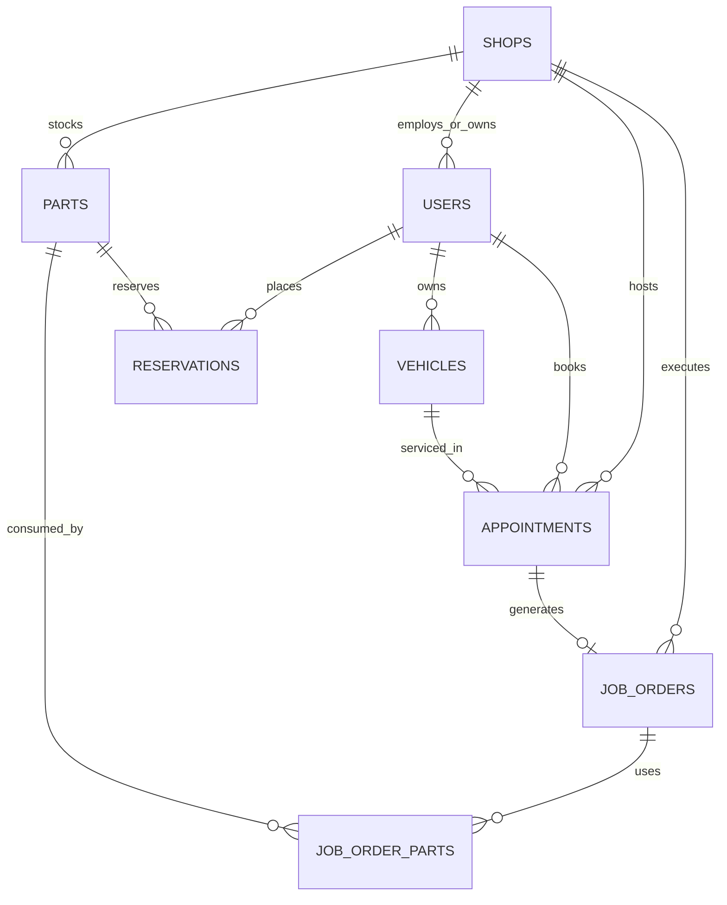

# MotoLink Architecture

> [!abstract] Overview
> **MotoLink** is a multi-tenant auto shop management platform designed to connect vehicle owners with auto service centers. The platform supports multi-tenant data isolation, role-based access control (RBAC), real-time inventory tracking, appointment scheduling, and automated customer notifications.

---

## 1. System Architecture Diagram

```mermaid
graph TD
    subgraph Client Layer ["Client Layer (React 18 + TypeScript + Vite)"]
        UI["Tailwind CSS Slate UI"]
        AuthContext["Auth Context (RBAC)"]
        Landing["Public Landing & Shop Discovery"]
        Portals["Role Portals (Customer, Mechanic, Owner, Admin)"]
    end

    subgraph Service Layer ["Service Layer"]
        SupabaseClient["Supabase Client Helper"]
        SendGridService["SendGrid Email Client"]
        GeoService["Haversine Geolocation Engine"]
        NotificationService["Notification Audit & Opt-Out Service"]
    end

    subgraph Backend Layer ["Backend Layer (Supabase PaaS)"]
        GoTrue["Supabase Auth (GoTrue)"]
        PostgreSQL[("PostgreSQL Database")]
        RLS["Row Level Security Policies (shop_id scoping)"]
    end

    Client Layer --> Service Layer
    Service Layer --> Backend Layer
    Portals --> AuthContext
    AuthContext --> GoTrue
    SupabaseClient --> PostgreSQL
    PostgreSQL --> RLS
    NotificationService --> SendGridService
```

---

## 2. Tech Stack

### Technology Stack Summary

- Frontend: React 18 + TypeScript + Vite
- UI Styling: Tailwind CSS + Framer Motion + Lucide React
- State & Auth: React Context API (`AuthContext`, `LanguageContext`, `PartsListContext`)
- Backend & Database: Supabase Postgres + Auth + Row-Level Security (RLS)
- AI Layer: Groq API with LLM-powered chatbot support
- Notifications: SendGrid transactional email integration
- Mapping & Discovery: Browser Geolocation API + Haversine distance calculation
- Deployment: Vercel-ready frontend delivery

### Stack Matrix

| Layer | Technology | Key Details |
| :--- | :--- | :--- |
| **Frontend Framework** | **React 18 (TypeScript)** | Single-page application built with Vite bundler |
| **Styling System** | **Tailwind CSS v3** | Design Tokens: `slate-900` primary, `slate-50` shells, `slate-200/300` borders |
| **State & Auth** | **React Context API** | `AuthContext` (RBAC & profile hydration), `PartsListContext`, `LanguageContext` |
| **UI Components** | **Lucide React + Framer Motion** | Iconography and smooth page/modal transition animations |
| **Database & Auth** | **Supabase (PostgreSQL 15)** | Row-Level Security (RLS), GoTrue JWT Auth, Realtime listeners |
| **AI Chat Service** | **Groq API** | LLM assistance for diagnostics and business context queries |
| **Transactional Email**| **SendGrid API** | Service completion notices with fallback plain-text rendering |
| **Location Engine** | **Browser Geolocation API** | Native coordinates paired with Haversine formula calculation |
| **Deployment Target** | **Vercel** | Hosted frontend with Supabase backend integration |

---

## 3. Database Schema & Data Models

> [!info] Multi-Tenant Architecture
> Multi-tenancy is enforced at the database level using `shop_id` scoping. Shop owners and mechanics only query and mutate data attached to their assigned `shop_id`.



### Core Entity Schema Definitions

#### `users`
- `id` (UUID, Primary Key -> `auth.users.id`)
- `email` (VARCHAR, Unique)
- `name` (VARCHAR)
- `phone` (VARCHAR, Optional)
- `address` (TEXT, Optional)
- `role` (ENUM: `'customer'`, `'mechanic'`, `'owner'`, `'admin'`)
- `shop_id` (UUID, Foreign Key -> `shops.id`, Nullable for Customers/Admins)

#### `shops`
- `id` (UUID, Primary Key)
- `name` (VARCHAR)
- `slug` (VARCHAR, Unique)
- `description` (TEXT)
- `address` (TEXT)
- `city` (VARCHAR)
- `latitude` (FLOAT8)
- `longitude` (FLOAT8)
- `specialties` (TEXT[])
- `operating_hours` (VARCHAR)
- `is_active` (BOOLEAN)

#### `vehicles`
- `id` (UUID, Primary Key)
- `customer_id` (UUID, Foreign Key -> `users.id`)
- `make` (VARCHAR)
- `model` (VARCHAR)
- `year` (INTEGER/VARCHAR)

#### `parts` (Inventory)
- `id` (UUID, Primary Key)
- `shop_id` (UUID, Foreign Key -> `shops.id`)
- `name` (VARCHAR)
- `category` (ENUM: `'brakes'`, `'tires'`, `'oils'`, `'electrical'`, `'suspension'`, `'exhaust'`, `'filters'`, `'other'`)
- `sku` (VARCHAR)
- `unit_price` (DECIMAL)
- `quantity_in_stock` (INTEGER)
- `reorder_level` (INTEGER)
- `image_url` (TEXT)

#### `appointments`
- `id` (UUID, Primary Key)
- `customer_id` (UUID, Foreign Key -> `users.id`)
- `vehicle_id` (UUID, Foreign Key -> `vehicles.id`)
- `shop_id` (UUID, Foreign Key -> `shops.id`)
- `mechanic_id` (UUID, Foreign Key -> `users.id`, Nullable)
- `scheduled_date` (DATE)
- `scheduled_time` (VARCHAR)
- `service_type` (VARCHAR)
- `status` (ENUM: `'pending'`, `'confirmed'`, `'in_progress'`, `'completed'`, `'cancelled'`)
- `notes` (TEXT)
- `parts` (JSONB)
- `total_amount` (DECIMAL)

#### `job_orders`
- `id` (UUID, Primary Key)
- `appointment_id` (UUID, Foreign Key -> `appointments.id`)
- `customer_id` (UUID, Foreign Key -> `users.id`)
- `mechanic_id` (UUID, Foreign Key -> `users.id`)
- `shop_id` (UUID, Foreign Key -> `shops.id`)
- `vehicle_id` (UUID, Foreign Key -> `vehicles.id`)
- `status` (ENUM: `'draft'`, `'pending'`, `'in_progress'`, `'completed'`, `'cancelled'`, `'billed'`)
- `parts_used` (JSONB: `[{ part_id, quantity_used, unit_price }]`)
- `labor_hours` (DECIMAL)
- `labor_rate` (DECIMAL)
- `total_cost` (DECIMAL)

---

## 4. Role-Based Access Control (RBAC) Matrix

> [!key] Security Permissions
> Managed via `AuthContext` helper functions and enforced by Supabase RLS.

| Permission Helper | Customer | Mechanic | Shop Owner | Platform Admin |
| :--- | :---: | :---: | :---: | :---: |
| `canAccessCustomerPortal()` | ✅ | ❌ | ❌ | ❌ |
| `canRecordServiceProgress()` | ❌ | ✅ | ✅ | ❌ |
| `canManageInventory()` | ❌ | ❌ | ✅ | ✅ |
| `canManageAppointments()` | ❌ | ✅ | ✅ | ✅ |
| `canManageUsers()` | ❌ | ❌ | ✅ (Shop Scope) | ✅ (Global) |
| `canAccessAdminDashboard()` | ❌ | ❌ | ❌ | ✅ |
| `canViewReports()` | ❌ | ❌ | ✅ (Shop Scope) | ✅ (Global) |

---

## 5. Related Notes
- [[MotoLink Logic and Algorithm]]
- [[MotoLink System Flow]]
