# MotoLink System Flow

> [!abstract] Purpose
> This note shows the end-to-end system workflow for MotoLink from sign-in to shop discovery, booking, service execution, inventory updates, and customer notification.

---

## 1. High-Level System Flow

```mermaid
flowchart LR
    A[User Visits Landing Page] --> B[Choose Login Type]
    B --> C[Authenticate via Supabase Auth]
    C --> D[Load Role Profile from users table]
    D --> E[Route to Customer / Mechanic / Owner / Admin Portal]
    E --> F[Interact with Shop, Appointment, Inventory, or Job Order Modules]
    F --> G[Write/Read via Supabase Postgres]
    G --> H[Apply RLS + Role Scope]
    H --> I[Show Dashboard / Notification / Service Result]
```



---

## 2. Public Discovery Flow

```text
Landing page is loaded
  ↓
User opens shop discovery
  ↓
Browser requests geolocation permission
  ↓
Current coordinates are captured
  ↓
Shops are loaded from the database
  ↓
Haversine formula calculates distance from user to each shop
  ↓
Shops are sorted nearest-first
  ↓
Relevant filters are applied
  ↓
The user sees a ranked shop list
```

### Discovery Rule

```text
HTTP Request → Shop records → Location enrichment → Sort distance → Render filtered list
```

---

## 3. Login and Role Routing Flow

```text
User enters credentials
  ↓
AuthContext.login() triggers Supabase auth
  ↓
Session is created and JWT is returned
  ↓
Auth listener refreshes profile from users table
  ↓
The app reads the user.role value
  ↓
App routes user to the correct page
```

### Routing Behavior

- `customer` → customer portal / booking flow
- `mechanic` → mechanic dashboard / service assignment
- `owner` → shop management dashboard
- `admin` → advanced platform dashboard

---

## 4. Appointment Booking System Flow

```text
Customer selects shop, vehicle, service, date, and time
  ↓
Booking modal validates required data
  ↓
Appointment service inserts new record into appointments
  ↓
Record is linked to customer_id, vehicle_id, and shop_id
  ↓
Appointment enters pending status
  ↓
Owner/mechanic reviews and confirms or assigns mechanic
  ↓
Status updates through pending → confirmed → in_progress → completed
```

### Booking Data Path

```text
Frontend Form
  ↓
BookAppointmentModal
  ↓
appointmentService.createAppointment()
  ↓
Supabase appointments table
  ↓
UI refresh and status display
```

---

## 5. Job Order Execution Flow

```text
Appointment is confirmed
  ↓
Mechanic opens job order / service panel
  ↓
System checks if an associated job order exists
  ↓
If absent, it is created automatically from the appointment
  ↓
Labor hours and labor rate are recorded
  ↓
Used parts are logged against the job order
  ↓
Total cost is recalculated
  ↓
Service result is recorded and status is updated
```

### Cost Flow

```text
job_order.total_cost = 
  labor_hours × labor_rate + parts_used subtotal
```

---

## 6. Inventory Management Flow

```text
Owner/admin opens inventory page
  ↓
inventoryService fetches all parts for shop_id scope
  ↓
Displayed table shows stock, price, category, reorder level
  ↓
User adds, edits, or deletes a part
  ↓
Database update is applied through Supabase
  ↓
Low-stock alerts are recalculated
  ↓
Inventory status is shown on dashboard and related pages
```

### Inventory Logic

```text
if stock <= reorder_level:
  show low-stock warning
  push alert to dashboard metrics
```

---

## 7. Notification and Completion Flow

```text
Service reaches completed status
  ↓
Notification job is triggered
  ↓
Customer details and service summary are assembled
  ↓
Email or notification message is sent
  ↓
Customer sees confirmation and service history update
```

### Output Behavior

- service completion notices
- customer communication confirmation
- record persistence for service history and audit trail

---

## 8. Data Security Flow

```text
Every request is authenticated by session
  ↓
Profile role and shop scope are loaded
  ↓
Supabase RLS query filter restricts result set
  ↓
Unauthorized cross-shop reads are blocked
```

### Security Rule

```text
A mechanic can view only records from their shop.
An owner can manage only that shop's inventory and appointments.
An admin can view platform-wide analytics.
```

---

## 9. End-to-End System Summary

```text
User Action
  ↓
Frontend Component
  ↓
Context or Service Layer
  ↓
Supabase / PostgreSQL Query
  ↓
RLS Scoped Result
  ↓
UI Refresh + Notification / Analytics
```

This is the basic operating pattern behind MotoLink: the UI triggers a request, the service layer performs the business action, the database persists the state, and security scope ensures each role only sees the records they are permitted to access.

---

## 10. Related Notes
- [[MotoLink Architecture]]
- [[MotoLink Logic and Algorithm]]
